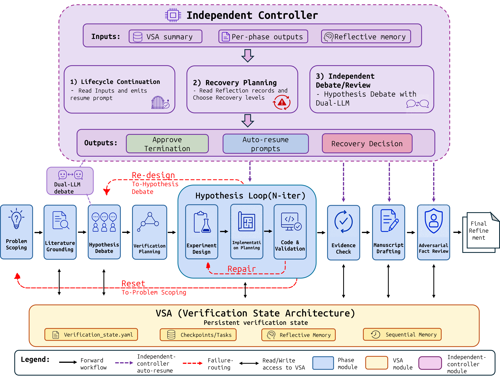

# YouRA: A Persistent-State Architecture for Evidence-Traceable Autonomous Research Agents

> ARR May 2026 Submission | Anonymous Repository

## Abstract

End-to-end research agents can now produce complete scientific papers, but manuscript claims can diverge from executed experiments. YouRA (Your Research Agent) addresses this reliability gap by making research state, execution evidence, and trajectory-level failure history explicit, persistent, and verifiable across the full research lifecycle.

YouRA combines three architectural components:

| Component | Description |
|:----------|:------------|
| **Verification State Architecture (VSA)** | Tracks hypotheses, gates, evidence pointers, checkpoints, tasks, reflective memory, and sequential memory as persistent state. |
| **Independent Controller** | Reads VSA summaries, per-phase outputs, and reflective memory to control lifecycle continuation, recovery planning, and independent debate/review. |
| **Stateful Reflection** | Records failures as structured lessons and routes recovery through bounded repair, hypothesis redesign, or problem-scoping reset. |

Given only a topic-level description, YouRA expands it into a research question, hypothesis, experiment plan, implementation, validation evidence, and final manuscript. For benchmark evaluation, runs are held to fully autonomous mode; for practical use, the same infrastructure exposes stage-specific CLI commands and resumable hook-driven orchestration.

## Key Results

The paper evaluates YouRA on the MLR-Bench predefined ten-task end-to-end subset.

### End-to-End Scores

[MLR-Bench](https://github.com/chchenhui/mlrbench) scores use a 1-10 rubric where higher is better. Each cell reports mean ± task standard deviation over four judges.

| System | Backbone LLM | Clarity | Novelty | Soundness | Significance | Overall |
|:--|:--|--:|--:|--:|--:|--:|
| [MLR-Agent](https://neurips.cc/virtual/2025/loc/san-diego/poster/121719) | Sonnet 4.5 | 7.42 ± 0.24 | 5.12 ± 0.74 | 2.48 ± 0.61 | 3.52 ± 0.68 | 3.10 ± 0.64 |
| MLR-Agent | Opus 4.5 | 7.30 ± 0.35 | 5.25 ± 0.31 | 3.05 ± 0.96 | 3.80 ± 0.71 | 3.62 ± 0.80 |
| MLR-Agent | Sonnet 4.6 | **7.78 ± 0.22** | **5.95 ± 0.44** | 4.05 ± 1.19 | 4.72 ± 1.14 | 4.42 ± 1.11 |
| [AI Scientist V2](https://www.nature.com/articles/s41586-026-10265-5) | Sonnet 4.5 | 6.72 ± 0.43 | 4.85 ± 0.60 | 3.45 ± 1.18 | 3.92 ± 0.85 | 3.62 ± 0.84 |
| AI Scientist V2 | Opus 4.5 | 6.38 ± 1.25 | 5.22 ± 0.86 | 4.18 ± 1.31 | **4.47 ± 1.03** | 4.28 ± 1.16 |
| AI Scientist V2 | Sonnet 4.6 | 6.45 ± 0.65 | 5.75 ± 0.47 | 3.32 ± 1.01 | 4.22 ± 0.95 | 3.88 ± 0.88 |
| **YouRA** | Sonnet 4.5 | **7.50 ± 0.49** | **5.23 ± 0.92** | **3.98 ± 1.74** | **4.30 ± 1.28** | **4.20 ± 1.45** |
| **YouRA** | Opus 4.5 | **7.73 ± 0.48** | **5.33 ± 1.03** | **4.58 ± 1.86** | 4.33 ± 1.42 | **4.45 ± 1.51** |
| **YouRA** | Sonnet 4.6 | 7.72 ± 0.32 | 5.70 ± 0.57 | **4.92 ± 1.09** | **5.05 ± 1.00** | **5.05 ± 0.92** |

### Pairwise Preferences

Each row summarizes 40 order-collapsed judge-task verdicts from the YouRA perspective (10 tasks x 4 judges). Each verdict is evaluated in both presentation orders; order reversals are counted as ties.

| Comparison | Backbone | Win | Tie | Lose |
|:--|:--|--:|--:|--:|
| YouRA vs [MLR-Agent](https://neurips.cc/virtual/2025/loc/san-diego/poster/121719) | Sonnet 4.5 | 25 | 14 | 1 |
| YouRA vs MLR-Agent | Opus 4.5 | 26 | 5 | 9 |
| YouRA vs MLR-Agent | Sonnet 4.6 | 21 | 14 | 5 |
| YouRA vs [AI Scientist V2](https://www.nature.com/articles/s41586-026-10265-5) | Sonnet 4.5 | 18 | 14 | 8 |
| YouRA vs AI Scientist V2 | Opus 4.5 | 17 | 12 | 11 |
| YouRA vs AI Scientist V2 | Sonnet 4.6 | 20 | 12 | 8 |


## Architecture Overview



YouRA's lifecycle proceeds left to right under the VSA. The independent controller consumes persistent state and reflective memory to decide whether to approve termination, emit auto-resume prompts, or select recovery routing. Sub-hypotheses move through an iterative experiment-design, implementation-planning, and code-validation loop. Failed gates are routed through repair, redesign, or reset, while final evidence passes through manuscript drafting, adversarial fact review, and refinement.

## Installation

### Prerequisites

- Python 3.10+
- Claude Code CLI available as `~/.local/bin/claude`
- Claude Code CLI must be logged in and backed by an active **Claude subscription** or **API-backed account** before running YouRA.
- Codex CLI must be installed, logged in, and backed by an active **subscription** or **API key** before running Codex-backed evaluation scripts.
- `OPENROUTER_API_KEY` in `.env` for the GPT-5.2-based auto-responder/controller
- MCP services: [Serena](https://github.com/oraios/serena) (strongly recommended) and [Archon](https://github.com/coleam00/Archon/tree/archive/v1-task-management-rag) (recommended but not required). Other optional MCP services can be found in the [Smithery server directory](https://smithery.ai/servers).

### Setup

```bash
# Clone repository
git clone https://github.com/Anonymous-ARR-Submissions/YouRA.git
cd YouRA

# Create virtual environment
python -m venv .venv
source .venv/bin/activate        # Linux/Mac
# or: .venv\Scripts\activate     # Windows

# Install root evaluation package
pip install -e .

# Configure environment
cp .env.example .env
# then edit .env and fill in OPENROUTER_API_KEY
# OPENAI_API_KEY is optional; needed only for direct OpenAI/Codex API calls
```

This repository has two Python setup layers:

- `pyproject.toml` installs the root evaluation/analysis package under `src/mlrbench`.
- `YOURA/install_hooks.py` installs the small Claude Code hook runtime dependencies
  and writes repository-specific absolute paths into `YOURA/.claude/settings.local.json`.

Run both steps in the same virtual environment. Do not manually edit
`YOURA/.claude/settings.local.json`; regenerate it with `install_hooks.py` after
moving or recloning the repository.

`ANTHROPIC_API_KEY` is not required for the default YouRA workflow when Claude Code
CLI is already logged in. It is only needed if you run the MLR-Bench evaluators
with direct Anthropic API models instead of OpenRouter/Claude Code CLI.
The default model choices work without additional environment variables; override
them only when needed via CLI flags such as `--judge-model`, `--model`, or the
optional `LLM_JUDGE_MODEL`, `CLAUDE_MODEL`, and `CODEX_MODEL` variables.

### Claude Hook Setup

Run the hook installer from the `YOURA/` directory. It writes absolute Python paths into `YOURA/.claude/settings.local.json`, so rerun it after moving the repository.

```bash
cd YOURA
python install_hooks.py --install-deps
```

If Claude CLI is installed somewhere other than `~/.local/bin/claude`, pass it explicitly:

```bash
python install_hooks.py --install-deps --claude-bin /path/to/claude
```

**On Windows**, the Claude CLI is typically `claude.EXE` and the default path check fails. Pass the absolute path explicitly:

```powershell
python install_hooks.py --install-deps --claude-bin "C:\Users\<you>\.local\bin\claude.EXE"
```

To skip the Claude CLI check entirely (e.g., when only configuring on a machine where Claude Code will be installed later), add `--skip-claude-check`.

## Usage

YouRA can be run in two modes. The benchmark runs in this repository use the
unattended Python launcher for reproducibility. Human users can also open Claude
Code in `YOURA/` and use slash commands such as `/phase0-brainstorm`,
`/phase1-research`, `/phase2a-dialogue`, and `/hypothesis-loop` to enter a
specific phase directly and proceed interactively with the AI. See
`YOURA/README.md` for the detailed YouRA workflow layout and phase-command
summary.

### Quick Start: Full Anonymous Pipeline

Run the pipeline from the `YOURA/` subdirectory. If you are at the repository
root, enter it first. Include `--enable-refine` so Phase 6.5.1 is followed by
the final refinement/PDF pass.

```bash
cd YOURA

# Text input
python .claude/hooks/run_total_youra.py "Weak supervision for image classification" \
    --research-folder docs/youra_research/20260304_scsl \
    --enable-refine

# Existing research idea file with a fixed output folder
python .claude/hooks/run_total_youra.py docs/research_idea.md \
    --research-folder docs/youra_research/20260304_scsl \
    --enable-refine
```

### Interactive Start for Very Short Research Topics

The commands above run the end-to-end pipeline automatically. For human-guided
use, avoid starting the full pipeline from an overly terse research topic such as
`weak supervision` or `LLM alignment`. A short topic can make Phase 0 generate a
too-simple idea and continue before you have shaped the research direction.

Instead, start Claude Code from `YOURA/` and run the Phase 0 slash command first:

```text
/phase0-brainstorm
```

Use Phase 0 to expand the topic into a concrete research question and check the
generated `docs/youra_research/<run>/00_brainstorm_session.md`. After reviewing
or editing that Phase 0 output, continue the automated pipeline from Phase 1:

```bash
python .claude/hooks/run_total_youra.py dummy \
    --resume-from phase1 \
    --research-folder docs/youra_research/<run> \
    --enable-refine
```

Claude Code also exposes phase-by-phase slash commands if you want to inspect or
steer each phase interactively. See `YOURA/README.md` for the command summary.

The full pipeline runs:

```text
Phase 0  Problem Scoping / Brainstorm
Phase 1  Literature Grounding
Phase 2A Hypothesis Dialogue
Phase 2B Verification Planning
Phase 2C Experiment Design
Phase 3  Implementation Planning
Phase 4  Coding & Validation
Phase 4.5 Hypothesis Synthesis
Phase 6  Manuscript Drafting
Phase 6.5 Adversarial Fact Review
Phase 6.5.1 Overleaf LaTeX + PDF Generation
Refine   Manuscript refinement
```

### Runtime Configuration

Default run behavior can be edited in `YOURA/.claude/hooks/auto_responder_config.yaml`.

| Setting | YAML Path | Meaning |
|:--------|:----------|:--------|
| Claude Code model | `claude_model` | Selects the Claude CLI execution model used by `run_phase*.py`, for example `claude-sonnet-4-6`, `claude-opus-4-6`, or `claude-haiku-4-5-20251001`. Empty/null uses the Claude CLI default. |
| Claude effort | `claude_effort` | Controls Claude extended thinking level: `low`, `medium`, `high`, or `max`. |
| Reflection budget | `pipeline_reflection.max_reflections` | Default maximum number of reflection reroutes after `MUST_WORK` failures. `-1` means unlimited; `0` disables reflection. CLI `--max-reflections` can be used per run. |
| Auto-responder model | `openrouter.model` | Model used by the OpenRouter-based auto-responder/controller when OpenRouter analysis is enabled. |

### Resume From The Middle

Use `--resume-from` when intermediate outputs already exist. Resume points other than `phase0` require `--research-folder`. Keep `--enable-refine` on resumed commands so the final refinement pass runs after Phase 6.5.1.

```bash
# Resume from any supported phase by changing the --resume-from value
python .claude/hooks/run_total_youra.py dummy \
    --resume-from hypothesis-loop \
    --research-folder docs/youra_research/20260304_scsl \
    --enable-refine
```

Supported `--resume-from` values:

| Value | Meaning |
|:------|:--------|
| `phase0`, `phase1`, `phase2a`, `phase2b` | Restart the early pipeline at the selected phase. |
| `hypothesis-loop` | Skip early phases and resume Phase 2C -> 3 -> 4. |
| `phase45`, `phase5`, `phase6`, `phase65`, `phase651` | Resume the post-experiment manuscript pipeline. |
| `refine` | Run refinement after Phase 6.5.1 with `--enable-refine`. |

### MCP Tool Stack

Claude Code is the execution host and hook surface. Serena and Archon are the main recommended MCP-backed memory/tool layers; the remaining MCP services are optional and can be found in the [Smithery server directory](https://smithery.ai/servers).

| Tool | Status | Usage in YouRA |
|:-----|:-------|:---------------|
| [Serena](https://github.com/oraios/serena) | Strongly recommended | Code-aware symbol navigation/editing and Reflective Memory failure-context recording. |
| [Archon](https://github.com/coleam00/Archon/tree/archive/v1-task-management-rag) | Recommended (not required) | Sequential Memory, RAG-backed knowledge base, implementation-pattern storage, and task lifecycle management. |
| Clear Thought, Exa, Semantic Scholar | Optional | Available through the [Smithery server directory](https://smithery.ai/servers) if you want structured reasoning, web evidence search, or literature search integrations. |

## Modified MLR-Bench Evaluation Utilities

This repository includes a modified `mlrbench-youra` package under `src/mlrbench`. It is used for evaluation, not for launching the YouRA research loop. The package provides unified judge wrappers for YouRA, AI Scientist V2, and MLR-Agent outputs.

### Setup

Install the repository in editable mode:

```bash
pip install -e .
```

The evaluator reads `OPENROUTER_API_KEY` from `.env`, so no separate shell
`export` is needed when running from the repository root.

### Single-Task Evaluation

Use the unified runner for overall quality and hallucination/factuality review:

```bash
python -m mlrbench.evals.run_eval \
    --system youra \
    --exp-dir TEST_scsl \
    --task-file path/to/task.md \
    --paper-file path/to/paper.md \
    --evaluator google/gemini-3.1-pro-preview \
    --lane sonnet45 \
    --task-name scsl
```

Supported systems are:

```text
youra
ai_scientist_v2
mlragent
```

Unless `--output-dir` is provided, outputs are written under:

```text
results/evaluations/mlrbench_overall_score/
results/evaluations/mlrbench_hallucination/
```

### Optional: Build `experiments/` Folders for New YouRA Runs

The bundled YouRA artifacts under `results/generations/youra/` already include
the `experiments/` folders used by the evaluation scripts. You do not need to run
this step to reproduce the included scores.

This helper is only for evaluating newly generated YouRA runs that still have the
raw `TEST_<task>/docs/youra_research/.../h-*` layout. MLR-Bench expects each task
directory to contain a flat `experiments/` folder, so the helper copies relevant
`.py`, `.json`, and `.log` files from the hypothesis folders into
`TEST_<task>/experiments/`.

```bash
python -m mlrbench.evals.youra.build_youra_experiments_dirs \
    --root path/to/workspace/with/TEST_dirs \
    --variant sonnet45 \
    --write
```

Other variants:

```bash
python -m mlrbench.evals.youra.build_youra_experiments_dirs --root path/to/workspace/with/TEST_dirs --variant sonnet46 --write
python -m mlrbench.evals.youra.build_youra_experiments_dirs --root path/to/workspace/with/TEST_dirs --variant opus45 --write
python -m mlrbench.evals.youra.build_youra_experiments_dirs --root path/to/workspace/with/TEST_dirs --variant all --write
```

Run without `--write` to preview the files that would be copied.

The individual stage reviewers under `src/mlrbench/evals/{youra,mlragent,ai_scientist_v2}/` are research scripts for idea, proposal, experiment, writeup, overall, and hallucination review. For normal reproduction, prefer `python -m mlrbench.evals.run_eval` because it exposes the system, task path, paper path, evaluator model, and output directory through CLI flags.

## Experiment Reproduction

> **Before running any evaluation script in this section, install the `mlrbench-youra` package in editable mode from the repo root** (`pip install -e .`) so that `python -m mlrbench.evals.*` and the scripts under `analysis/` can import it. See [Modified MLR-Bench Evaluation Utilities -> Setup](#setup-1) for details.

### Evaluation Scripts

End-to-end and pairwise judging artifacts are under `analysis/LLM_as_Judge_main/`. The pairwise script loads `.env`, can prompt interactively if paths are omitted, and uses explicit paths for reproducibility. `--judge-model` accepts only the four supported judges: `google/gemini-3.1-pro-preview`, `openai/gpt-5.4`, `x-ai/grok-4.3`, `anthropic/claude-opus-4.6`.

```bash
# Compare two papers. By default this runs both A/B and B/A orderings.
python analysis/LLM_as_Judge_main/run_llm_as_judge.py \
    --paper-a path/to/youra.md \
    --paper-b path/to/baseline.pdf \
    --task path/to/task.md \
    --label-a YouRA \
    --label-b "AI Scientist V2" \
    --judge-model google/gemini-3.1-pro-preview \
    --output analysis/LLM_as_Judge_main/custom_results.json

# Validate prompts and file loading without calling the judge API
python analysis/LLM_as_Judge_main/run_llm_as_judge.py \
    --paper-a path/to/youra.md \
    --paper-b path/to/baseline.pdf \
    --task path/to/task.md \
    --output analysis/LLM_as_Judge_main/dry_run_results.json \
    --dry-run
```

Aggregate judge CSVs and compute Fleiss' kappa:

```bash
python analysis/LLM_as_Judge_main/compute_fleiss_kappa.py \
    --input-dir analysis/LLM_as_Judge_main/LLM_as_Judge_results/LLM_as_Judge_YouRA_vs_MLRagent \
    --input-dir analysis/LLM_as_Judge_main/LLM_as_Judge_results/LLM_as_Judge_YouRA_vs_AI_scientist_v2 \
    --output analysis/LLM_as_Judge_main/fleiss_kappa_summary.csv \
    --format csv
```

Data-provenance diagnostics are under `analysis/Data_type_fabrication_analysis/`. These scripts load `.env`. The Claude-backed runner requires an authenticated Claude Code CLI session; the Codex-backed runner requires an authenticated Codex CLI session.

Each runner supports two modes:

- **Single-pair mode** (free-form paths): pass `--paper-file`, `--exp-folder`, `--output-json` to analyze one arbitrary (paper, experiment-folder) pair.
- **Batch mode** (MLR-Bench layout): pass `--paper-dir`, `--exp-dir`, `--output-dir`, and the runner iterates over names matching `iclr2025_<name>.md`/`iclr2025_<name>/`. `--names` selects which names to process (default: the bundled ten MLR-Bench tasks).

```bash
# Single-pair mode (Claude) — arbitrary paper/experiment paths
python analysis/Data_type_fabrication_analysis/run_fabrication_grounded_claude_data_type.py \
    --paper-file path/to/my_paper.md \
    --exp-folder path/to/my_experiment_dir \
    --output-json path/to/out/my_paper_fabrication_analysis_data_type.json \
    --model claude-opus-4-6

# Single-pair mode (Codex)
python analysis/Data_type_fabrication_analysis/run_fabrication_grounded_codex_data_type.py \
    --paper-file path/to/my_paper.md \
    --exp-folder path/to/my_experiment_dir \
    --output-json path/to/out/my_paper_fabrication_analysis_data_type.json \
    --model gpt-5.4 \
    --cwd .

# Batch mode (Claude) — MLR-Bench iclr2025_<name> layout
python analysis/Data_type_fabrication_analysis/run_fabrication_grounded_claude_data_type.py \
    --paper-dir path/to/generated_papers \
    --exp-dir path/to/experiment_folders \
    --output-dir analysis/Data_type_fabrication_analysis/data_type_analysis_results/fabrication_analysis_claude_data_type_youra \
    --model claude-opus-4-6 \
    --names scsl wsl

# Batch mode (Codex)
python analysis/Data_type_fabrication_analysis/run_fabrication_grounded_codex_data_type.py \
    --paper-dir path/to/generated_papers \
    --exp-dir path/to/experiment_folders \
    --output-dir analysis/Data_type_fabrication_analysis/data_type_analysis_results/fabrication_analysis_codex_data_type_youra \
    --model gpt-5.4 \
    --cwd . \
    --names scsl wsl
```

The pie-chart script uses the fixed result root `analysis/Data_type_fabrication_analysis/data_type_analysis_results/` and writes both PNG and PDF outputs next to the script:

```bash
python analysis/Data_type_fabrication_analysis/make_data_type_pies.py
```

Analysis scripts used for tables and supporting plots are under `analysis/`. Each script below regenerates a specific paper artifact from the bundled evaluation outputs.

```bash
# Reproduces the main MLR-Bench score table (the "End-to-End Scores" table above).
# Outputs: analysis/MLRbench_scores_analysis/overall/table1_mlrbench_overall_scores.{csv,tex}
#          and table1_task_level_scores.csv
python analysis/MLRbench_scores_analysis/overall/build_overall_score_table.py

# Reproduces the VSA recovery-routing analysis (routing-level CSVs and stacked-bar figure).
# Outputs: analysis/VSA/routing_levels{,_detail,_per_backbone,_per_task}.csv
#          and analysis/VSA/routing_levels_stack.png
python analysis/VSA/classify_routing_levels.py
python analysis/VSA/plot_routing_levels.py

# Reproduces the MLR-Bench hallucination analysis figures (prevalence, taxonomy, evidence-intersection).
# Outputs: analysis/MLRbench_hallucination_analysis/plots/*.png
python analysis/MLRbench_hallucination_analysis/extract_hallucination_csvs.py
python analysis/MLRbench_hallucination_analysis/plot_hallucination_prevalence.py
python analysis/MLRbench_hallucination_analysis/plot_hallucination_taxonomy_bounds.py
python analysis/MLRbench_hallucination_analysis/plot_hallucination_taxonomy_intersection.py
```

## Project Structure

```text
YouRA/
+-- README.md                         # Repository-level overview
+-- overview.png                      # Main lifecycle overview figure
+-- pyproject.toml                    # Root evaluation package metadata
+-- YOURA/
|   +-- install_hooks.py              # Claude Code hook installer
|   +-- requirements.txt              # Hook runtime dependencies
|   +-- tasks_youra/                  # Research task prompts
|   +-- .claude/
|   |   +-- commands/                 # Stage-specific Claude commands
|   |   +-- hooks/                    # Pipeline launchers, responder, verifier
|   |   +-- agents/                   # Phase-specialized agents
|   |   +-- prompts/                  # Phase responder prompts
|   |   +-- skills/                   # Tool/reasoning skill wrappers
|   +-- bmad-custom-src/              # YouRA BMAD module sources
+-- analysis/
|   +-- LLM_as_Judge_main/            # MLR-Judge-style evaluation scripts/results
|   +-- Data_type_fabrication_analysis/  # Real/Synthetic/Fabricated diagnostics
|   +-- MLRbench_scores_analysis/     # Score table construction
|   +-- MLRbench_hallucination_analysis/
|   +-- VSA/                          # Recovery-routing telemetry analysis
+-- results/
|   +-- evaluations/                  # Evaluation outputs
|   +-- generations/                  # Generated research artifacts
+-- src/
    +-- mlrbench/                     # Shared evaluation utilities
```

## Results Format

Primary generated research artifacts are saved under `YOURA/docs/youra_research/`
and mirrored in benchmark-generation results under
`results/generations/youra/<model>/<task>/docs/youra_research/`:

```text
YOURA/docs/youra_research/<timestamp>/
+-- 00_brainstorm_session.md
+-- 01_targeted_research.md
+-- 01_targeted_research_full.md
+-- 02_synthesis.yaml
+-- 02b_verification_plan.md
+-- 03_refinement.md
+-- 03_refinement.yaml
+-- verification_state.yaml
+-- <h-id>/
|   +-- 02c_experiment_brief.md
|   +-- 03_prd.md
|   +-- 03_architecture.md
|   +-- 03_logic.md
|   +-- 03_config.md
|   +-- 04_validation.md
|   +-- 04_checkpoint.yaml
|   +-- code/
+-- 045_validated_hypothesis.md
+-- paper/
    +-- 06_paper.md
    +-- sections/
    +-- 06_references.bib
    +-- 06_paper_final.md
    +-- review/065_review_summary.md
    +-- refinement/
        +-- 06_paper_refinement.md        -> final refined manuscript
        +-- overleaf_refinement/main.pdf  -> compiled paper PDF, when available
```

**Final generated paper:** for benchmark-generation mirrors under `results/generations/`, the final refined manuscript is `06_paper_refinement.md` inside the run's `paper/refinement/` directory.

Example final manuscript path:

```text
results/generations/youra/sonnet45/iclr2025_buildingtrust/docs/youra_research/2026_buildingtrust/paper/refinement/06_paper_refinement.md
```

## Safety and Reliability Mechanisms

| Mechanism | Purpose |
|:----------|:--------|
| Phase output verification | Each launcher checks required files and structured fields before advancing. |
| Auto-responder stop control | The hook router either approves stop, emits a resume prompt, or escalates `MUST_STOP`. |
| VSA gates | `MUST_WORK` and `SHOULD_WORK` gates determine whether failures trigger repair, redesign, reset, or limitation recording. |
| Independent fact review | Later manuscript stages check generated claims against VSA, stage artifacts, results, logs, and code. |

## Citation

```bibtex
@inproceedings{anonymous2026youra,
  title={YouRA: A Persistent-State Architecture for Evidence-Traceable Autonomous Research Agents},
  author={Anonymous},
  booktitle={ARR May 2026},
  year={2026},
  note={Under review}
}
```

## License

No repository-level license file is present in this checkout. MLR-Bench tasks, reference papers, datasets, and starter code should be used under their original upstream licenses; generated artifacts inherit applicable upstream obligations.
