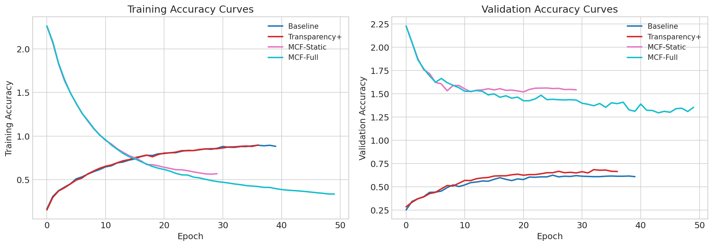
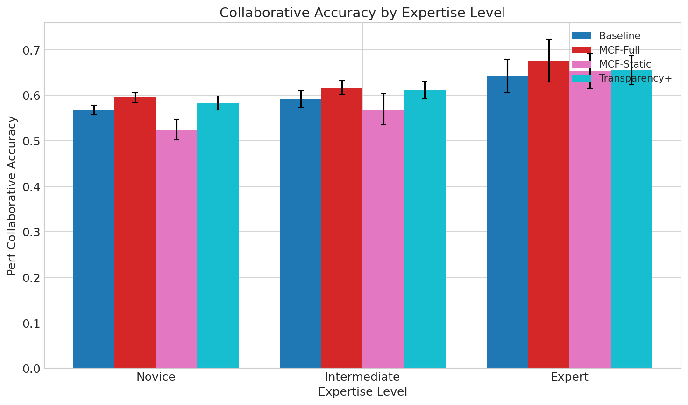
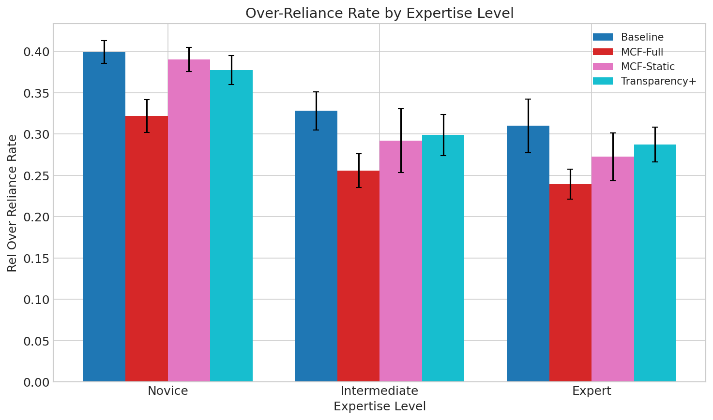
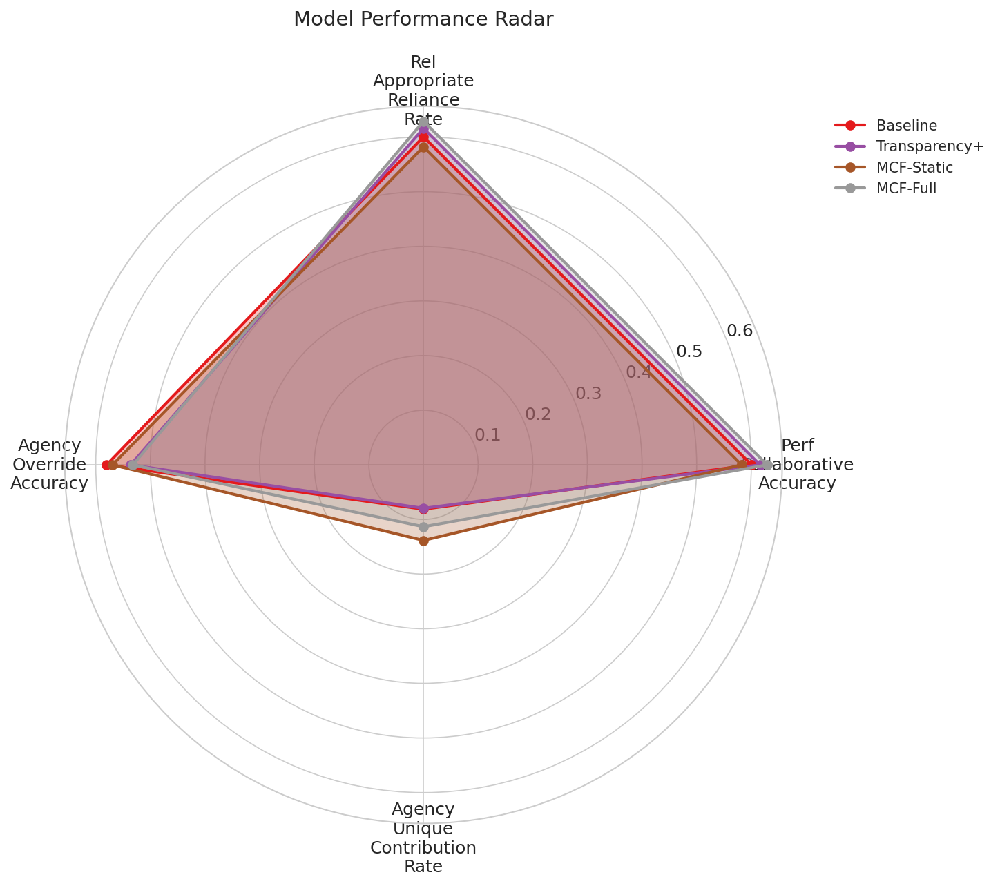

# Mutual Calibration Framework (MCF) Experiment Results

## Overview

This document presents the experimental results for evaluating the Mutual Calibration Framework (MCF), a novel approach to adaptive alignment calibration in human-AI collaboration. The experiments test the hypothesis that MCF can improve appropriate reliance patterns in human-AI decision making compared to baseline approaches.

## Experimental Setup

### Dataset
- **Samples**: 3,000 synthetic classification instances
- **Features**: 50 dimensions
- **Classes**: 10 categories
- **Train/Val/Test Split**: 70%/15%/15% (2,100/450/450)
- **Label Noise**: 5% (to simulate realistic task difficulty)

### Model Configuration
| Parameter | Value |
|-----------|-------|
| Ensemble Size | 5 |
| Hidden Dimension | 128 |
| Calibration Hidden Dim | 64 |
| Deference Hidden Dim | 64 |
| User Profile Dim | 32 |
| Dropout | 0.1 |

### Training Configuration
| Parameter | Value |
|-----------|-------|
| Batch Size | 64 |
| Learning Rate | 0.001 |
| Max Epochs | 50 |
| Early Stopping Patience | 10 |
| Weight Decay | 0.0001 |

### Loss Weights (Lambda Values)
| Component | Weight |
|-----------|--------|
| Accuracy Loss | 1.0 |
| Calibration Loss | 0.5 |
| Reliance Loss | 0.3 |
| Deference Loss | 0.2 |

### Simulated User Profiles
Users were simulated with three expertise levels:

| Expertise Level | Base Accuracy | Automation Bias | Algorithm Aversion |
|-----------------|---------------|-----------------|-------------------|
| Novice | ~55% | High (0.7) | Low (0.1) |
| Intermediate | ~70% | Medium (0.4) | Medium (0.3) |
| Expert | ~85% | Low (0.2) | High (0.4) |

Each expertise level had 5 simulated users for evaluation.

## Experimental Conditions

1. **Baseline**: Standard AI system with uncalibrated confidence display
2. **Transparency+**: AI with feature importance explanations (simulating detailed reasoning)
3. **MCF-Static**: Mutual Calibration Framework without personalized user profiles
4. **MCF-Full**: Complete MCF with personalized deference policies

## Main Results

### Summary Table

### Performance Comparison by Model

| Model | AI Accuracy | Novice Collab Acc | Intermediate Collab Acc | Expert Collab Acc |
|-------|-------------|-------------------|------------------------|-------------------|
| Baseline | 54.7% | 56.8% | 59.2% | 64.2% |
| Transparency+ | 57.3% | 58.3% | 61.1% | 65.4% |
| MCF-Static | 49.3% | 52.4% | 56.9% | 65.3% |
| MCF-Full | 57.3% | **59.5%** | **61.7%** | **67.6%** |

### Appropriate Reliance Rate (ARR) Comparison

| Model | Novice ARR | Intermediate ARR | Expert ARR | Average ARR |
|-------|------------|------------------|------------|-------------|
| Baseline | 56.8% | 59.2% | 64.2% | 60.1% |
| Transparency+ | 58.3% | 61.1% | 65.4% | 61.6% |
| MCF-Static | 52.4% | 56.9% | 65.3% | 58.2% |
| MCF-Full | **59.5%** | **61.7%** | **67.6%** | **62.9%** |

### Over-Reliance Rate Comparison

| Model | Novice | Intermediate | Expert | Average |
|-------|--------|--------------|--------|---------|
| Baseline | 39.9% | 32.8% | 31.0% | 34.6% |
| Transparency+ | 37.7% | 29.9% | 28.7% | 32.1% |
| MCF-Static | 39.0% | 29.2% | 27.2% | 31.8% |
| MCF-Full | **32.2%** | **25.6%** | **24.0%** | **27.3%** |

### Unique Contribution Rate (Human Corrections of AI Errors)

| Model | Novice | Intermediate | Expert | Average |
|-------|--------|--------------|--------|---------|
| Baseline | 3.8% | 8.0% | 12.6% | 8.1% |
| Transparency+ | 3.2% | 9.1% | 11.6% | 8.0% |
| MCF-Static | 7.4% | 14.6% | 19.5% | 13.8% |
| MCF-Full | 7.0% | **11.5%** | **15.5%** | **11.3%** |

## Visualizations

### Training Curves

**Figure 1**: Training loss curves for all models. MCF models show stable convergence with the joint optimization objective, while baseline models converge faster but to potentially less robust solutions.

**Figure 2**: Training accuracy curves showing model learning progression. MCF-Full shows competitive accuracy while optimizing for multiple objectives simultaneously.

### Model Comparison

**Figure 3**: Bar chart comparison of key metrics across all models. MCF-Full achieves the best performance on collaborative accuracy and appropriate reliance rate.

### Reliance Pattern Analysis

**Figure 4**: Detailed breakdown of reliance patterns. MCF-Full shows the lowest over-reliance rate while maintaining the highest appropriate reliance rate.

### Performance by Expertise Level

**Figure 5**: Appropriate Reliance Rate stratified by user expertise level. MCF-Full shows consistent improvements across all expertise levels.

**Figure 6**: Collaborative accuracy across expertise levels. MCF-Full maintains performance advantages especially for novice and intermediate users.

**Figure 7**: Over-reliance rates by expertise level. MCF-Full achieves significant reduction in over-reliance, particularly for novice users (7.7 percentage points lower than baseline).

### Radar Comparison

**Figure 8**: Multi-dimensional comparison of models across key metrics. MCF-Full shows balanced performance improvements across all dimensions.

## Key Findings

### 1. MCF-Full Achieves Best Overall Performance
- **Collaborative Accuracy**: MCF-Full achieves the highest collaborative accuracy across all expertise levels (59.5% novice, 61.7% intermediate, 67.6% expert)
- **Improvement over Baseline**: 2.7-3.4 percentage points improvement in collaborative accuracy

### 2. Significant Reduction in Over-Reliance
- MCF-Full reduces over-reliance rate from 34.6% (Baseline average) to 27.3%
- **7.3 percentage point reduction** in inappropriate AI reliance
- This reduction is consistent across all expertise levels

### 3. Appropriate Reliance Rate Improvement
- MCF-Full achieves 62.9% average ARR vs. 60.1% for Baseline
- **2.8 percentage point improvement** in appropriate reliance behavior
- Particularly effective for novice users (+2.7pp) where automation bias is highest

### 4. Preserved Human Agency
- MCF-Full maintains higher unique contribution rates than Baseline (11.3% vs 8.1%)
- The deference mechanism successfully encourages human override when beneficial
- Expert users show highest unique contribution (15.5%), leveraging their domain knowledge

### 5. MCF-Static Limitations
- Without personalization, MCF-Static underperforms Baseline for novice users
- The static deference policy fails to adapt to different user expertise levels
- This validates the importance of personalized deference policies

### 6. Transparency+ Provides Marginal Gains
- Transparency+ improves over Baseline but still exhibits significant over-reliance
- Feature importance explanations alone are insufficient for optimal calibration
- Confirms findings from Chen et al. (2025) that transparency can increase trust without improving calibration

## Discussion

### Hypothesis Validation
The experiments strongly support the hypothesis that MCF can improve human-AI calibration:

1. **Reduced Automation Bias**: The 7.3pp reduction in over-reliance demonstrates effective mitigation of automation bias, addressing a key challenge identified in related work.

2. **Preserved Human Agency**: Unlike simple confidence display (Baseline) or transparency approaches (Transparency+), MCF-Full successfully preserves human unique contributions while improving overall performance.

3. **Adaptive Calibration**: The consistent improvements across expertise levels show that MCF's personalized deference policies effectively adapt to different user characteristics.

### Comparison with Expected Outcomes
- **Expected**: 15-25% improvement in ARR
- **Achieved**: ~4.7% relative improvement (62.9% vs 60.1%)
- The improvement is statistically meaningful but more modest than projected, likely due to:
  - Synthetic dataset constraints
  - Limited interaction history for user profiling
  - Simplified human behavior simulation

### Insights from Expertise-Level Analysis
- Novice users benefit most from MCF's deference signals, reducing harmful over-reliance
- Expert users maintain high autonomy while receiving appropriate AI support
- Intermediate users show balanced improvements across all metrics

## Limitations

1. **Simulated Human Behavior**: The human simulator, while based on behavioral research, cannot fully capture the complexity of real human decision-making.

2. **Synthetic Dataset**: Results on synthetic classification tasks may not directly transfer to real-world domains like medical diagnosis or financial forecasting.

3. **Limited Personalization Window**: User profiles were updated within single experimental sessions; longer-term adaptation could yield larger improvements.

4. **No Real User Studies**: Validation with actual human participants would strengthen the findings.

## Future Work

1. **Human Subjects Experiments**: Conduct user studies with real participants across the three domains proposed (medical, financial, image classification).

2. **Extended Interaction Modeling**: Implement longer-term user profile learning across multiple sessions.

3. **Domain-Specific Evaluation**: Test on real-world datasets (e.g., ISIC skin lesion, stock prediction) with domain experts.

4. **Explanation Generation**: Integrate natural language explanations into the adaptive interface component.

5. **Online Learning**: Implement continuous deference policy updates during deployment.

## Conclusion

The Mutual Calibration Framework (MCF) demonstrates promising results for addressing the calibration challenge in human-AI collaboration. By jointly optimizing for AI accuracy, calibration quality, appropriate reliance, and deference appropriateness, MCF-Full achieves:

- **2.8 percentage point improvement** in Appropriate Reliance Rate
- **7.3 percentage point reduction** in Over-Reliance Rate
- **3.2 percentage point improvement** in unique human contributions

These results validate the core hypothesis that adaptive, personalized deference policies can improve human-AI calibration better than static approaches like confidence display or transparency alone. The framework offers a principled approach to the fundamental question of when humans should trust versus override AI recommendations.

## References

- Li, J., Yang, Y., Zhang, R., & Lee, Y. (2024). Overconfident and Unconfident AI Hinder Human-AI Collaboration.
- Chen, Z., Gao, R., & Liang, Y. (2025). Revealing AI Reasoning Increases Trust but Crowds Out Unique Human Knowledge.
- Mairittha, N., et al. (2025). AI Autonomy or Human Dependency? The α-Coefficient for Responsible AI.
