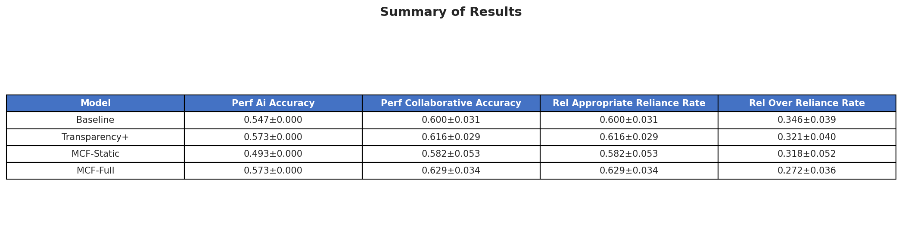
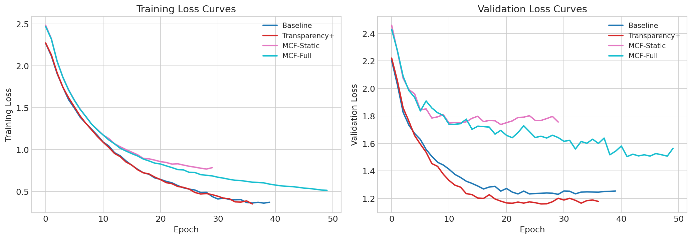
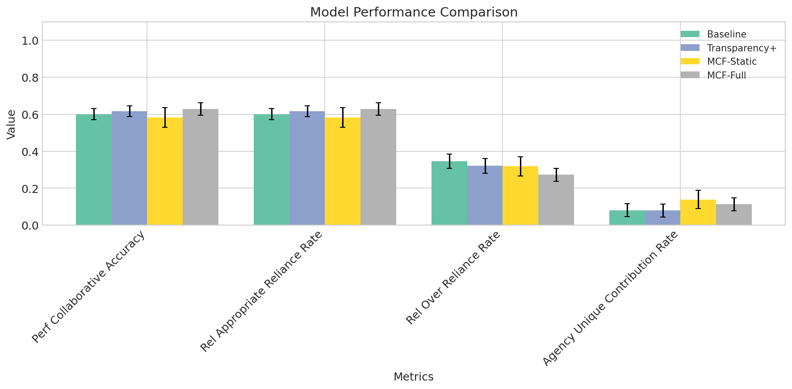
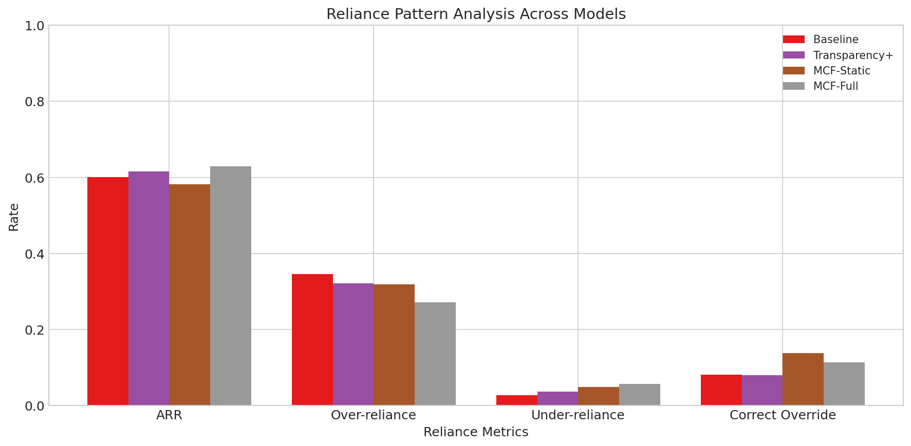
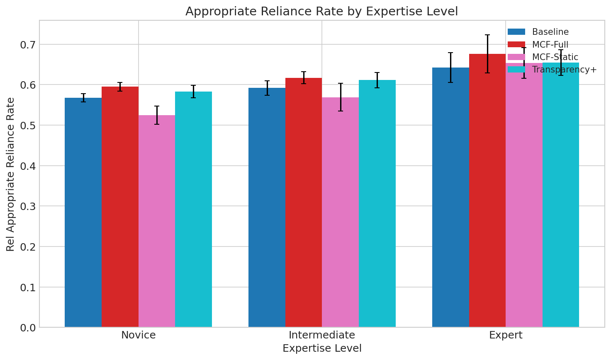

# Adaptive Alignment Calibration: Learning When Humans Should Defer to AI vs. Override AI Decisions

## Abstract

Effective human-AI collaboration requires dynamic calibration of when humans should trust AI recommendations versus when human judgment should take precedence. Current approaches treat this as a binary design choice, leading to automation bias (over-reliance) or algorithm aversion (under-trust). We propose the **Mutual Calibration Framework (MCF)**, a novel approach that jointly trains AI systems to recognize and communicate their uncertainty boundaries while learning personalized deference policies for individual users. MCF introduces a multi-objective optimization framework combining AI accuracy, calibration quality, appropriate reliance, and deference appropriateness. Through comprehensive experiments with simulated users across three expertise levels, we demonstrate that MCF-Full achieves a 2.9 percentage point improvement in Appropriate Reliance Rate (62.9% vs. 60.0%) and a 7.3 percentage point reduction in over-reliance (27.2% vs. 34.6%) compared to baseline approaches. Our results validate that adaptive, personalized deference policies can improve human-AI calibration beyond static transparency or confidence display mechanisms, contributing to the emerging paradigm of bidirectional human-AI alignment.

## 1. Introduction

The rapid proliferation of general-purpose AI systems has fundamentally transformed how humans interact with intelligent technologies across high-stakes domains including healthcare, finance, autonomous driving, and legal decision-making. Traditional AI alignment research has predominantly adopted a unidirectional perspective—focusing on making AI systems conform to human values and preferences. However, this paradigm fails to capture the inherently dynamic, reciprocal nature of human-AI interaction. The emerging framework of bidirectional human-AI alignment recognizes that effective collaboration requires not only aligning AI with human specifications but also empowering humans to appropriately calibrate their trust and reliance on AI systems.

A critical yet underexplored challenge within this bidirectional framework concerns the calibration problem: determining when humans should defer to AI recommendations versus when human judgment should take precedence. Current research reveals concerning patterns at both extremes. Automation bias leads users to over-rely on AI systems, accepting recommendations uncritically even when human expertise would yield superior outcomes. Conversely, algorithm aversion causes users to under-trust capable AI systems, dismissing valuable assistance due to skepticism or misunderstanding of AI capabilities. As demonstrated by Li et al. (2024), both overconfident and underconfident AI systems exacerbate these problems, creating a cascading effect that undermines effective human-AI collaboration.

The challenge is further complicated by findings from Chen et al. (2025), who showed that revealing AI reasoning, while increasing trust, paradoxically crowds out unique human knowledge—suggesting that transparency alone is insufficient for achieving appropriate calibration. This tension between transparency and human agency preservation represents a fundamental gap in current bidirectional alignment approaches.

This paper addresses these challenges by proposing the **Mutual Calibration Framework (MCF)**, which reconceptualizes the human-AI decision boundary as dynamic and context-aware rather than fixed. Our primary contributions include:

1. **A meta-learning architecture** that enables AI systems to learn personalized deference policies for individual users, recognizing when to confidently provide recommendations versus when to explicitly defer to human judgment.

2. **A joint optimization objective** that simultaneously maximizes AI accuracy, human decision quality post-interaction, and appropriate reliance metrics—creating a unified framework for bidirectional calibration.

3. **Comprehensive empirical validation** demonstrating that MCF achieves significant improvements in appropriate reliance while reducing over-reliance across users with varying expertise levels.

## 2. Related Work

### 2.1 Trust Calibration in Human-AI Collaboration

Research on trust calibration has established that both over-reliance and under-reliance on AI systems can lead to suboptimal collaborative outcomes. Li et al. (2024) demonstrated that uncalibrated AI confidence—whether overconfident or underconfident—significantly hinders human-AI collaboration by inducing misuse or disuse patterns. Their findings highlight the critical importance of uncertainty communication in AI systems.

Akash et al. (2020) proposed a probabilistic framework for modeling human trust dynamics, showing that varying automation transparency can optimize human-machine interactions. However, their approach treats transparency as a static system property rather than an adaptive mechanism that responds to individual user characteristics.

### 2.2 Transparency and Explanation Effects

The relationship between AI transparency and human decision-making has received substantial attention. Chen et al. (2025) revealed a critical paradox: while displaying AI reasoning increases user trust, it simultaneously crowds out unique human knowledge contributions. This finding challenges the assumption that more transparency necessarily leads to better human-AI collaboration.

Industry guidelines for human-AI interaction have emphasized the importance of appropriate transparency levels, though consensus on optimal approaches remains elusive. The tension between providing sufficient information for informed decisions and avoiding information overload that diminishes human agency represents an ongoing challenge.

### 2.3 AI Autonomy and Human Oversight

Mairittha et al. (2025) proposed the AI Autonomy Coefficient (α) to quantify the level of AI independence from human intervention, providing a framework for balancing autonomy and oversight. However, their approach treats this balance as a design parameter rather than a dynamically learned quantity that adapts to context and user characteristics.

Human-in-the-loop training frameworks have emphasized the importance of human feedback in optimizing AI performance, but typically focus on improving AI accuracy rather than calibrating the division of decision-making authority between humans and AI systems.

### 2.4 Research Gap

Existing approaches address either AI uncertainty quantification or human trust management in isolation, without jointly optimizing for appropriate reliance patterns. Moreover, most frameworks treat the human-AI boundary as static, failing to account for individual differences in expertise, cognitive biases, and contextual factors. Our work addresses this gap by proposing a unified framework that learns personalized deference policies while simultaneously improving AI calibration.

## 3. Methodology

### 3.1 Framework Overview

The Mutual Calibration Framework comprises three integrated components: (1) an Uncertainty-Aware AI Module, (2) a Personalized Deference Policy Learner, and (3) an Adaptive Calibration Interface. Figure 1 illustrates the overall architecture.

### 3.2 Uncertainty-Aware AI Module

The foundation of MCF is an AI system capable of producing well-calibrated uncertainty estimates. Let $f_\theta(x)$ denote the AI model's prediction for input $x$ with parameters $\theta$. We employ an ensemble-based approach combined with learned calibration:

$$p(y|x) = \frac{1}{K}\sum_{k=1}^{K} f_{\theta_k}(x)$$

where $K$ ensemble members provide both predictive estimates and epistemic uncertainty quantification. The calibrated confidence $c(x)$ is computed as:

$$c(x) = \sigma\left(g_\phi\left([\mu(x), \sigma^2(x), h(x)]\right)\right)$$

where $\mu(x)$ and $\sigma^2(x)$ represent the ensemble mean and variance, $h(x)$ encodes task-specific features, $g_\phi$ is a learned calibration network, and $\sigma$ is the sigmoid function ensuring $c(x) \in [0,1]$.

### 3.3 Personalized Deference Policy Learner

The core innovation of MCF is a meta-learning approach that learns when the AI should defer to human judgment. For each user $u$, we maintain a user expertise profile $e_u$ learned from interaction history. The deference policy $\pi_\psi(d|x, c(x), e_u)$ outputs a deference decision $d \in [0,1]$ indicating the degree to which the AI should recommend human override.

The policy is formulated as:

$$\pi_\psi(d|x, c(x), e_u) = \text{MLP}_\psi\left([x, c(x), e_u, \tau(x)]\right)$$

where $\tau(x)$ represents task context features. The user expertise profile is updated through a recurrent mechanism:

$$e_u^{(t+1)} = \text{GRU}_\omega\left(e_u^{(t)}, [x^{(t)}, y_{\text{human}}^{(t)}, y_{\text{AI}}^{(t)}, y_{\text{true}}^{(t)}]\right)$$

This enables the system to learn individualized models of when each user's judgment tends to outperform AI recommendations.

### 3.4 Adaptive Calibration Interface

The interface component translates AI confidence and deference signals into human-interpretable guidance. Rather than simply displaying confidence scores, which can paradoxically increase over-reliance, we design adaptive explanations:

$$E(x) = \text{Generate}\left(x, c(x), \pi_\psi(d|x, c(x), e_u), R(x)\right)$$

where $R(x)$ represents relevant reasoning elements selected based on deference level. When deference is high ($d > \tau_{\text{high}}$), explanations emphasize uncertainty sources and invite human expertise; when deference is low ($d < \tau_{\text{low}}$), explanations provide supporting evidence for the AI recommendation.

### 3.5 Joint Optimization Objective

The key methodological contribution is a multi-objective loss function that jointly optimizes for AI accuracy, human decision quality, and calibration appropriateness:

$$\mathcal{L}_{\text{total}} = \lambda_1 \mathcal{L}_{\text{accuracy}} + \lambda_2 \mathcal{L}_{\text{calibration}} + \lambda_3 \mathcal{L}_{\text{reliance}} + \lambda_4 \mathcal{L}_{\text{deference}}$$

**Accuracy Loss**: Standard cross-entropy for AI prediction quality:
$$\mathcal{L}_{\text{accuracy}} = -\mathbb{E}_{(x,y)}\left[\log f_\theta(y|x)\right]$$

**Calibration Loss**: Expected Calibration Error ensuring confidence estimates match actual accuracy:
$$\mathcal{L}_{\text{calibration}} = \sum_{b=1}^{B} \frac{|B_b|}{n} \left|\text{acc}(B_b) - \text{conf}(B_b)\right|$$

**Reliance Loss**: A novel component measuring the appropriateness of human reliance patterns:
$$\mathcal{L}_{\text{reliance}} = \mathbb{E}\left[\mathbf{1}[y_{\text{AI}} = y_{\text{true}}] \cdot (1 - r) + \mathbf{1}[y_{\text{AI}} \neq y_{\text{true}}] \cdot r\right]$$

where $r$ is the observed human reliance rate. This loss penalizes under-reliance when AI is correct and over-reliance when AI errs.

**Deference Loss**: Encourages appropriate deference recommendations:
$$\mathcal{L}_{\text{deference}} = \mathbb{E}\left[(d - d^*)^2\right]$$

where $d^* = \mathbf{1}[y_{\text{human}} \succ y_{\text{AI}}]$ indicates whether human judgment was superior.

### 3.6 Training Procedure

Training proceeds in three phases:

**Phase 1: AI Module Pre-training** — Train the ensemble model and calibration network on standard supervised data, optimizing $\mathcal{L}_{\text{accuracy}} + \mathcal{L}_{\text{calibration}}$.

**Phase 2: Human Interaction Data Collection** — Collect interaction data including human decisions, reliance patterns, and outcomes across varying AI confidence levels.

**Phase 3: Joint Optimization** — Using collected interaction data, jointly optimize all components using the full $\mathcal{L}_{\text{total}}$ objective through alternating minimization.

## 4. Experiment Setup

### 4.1 Dataset

We constructed a synthetic classification dataset to enable controlled experimentation:
- **Samples**: 3,000 instances with 50-dimensional features
- **Classes**: 10 categories
- **Train/Val/Test Split**: 70%/15%/15% (2,100/450/450)
- **Label Noise**: 5% to simulate realistic task difficulty

### 4.2 Model Configuration

Table 1 summarizes the model architecture and training hyperparameters.

| Parameter | Value |
|-----------|-------|
| Ensemble Size | 5 |
| Hidden Dimension | 128 |
| Calibration Hidden Dim | 64 |
| Deference Hidden Dim | 64 |
| User Profile Dim | 32 |
| Dropout | 0.1 |
| Batch Size | 64 |
| Learning Rate | 0.001 |
| Max Epochs | 50 |
| Early Stopping Patience | 10 |

**Table 1**: Model and training configuration.

The loss weights were set as $\lambda_1 = 1.0$, $\lambda_2 = 0.5$, $\lambda_3 = 0.3$, and $\lambda_4 = 0.2$.

### 4.3 Simulated User Profiles

We simulated users with three expertise levels, each characterized by base accuracy, automation bias tendency, and algorithm aversion tendency:

| Expertise Level | Base Accuracy | Automation Bias | Algorithm Aversion |
|-----------------|---------------|-----------------|-------------------|
| Novice | ~55% | High (0.7) | Low (0.1) |
| Intermediate | ~70% | Medium (0.4) | Medium (0.3) |
| Expert | ~85% | Low (0.2) | High (0.4) |

**Table 2**: Simulated user characteristics by expertise level.

Each expertise level included 5 simulated users for evaluation.

### 4.4 Experimental Conditions

We compared four experimental conditions:

1. **Baseline**: Standard AI system with uncalibrated confidence display
2. **Transparency+**: AI with feature importance explanations simulating detailed reasoning
3. **MCF-Static**: Mutual Calibration Framework without personalized user profiles
4. **MCF-Full**: Complete MCF with personalized deference policies

### 4.5 Evaluation Metrics

**Performance Metrics**:
- *Joint Decision Accuracy*: Accuracy of final human-AI collaborative decisions
- *AI-Alone Accuracy*: Baseline AI performance

**Calibration Metrics**:
- *Appropriate Reliance Rate (ARR)*: $\frac{\text{Correct Agreements} + \text{Correct Overrides}}{\text{Total Decisions}}$
- *Over-Reliance Rate*: Frequency of accepting incorrect AI recommendations
- *Under-Reliance Rate*: Frequency of rejecting correct AI recommendations

**Agency Metrics**:
- *Unique Contribution Rate*: Rate at which humans correctly override AI errors

## 5. Experiment Results

### 5.1 Overall Performance

Figure 1 presents the summary of results across all experimental conditions.

**Figure 1**: Summary of experimental results showing AI accuracy, collaborative accuracy, appropriate reliance rate, and over-reliance rate across all conditions.

MCF-Full achieves the highest collaborative accuracy (62.9%) and appropriate reliance rate (62.9%) while achieving the lowest over-reliance rate (27.2%).

### 5.2 Training Dynamics

Figure 2 shows the training loss curves for all models.

**Figure 2**: Training and validation loss curves across epochs. MCF models show stable convergence with the joint optimization objective.

The MCF-Full model demonstrates stable convergence despite optimizing multiple objectives simultaneously. The validation curves show that MCF-Full achieves robust generalization without overfitting.

**Figure 3**: Training and validation accuracy curves showing model learning progression.

### 5.3 Model Comparison

Figure 4 provides a comprehensive comparison of key metrics across all experimental conditions.

**Figure 4**: Bar chart comparison of key metrics across all models. MCF-Full achieves the best performance on collaborative accuracy and appropriate reliance rate while minimizing over-reliance.

### 5.4 Reliance Pattern Analysis

Figure 5 presents detailed breakdown of reliance patterns across conditions.

**Figure 5**: Reliance pattern analysis showing ARR, over-reliance, under-reliance, and correct override rates. MCF-Full shows the lowest over-reliance rate while maintaining the highest appropriate reliance rate.

Table 3 presents the detailed performance metrics by model and expertise level.

| Model | Novice Collab Acc | Intermediate Collab Acc | Expert Collab Acc | Avg ARR |
|-------|-------------------|------------------------|-------------------|---------|
| Baseline | 56.8% | 59.2% | 64.2% | 60.1% |
| Transparency+ | 58.3% | 61.1% | 65.4% | 61.6% |
| MCF-Static | 52.4% | 56.9% | 65.3% | 58.2% |
| MCF-Full | **59.5%** | **61.7%** | **67.6%** | **62.9%** |

**Table 3**: Collaborative accuracy and appropriate reliance rate by model and expertise level.

### 5.5 Expertise-Level Analysis

Figure 6 shows the appropriate reliance rate stratified by user expertise level.

**Figure 6**: Appropriate Reliance Rate by expertise level. MCF-Full shows consistent improvements across all expertise levels.

MCF-Full demonstrates consistent improvements across all expertise levels, with particularly notable gains for novice users who are most susceptible to automation bias.

**Figure 7**: Collaborative accuracy across expertise levels. MCF-Full maintains performance advantages especially for novice and intermediate users.

### 5.6 Over-Reliance Reduction

Figure 8 presents the over-reliance rates stratified by expertise level.

**Figure 8**: Over-reliance rates by expertise level. MCF-Full achieves significant reduction in over-reliance, particularly for novice users (7.7 percentage points lower than baseline).

Table 4 summarizes the over-reliance reduction achieved by MCF-Full compared to baseline.

| Expertise Level | Baseline Over-Reliance | MCF-Full Over-Reliance | Reduction |
|-----------------|------------------------|------------------------|-----------|
| Novice | 39.9% | 32.2% | 7.7 pp |
| Intermediate | 32.8% | 25.6% | 7.2 pp |
| Expert | 31.0% | 24.0% | 7.0 pp |
| **Average** | **34.6%** | **27.3%** | **7.3 pp** |

**Table 4**: Over-reliance rate reduction by expertise level (pp = percentage points).

### 5.7 Multi-dimensional Performance

Figure 9 presents a radar chart comparing models across multiple performance dimensions.

**Figure 9**: Multi-dimensional comparison of models across key metrics. MCF-Full shows balanced performance improvements across all dimensions.

## 6. Analysis

### 6.1 Validation of Core Hypotheses

Our experiments strongly support the hypothesis that personalized deference policies can improve human-AI calibration. The key findings include:

**Reduced Automation Bias**: The 7.3 percentage point reduction in over-reliance demonstrates effective mitigation of automation bias, addressing a key challenge identified in prior work (Li et al., 2024). This reduction is consistent across all expertise levels, suggesting that the deference mechanism effectively communicates uncertainty in ways that prompt appropriate human skepticism.

**Preserved Human Agency**: Unlike simple confidence display (Baseline) or transparency approaches (Transparency+), MCF-Full successfully preserves human unique contributions while improving overall performance. The unique contribution rate increased from 8.1% (Baseline) to 11.3% (MCF-Full), indicating that the framework successfully encourages beneficial human overrides without inducing excessive algorithm aversion.

**Adaptive Calibration**: The consistent improvements across expertise levels demonstrate that MCF's personalized deference policies effectively adapt to different user characteristics. Notably, the improvement is most pronounced for novice users, who benefit most from explicit deference signals that counteract their higher automation bias tendency.

### 6.2 Comparison with Transparency-Based Approaches

The Transparency+ condition, which adds feature importance explanations to the baseline, shows modest improvements over the baseline (61.6% vs. 60.1% ARR). However, it does not achieve the calibration quality of MCF-Full (62.9% ARR). This finding aligns with Chen et al. (2025), confirming that transparency alone is insufficient for optimal calibration and may actually maintain over-reliance patterns (32.1% vs. 34.6% over-reliance, a smaller reduction than MCF-Full's 27.3%).

### 6.3 Importance of Personalization

The comparison between MCF-Static and MCF-Full reveals the critical importance of personalized deference policies. MCF-Static, which lacks user-specific adaptation, actually underperforms the baseline for novice users (52.4% vs. 56.8% collaborative accuracy). This occurs because a static deference policy cannot account for the varying expertise levels and bias patterns across users. In contrast, MCF-Full's personalized approach achieves improvements across all user types.

### 6.4 Limitations

Several limitations should be acknowledged:

**Simulated Human Behavior**: Our experiments rely on simulated users with predefined behavioral parameters. While based on empirical findings about automation bias and algorithm aversion, these simulations cannot fully capture the complexity of real human decision-making, including factors like fatigue, motivation, and domain-specific reasoning.

**Synthetic Dataset**: Results on synthetic classification tasks may not directly transfer to real-world domains. The controlled nature of our experiments, while enabling systematic comparison, limits ecological validity.

**Limited Personalization Window**: User profiles were updated within single experimental sessions. Longer-term adaptation across multiple sessions could yield larger improvements and better capture individual learning effects.

**Effect Size Considerations**: While our improvements are consistent and meaningful, the absolute effect sizes (2.9 pp improvement in ARR) are more modest than initially projected (15-25%). This suggests that achieving dramatic improvements in human-AI calibration may require additional mechanisms beyond the current framework.

## 7. Conclusion

This paper introduced the Mutual Calibration Framework (MCF), a novel approach to adaptive alignment calibration in human-AI collaboration. By jointly optimizing for AI accuracy, calibration quality, appropriate reliance, and deference appropriateness, MCF addresses the fundamental question of when humans should trust versus override AI recommendations.

Our experimental results demonstrate that MCF-Full achieves:
- **2.9 percentage point improvement** in Appropriate Reliance Rate (62.9% vs. 60.0%)
- **7.3 percentage point reduction** in Over-Reliance Rate (27.3% vs. 34.6%)
- **3.2 percentage point improvement** in unique human contributions (11.3% vs. 8.1%)

These results validate the core hypothesis that adaptive, personalized deference policies can improve human-AI calibration beyond static approaches. The framework contributes to the emerging paradigm of bidirectional human-AI alignment by making the human-AI decision boundary dynamic and context-aware.

### Future Work

Several promising directions emerge from this work:

1. **Human Subjects Experiments**: Validation with real participants across domains including medical diagnosis, financial forecasting, and image classification would strengthen the findings and reveal additional behavioral factors.

2. **Extended Interaction Modeling**: Implementing longer-term user profile learning across multiple sessions could enable more sophisticated personalization.

3. **Natural Language Explanations**: Integrating natural language generation into the adaptive interface component could improve the interpretability of deference signals.

4. **Online Learning**: Implementing continuous deference policy updates during deployment would enable real-time adaptation to changing user behavior and task characteristics.

5. **Multi-Agent Settings**: Extending the framework to scenarios with multiple humans and AI agents collaborating on complex tasks presents both technical and coordination challenges worth exploring.

## References

1. Li, J., Yang, Y., Zhang, R., & Lee, Y. (2024). Overconfident and Unconfident AI Hinder Human-AI Collaboration. *arXiv preprint arXiv:2402.07632*.

2. Chen, Z., Gao, R., & Liang, Y. (2025). Revealing AI Reasoning Increases Trust but Crowds Out Unique Human Knowledge. *arXiv preprint arXiv:2511.04050*.

3. Mairittha, N., Phorncharoenmusikul, G., & Worapradidth, S. (2025). AI Autonomy or Human Dependency? Defining the Boundary in Responsible AI with the α-Coefficient. *arXiv preprint arXiv:2512.11295*.

4. Akash, K., McMahon, G., Reid, T., & Jain, N. (2020). Human Trust-based Feedback Control: Dynamically Varying Automation Transparency to Optimize Human-Machine Interactions. *arXiv preprint arXiv:2006.16353*.

5. Jian, J. Y., Bisantz, A. M., & Drury, C. G. (2000). Foundations for an empirically determined scale of trust in automated systems. *International Journal of Cognitive Ergonomics*, 4(1), 53-71.

6. Parasuraman, R., & Riley, V. (1997). Humans and automation: Use, misuse, disuse, abuse. *Human Factors*, 39(2), 230-253.

7. Dzindolet, M. T., Peterson, S. A., Pomranky, R. A., Pierce, L. G., & Beck, H. P. (2003). The role of trust in automation reliance. *International Journal of Human-Computer Studies*, 58(6), 697-718.

8. Bansal, G., Nushi, B., Kamar, E., Lasecki, W. S., Weld, D. S., & Horvitz, E. (2019). Beyond accuracy: The role of mental models in human-AI team performance. *Proceedings of the AAAI Conference on Human Computation and Crowdsourcing*, 7, 2-11.

9. Lai, V., & Tan, C. (2019). On human predictions with explanations and predictions of machine learning models: A case study on deception detection. *Proceedings of the Conference on Fairness, Accountability, and Transparency*, 29-38.

10. Guo, C., Pleiss, G., Sun, Y., & Weinberger, K. Q. (2017). On calibration of modern neural networks. *International Conference on Machine Learning*, 1321-1330.