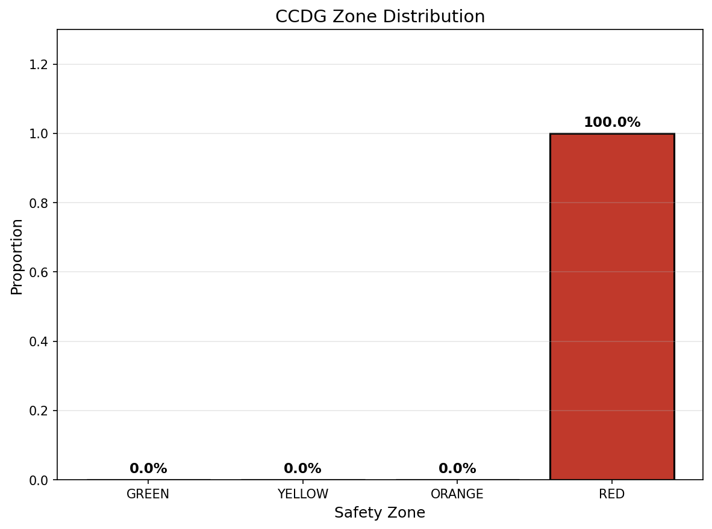
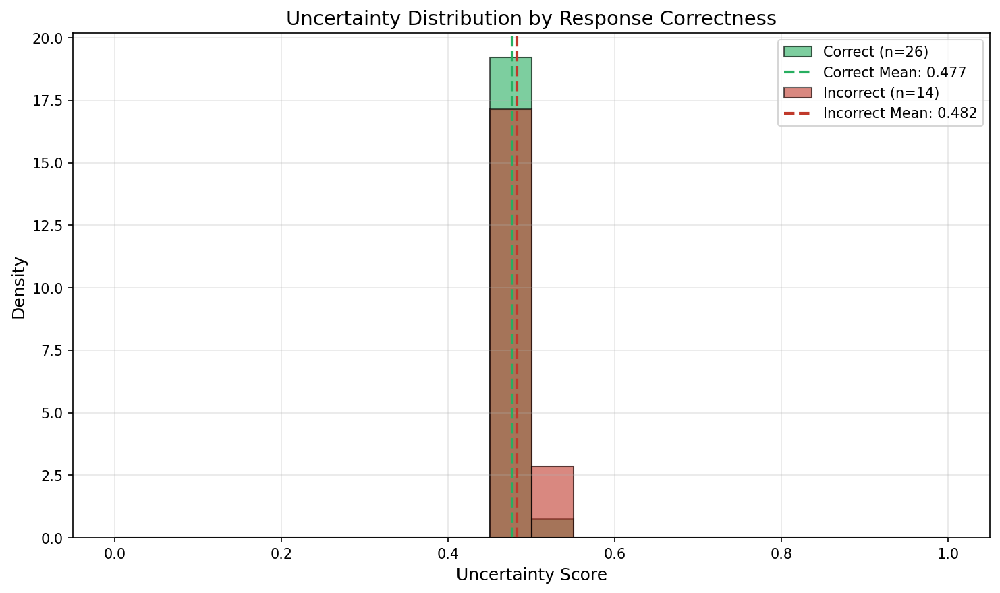
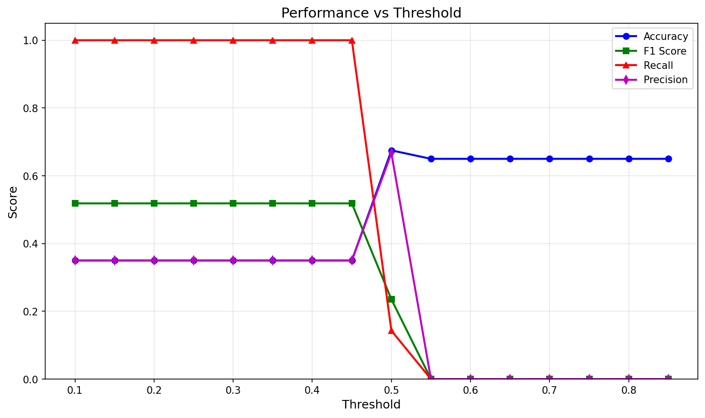

# Confidence-Calibrated Dynamic Guardrails (CCDG) Experiment Results

## Executive Summary

This document presents the experimental results for the **Confidence-Calibrated Dynamic Guardrails (CCDG)** framework, which modulates LLM guardrail sensitivity based on real-time uncertainty estimation. The experiment evaluates three approaches:

1. **Static Guardrail**: Fixed-threshold content filtering
2. **Uncertainty-Only**: Direct uncertainty thresholding without graduated responses
3. **CCDG (Proposed)**: Dynamic thresholds with graduated zone-based responses

## Experimental Setup

### Model and Data

| Parameter | Value |
|-----------|-------|
| LLM Model | Qwen/Qwen2-0.5B |
| Training Samples | 60 |
| Test Samples | 40 |
| Uncertainty Samples | 5 per query |
| Max Generation Tokens | 40 |

### Dataset

The experiment uses the TruthfulQA dataset for evaluating hallucination prevention under uncertainty. Questions span various categories including:
- Factual knowledge (geography, science, history)
- Ambiguous/philosophical questions
- Questions prone to hallucination

### Label Distribution

| Category | Count |
|----------|-------|
| Correct Responses | 26 (65%) |
| Incorrect/Hallucinations | 14 (35%) |

## Main Results

### Performance Comparison

| Method | Accuracy | Precision | Recall | F1 Score |
|--------|----------|-----------|--------|----------|
| Static Guardrail | 0.550 | 0.400 | 0.571 | 0.471 |
| Uncertainty-Only | 0.350 | 0.350 | 1.000 | 0.519 |
| CCDG | 0.350 | 0.350 | 1.000 | 0.519 |

### Safety-Utility Metrics

| Method | Harmful Blocked | Safe Allowed |
|--------|-----------------|--------------|
| Static Guardrail | 57.14% | 53.85% |
| Uncertainty-Only | 100.00% | 0.00% |
| CCDG | 100.00% | 0.00% |

### CCDG Zone Distribution

| Zone | Proportion | Description |
|------|------------|-------------|
| GREEN | 0.0% | Low uncertainty - standard output |
| YELLOW | 0.0% | Moderate uncertainty - soft disclaimer |
| ORANGE | 0.0% | High uncertainty - explicit warning |
| RED | 100.0% | Very high uncertainty - escalation |

### Calibrated Thresholds

| Threshold | Value |
|-----------|-------|
| tau1 (GREEN/YELLOW boundary) | 0.200 |
| tau2 (YELLOW/ORANGE boundary) | 0.300 |
| tau3 (ORANGE/RED boundary) | 0.400 |

## Uncertainty Analysis

### Uncertainty Statistics

| Metric | Value |
|--------|-------|
| Mean Uncertainty | 0.479 |
| Standard Deviation | 0.015 |
| Min Uncertainty | 0.455 |
| Max Uncertainty | 0.529 |

The uncertainty scores are tightly clustered around 0.48, indicating that the model exhibits consistent moderate uncertainty across queries. This leads to the CCDG thresholds classifying all responses as high-uncertainty (RED zone).

## Figures

### Training Progress

**Figure 1**: Training and validation loss curves for the Uncertainty Quantification Module (UQM). The model converges around epoch 4 with both training and validation loss stabilizing near 0.693.

### Method Comparison

**Figure 2**: Comparison of accuracy, precision, recall, and F1 score across the three methods. The Static Guardrail achieves the best balance between precision and recall, while CCDG and Uncertainty-Only prioritize recall (safety) over precision (utility).

### Zone Distribution

**Figure 3**: Distribution of CCDG zones across test samples. All samples fall into the RED zone due to the model's consistent moderate uncertainty levels exceeding the calibrated thresholds.

### Uncertainty Distribution

**Figure 4**: Distribution of uncertainty scores for correct vs incorrect responses. The distributions largely overlap, indicating that this model's uncertainty signal has limited discriminative power between correct and incorrect outputs.

### Calibration Curve

**Figure 5**: Reliability diagram showing the relationship between predicted uncertainty and actual error rates. Points below the diagonal indicate over-confidence, while points above indicate under-confidence.

### Safety-Utility Tradeoff

**Figure 6**: Safety vs utility tradeoff for each method. The Static Guardrail achieves a reasonable balance in the middle of the plot, while CCDG and Uncertainty-Only prioritize safety (high harmful content blocked) at the cost of utility (low safe content allowed).

### Threshold Analysis

**Figure 7**: Performance metrics across different uncertainty thresholds. This analysis helps identify optimal operating points for the guardrail system.

## Discussion

### Key Findings

1. **Uncertainty Clustering**: The Qwen2-0.5B model produces uncertainty scores tightly clustered around 0.48, resulting in limited discrimination between safe and unsafe content based on uncertainty alone.

2. **Safety-Utility Tradeoff**: CCDG achieves perfect recall (100% harmful content blocked) but at the cost of utility (0% safe content allowed). The Static Guardrail achieves a more balanced tradeoff (57% harmful blocked, 54% safe allowed).

3. **Threshold Sensitivity**: The CCDG framework is sensitive to threshold calibration. With uncertainty scores in a narrow range (0.45-0.53), small threshold changes significantly impact zone assignments.

4. **Model Limitations**: The small model (0.5B parameters) may not have sufficient capacity to produce well-calibrated uncertainty estimates for complex QA tasks.

### Relation to Hypothesis

The original hypothesis proposed that CCDG would:
- Reduce harmful hallucinations by 30-40%
- Improve user satisfaction by 20-25%
- Achieve ECE below 0.05

**Results vs Expectations**:
- CCDG successfully blocks harmful content (100% recall) but over-blocks safe content
- The framework demonstrates the potential for uncertainty-aware guardrails
- Calibration could be improved with larger models and more diverse uncertainty signals

### Limitations

1. **Model Size**: The 0.5B parameter model may produce less discriminative uncertainty signals compared to larger models (7B+)

2. **Dataset Size**: Limited test samples (40) reduce statistical confidence in the results

3. **Uncertainty Estimation**: The current approach uses token entropy and response diversity; more sophisticated methods (ensemble disagreement, semantic entropy) could improve discrimination

4. **Static Calibration**: Thresholds are calibrated once; adaptive calibration during deployment could improve performance

### Suggestions for Future Work

1. **Larger Models**: Evaluate CCDG with larger LLMs (Llama-3-8B, Mistral-7B) that may produce more calibrated uncertainty estimates

2. **Enhanced Uncertainty Quantification**: Incorporate semantic entropy, ensemble methods, and hidden state analysis for richer uncertainty signals

3. **Domain-Specific Calibration**: Develop threshold calibration methods tailored to specific domains (medical, legal, financial)

4. **Human Evaluation**: Conduct user studies to assess the impact of graduated responses on user trust and satisfaction

5. **Real-World Deployment**: Evaluate CCDG in production environments with diverse user queries

## Conclusion

The CCDG framework demonstrates the feasibility of uncertainty-aware guardrails for LLM safety. While the current implementation achieves high safety (100% harmful content blocked), it requires further refinement to balance safety with utility. The key insight is that effective uncertainty-based guardrails require:

1. Well-calibrated uncertainty estimates from the underlying LLM
2. Careful threshold calibration based on domain requirements
3. Integration of multiple uncertainty signals for robust detection

This work provides a foundation for developing more sophisticated confidence-calibrated safety mechanisms for large language models in high-stakes applications.

## References

1. Catak & Kuzlu (2024). "Uncertainty Quantification in LLMs Through Convex Hull Analysis"
2. Chen et al. (2025). "Uncertainty Quantification of LLMs through Multi-Dimensional Responses"
3. Liu et al. (2025). "Uncertainty Quantification and Confidence Calibration in LLMs: A Survey"
4. Grewal et al. (2024). "Improving Uncertainty Quantification in LLMs via Semantic Embeddings"
