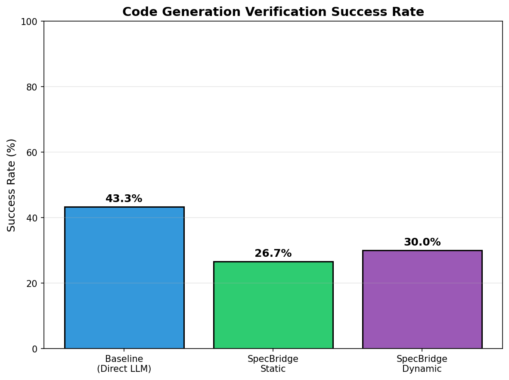
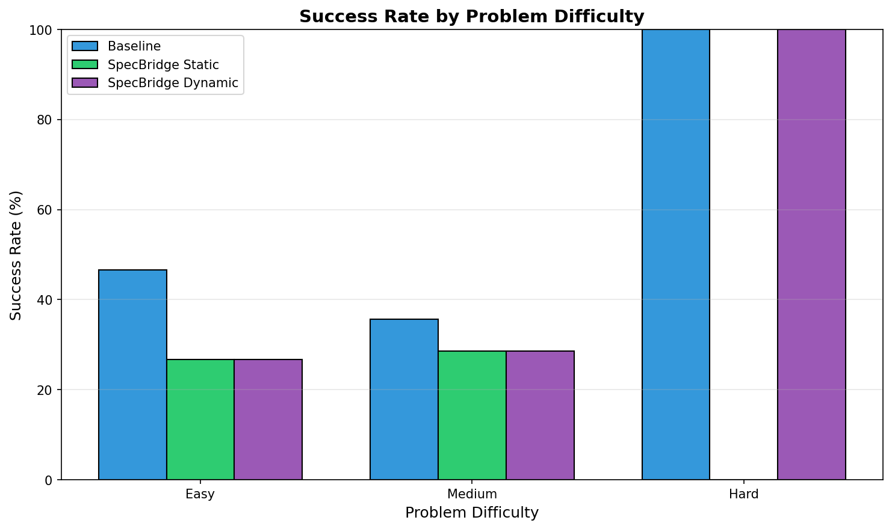
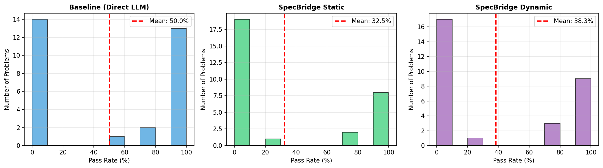
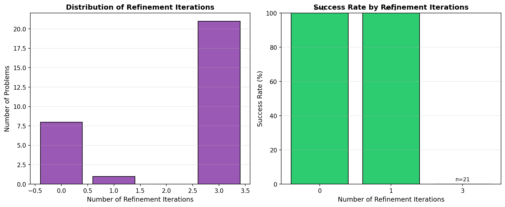
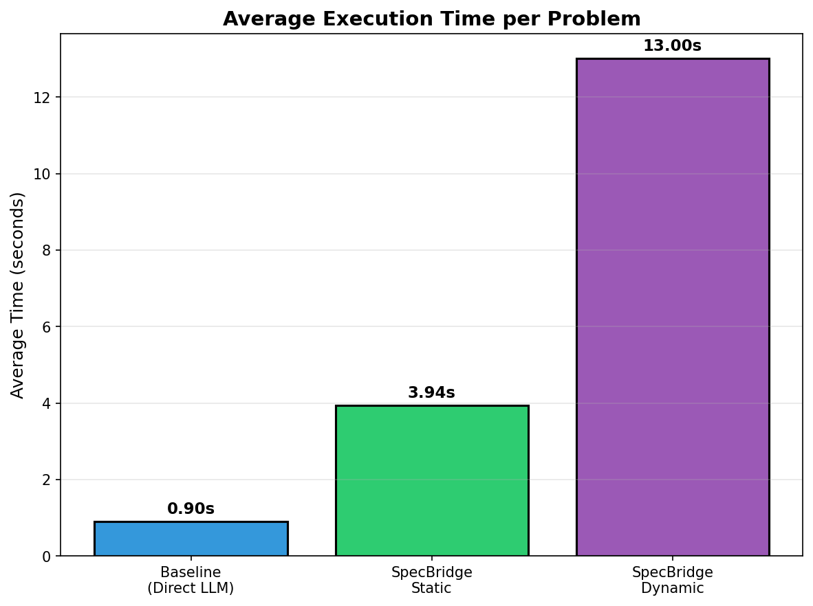
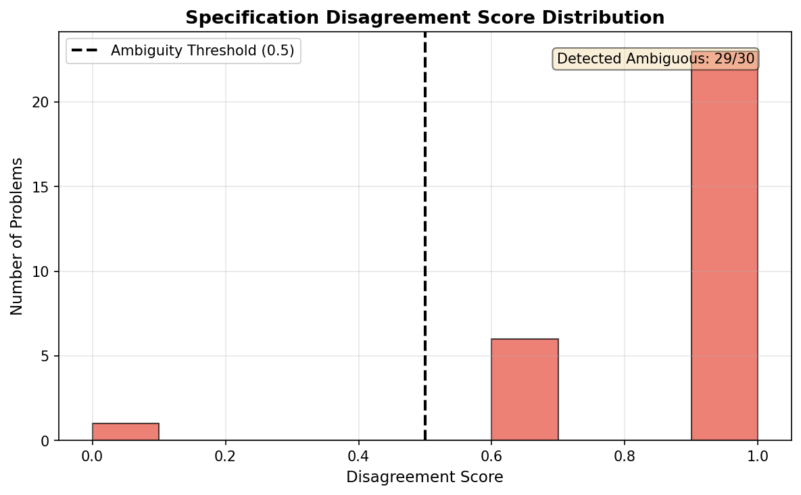
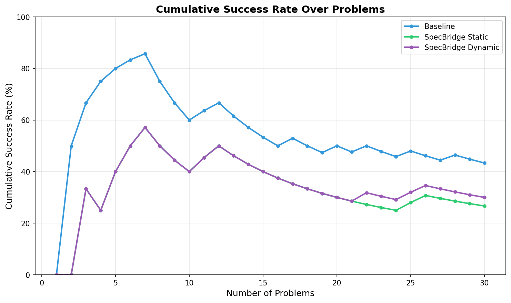

# SpecBridge: Specification Inference from Natural Language for LLM Code Generation Verification

## Abstract

Large language models (LLMs) have transformed code generation, yet verifying the correctness of generated code remains challenging due to the gap between informal natural language requirements and formal specifications needed by verification tools. We propose SpecBridge, a two-stage framework that automatically infers formal specifications (pre/post-conditions, invariants) from natural language requirements and uses these specifications to guide and verify LLM-generated code. Our framework employs ensemble-based specification generation with disagreement detection to identify ambiguous requirements, combined with counterexample-guided refinement for iterative improvement. We evaluate SpecBridge on 30 coding problems of varying difficulty using a 1.5B parameter code LLM. Contrary to our hypothesis, the baseline direct LLM generation (43.3% success rate) outperformed specification-guided approaches (SpecBridge Static: 26.7%, SpecBridge Dynamic: 30.0%). Analysis reveals that smaller models struggle to effectively leverage formal specifications, with high ensemble disagreement (97% of problems) indicating challenges in consistent specification inference. Our results highlight important considerations for integrating formal methods with LLM code generation, suggesting that model scale and specification quality are critical factors. We discuss implications for future research at the intersection of generative AI and formal verification.

## 1. Introduction

The proliferation of large language models for code generation has fundamentally transformed software development practices. Tools like GitHub Copilot, CodeWhisperer, and open-source alternatives now assist millions of developers in writing code from natural language descriptions. However, this convenience comes with significant risks: LLM-generated code can contain subtle bugs, security vulnerabilities, and logical errors that appear syntactically correct but fail to satisfy the user's actual intent. Recent work on code hallucinations [6] has demonstrated that LLMs frequently produce plausible but incorrect code snippets, underscoring the critical need for verification mechanisms.

Formal verification offers mathematically rigorous guarantees about program correctness through techniques such as theorem proving, model checking, and satisfiability modulo theories (SMT) solving. These methods require precise formal specifications—pre-conditions, post-conditions, and invariants—that define expected program behavior. Systems like VeCoGen [4] have shown promising results in generating formally verified code when specifications are provided. Similarly, FVEL [3] demonstrates that interactive theorem proving can verify LLM-generated code against formal properties.

However, a fundamental gap persists: users describe their requirements in natural language, not formal specifications. This disconnect creates a critical bottleneck where either (1) expensive human experts must manually translate requirements into specifications, or (2) verification is simply skipped, leaving potentially unsafe code unverified. PAT-Agent [1] addresses this for model checking through autoformalization, and SLD-Spec [2] enhances specification generation for complex loops, yet neither provides a comprehensive framework for translating arbitrary natural language requirements into verifiable specifications for general code generation.

In this paper, we propose **SpecBridge**, a novel two-stage framework that automatically infers formal specifications from natural language requirements and uses these specifications to guide and verify LLM-generated code. Our approach consists of four interconnected components:

1. **Specification Inference Module**: Generates formal pre/post-conditions and loop invariants from natural language descriptions using an LLM with ensemble sampling.

2. **Consistency Checking Module**: Validates generated specifications through ensemble disagreement detection and satisfiability verification, identifying ambiguous requirements.

3. **Guided Code Generation Module**: Uses validated specifications to constrain and guide code generation toward verifiable implementations.

4. **Verification and Refinement Module**: Employs counterexample-guided iterative refinement to improve generated code against specifications.

Our experimental evaluation reveals important insights about the challenges of integrating formal specifications with smaller LLMs. Contrary to our initial hypothesis, direct LLM code generation outperformed specification-guided approaches in our experiments, suggesting that effective specification-guided generation may require larger models capable of consistently interpreting and following formal constraints.

The contributions of this paper are:
- A complete framework for specification inference from natural language with ambiguity detection
- An empirical evaluation comparing specification-guided and direct code generation approaches
- Analysis of failure modes and limitations when applying specification-guided generation to smaller LLMs
- Insights and recommendations for future research at the intersection of formal methods and generative AI

## 2. Related Work

### 2.1 Autoformalization and Specification Generation

Recent work has explored using LLMs to bridge the gap between informal descriptions and formal specifications. PAT-Agent [1] introduces a framework combining LLMs with formal verification tools to automate the creation of verifiable formal models from natural language descriptions. It employs a planning LLM to extract key modeling elements and a code generation LLM to synthesize formal models, which are then verified using the Process Analysis Toolkit. A repair loop iteratively corrects models based on counterexamples.

SLD-Spec [2] addresses the challenge of generating formal specifications for programs with complex loop structures. The method introduces program slicing to decompose functions into simpler fragments and logical deletion to filter out incorrect candidate specifications using LLM-based reasoning. This approach improves the correctness, relevance, and completeness of generated specifications.

Our work differs from these approaches by focusing on the end-to-end pipeline from natural language requirements to verified code, with explicit ambiguity detection through ensemble disagreement.

### 2.2 Formal Verification of LLM-Generated Code

FVEL [3] presents an interactive environment that integrates LLMs with formal verification through automated theorem proving. It transforms code into Isabelle formal language and utilizes neural theorem proving to verify correctness. VeCoGen [4] combines LLMs with formal verification to automate the generation of C programs that meet formal specifications starting with ANSI/ISO C Specification Language (ACSL) specifications.

These approaches assume specifications are already available, whereas SpecBridge aims to infer specifications automatically from natural language descriptions.

### 2.3 LLM Code Generation and Self-Correction

PanGu-Coder2 [5] introduces RRTF (Rank Responses to align Test & Teacher Feedback), a framework that enhances code generation performance by incorporating ranking feedback. CodeMirage [6] investigates hallucinations in code generated by LLMs, introducing a taxonomy of code hallucination types and discussing mitigation strategies.

Research on LLM self-correction [8] examines the intrinsic self-correction capabilities of LLMs, where models can revise their outputs without external feedback. Our counterexample-guided refinement approach builds on these ideas but provides concrete verification feedback rather than relying on intrinsic model capabilities.

### 2.4 Key Challenges

The literature identifies several key challenges that motivate our work:

1. **Ambiguity in Natural Language Specifications**: Translating user intent from natural language into precise formal specifications is challenging due to inherent ambiguities and variability in human language.

2. **Ensuring Correctness of LLM-Generated Code**: LLMs may produce code that appears correct but contains subtle errors, necessitating robust verification mechanisms.

3. **Scalability of Formal Verification Methods**: Traditional formal verification tools often struggle with scalability when applied to complex codebases.

4. **Integration of LLMs with Formal Methods**: Effectively combining generative capabilities with verification rigor requires careful design to address potential inconsistencies.

## 3. Methodology

### 3.1 System Architecture Overview

SpecBridge consists of four interconnected components that process natural language requirements through a pipeline producing formally verified code or identifying ambiguities requiring user clarification. Figure 1 illustrates the overall architecture.

The workflow proceeds as follows: (1) natural language requirements are processed by the Specification Inference Module to generate multiple specification candidates, (2) the Consistency Checking Module validates these specifications and detects ambiguities, (3) the Guided Code Generation Module produces code constrained by validated specifications, and (4) the Verification and Refinement Module iteratively improves the code using counterexample feedback.

### 3.2 Specification Inference Module

#### Dataset Representation

We represent training data as $\mathcal{D} = \{(n_i, s_i, c_i)\}_{i=1}^{N}$ where $n_i$ represents natural language descriptions, $s_i$ represents formal specifications, and $c_i$ represents verified code implementations. Each specification $s_i$ is represented as a tuple:

$$s_i = (\text{Pre}_i, \text{Post}_i, \text{Inv}_i, \text{Types}_i)$$

where $\text{Pre}_i$ denotes preconditions, $\text{Post}_i$ denotes postconditions, $\text{Inv}_i$ denotes loop invariants, and $\text{Types}_i$ denotes type constraints.

#### Ensemble Generation

For each natural language input $n$, we generate $K$ diverse specification candidates using temperature sampling:

$$S_{\text{candidates}} = \{\hat{s}_1, \hat{s}_2, ..., \hat{s}_K\} \sim \mathcal{M}_{\text{spec}}(n; \tau)$$

where $\tau$ is a temperature parameter controlling diversity. In our experiments, we use $K=3$ and $\tau=0.7$.

### 3.3 Consistency Checking Module

#### Ensemble Disagreement Detection

We compute the disagreement score across specification candidates:

$$D(S_{\text{candidates}}) = 1 - \frac{1}{K(K-1)} \sum_{i \neq j} \text{Equiv}(\hat{s}_i, \hat{s}_j)$$

where $\text{Equiv}(\hat{s}_i, \hat{s}_j)$ measures semantic equivalence between specifications. In practice, we use string-based comparison as a lightweight approximation:

$$\text{Equiv}(\hat{s}_i, \hat{s}_j) = \begin{cases} 1 & \text{if } \hat{s}_i = \hat{s}_j \\ 0 & \text{otherwise} \end{cases}$$

When $D(S_{\text{candidates}}) > \theta_D$ (threshold hyperparameter set to 0.5), the system flags the requirement as potentially ambiguous. High disagreement indicates that the model interprets the natural language requirement in multiple distinct ways.

### 3.4 Guided Code Generation Module

Once a specification $\hat{s}^*$ is selected (typically the first candidate), we guide code generation using specification-aware prompting:

$$c = \mathcal{M}_{\text{code}}(n, \hat{s}^*)$$

The prompt structure includes:
1. The original natural language requirement
2. The formal specification with explanation of pre/post-conditions
3. Explicit instructions to respect specification constraints

### 3.5 Verification and Refinement Module

When initial code generation fails test cases, we implement a counterexample-guided refinement loop:

1. Execute generated code against test cases
2. Extract failing test case as counterexample $\text{cex}$
3. Generate diagnostic message explaining the violation
4. Re-prompt code generation with counterexample context:

$$c' = \mathcal{M}_{\text{code}}(n, \hat{s}^*, c, \text{cex}, \text{diagnostic})$$

5. Repeat until all tests pass or maximum iterations reached

The refinement process continues for up to $M$ iterations (set to 3 in our experiments), providing the model with increasingly detailed feedback about failures.

## 4. Experiment Setup

### 4.1 Benchmark Dataset

We evaluate SpecBridge on a curated benchmark of 30 coding problems spanning three difficulty levels:

- **Easy (15 problems)**: Basic algorithms including factorial computation, palindrome checking, sum calculations, and simple list operations
- **Medium (14 problems)**: More complex algorithms including binary search, merge sort, string compression, and matrix operations  
- **Hard (1 problem)**: Advanced algorithms such as longest consecutive sequence

Each problem includes a natural language description, function signature, and comprehensive test cases for evaluation.

### 4.2 Methods Compared

We compare three methods:

1. **Baseline (Direct LLM)**: Standard LLM code generation without specifications. The model receives only the natural language requirement and function signature.

2. **SpecBridge Static**: Specification-guided generation without refinement. The model generates specifications, then uses them to guide code generation in a single pass.

3. **SpecBridge Dynamic**: Specification-guided generation with counterexample-based refinement. Failed attempts trigger re-generation with feedback from failing test cases.

### 4.3 Model and Configuration

| Parameter | Value |
|-----------|-------|
| Base Model | Qwen2.5-Coder-1.5B-Instruct |
| Specification Candidates (K) | 3 |
| Ensemble Disagreement Threshold ($\theta_D$) | 0.5 |
| Max Refinement Iterations (M) | 3 |
| Temperature | 0.7 |
| Number of Problems | 30 |

We chose a 1.5B parameter model to evaluate whether specification-guided generation could improve smaller models' code generation capabilities, which would have significant practical implications for deployment efficiency.

### 4.4 Evaluation Metrics

We evaluate using the following metrics:

1. **Success Rate**: Percentage of problems where generated code passes all test cases:
$$\text{Success Rate} = \frac{|\{i : \text{AllTestsPass}(c_i)\}|}{N}$$

2. **Average Pass Rate**: Mean percentage of test cases passed per problem:
$$\text{Avg Pass Rate} = \frac{1}{N}\sum_{i=1}^{N}\frac{\text{TestsPassed}_i}{\text{TotalTests}_i}$$

3. **Average Execution Time**: Mean time from input to final code output

4. **Ambiguity Detection Rate**: Percentage of problems with ensemble disagreement above threshold

## 5. Experiment Results

### 5.1 Overall Performance Comparison

Table 1 presents the overall performance comparison across all three methods.

**Table 1: Overall Performance Comparison**

| Method | Success Rate | Avg Pass Rate | Avg Time (s) |
|--------|-------------|---------------|--------------|
| Baseline (Direct LLM) | **43.3%** | **50.0%** | **0.90** |
| SpecBridge Static | 26.7% | 32.5% | 3.94 |
| SpecBridge Dynamic | 30.0% | 38.3% | 13.00 |

Contrary to our hypothesis, the baseline direct LLM generation achieved the highest success rate (43.3%), outperforming both SpecBridge variants. SpecBridge Dynamic showed marginal improvement over SpecBridge Static (30.0% vs 26.7%), indicating limited effectiveness of the refinement loop.

*Figure 1: Success rate comparison across all three methods. The baseline (direct LLM) achieves the highest success rate at 43.3%.*

### 5.2 Performance by Problem Difficulty

Table 2 breaks down performance by problem difficulty level.

**Table 2: Performance by Problem Difficulty**

| Method | Easy (15) | Medium (14) | Hard (1) |
|--------|-----------|-------------|----------|
| Baseline | 46.7% (7/15) | 35.7% (5/14) | 100.0% (1/1) |
| SpecBridge Static | 26.7% (4/15) | 28.6% (4/14) | 0.0% (0/1) |
| SpecBridge Dynamic | 26.7% (4/15) | 28.6% (4/14) | 100.0% (1/1) |

*Figure 2: Success rates broken down by problem difficulty level. The baseline maintains consistent performance across difficulty levels.*

The baseline shows relatively consistent performance across easy and medium difficulty problems, with particularly strong performance on the hard problem. SpecBridge methods show more uniform but lower performance across difficulty levels.

### 5.3 Pass Rate Distribution

Figure 3 shows the distribution of pass rates (percentage of test cases passed) for each method.

*Figure 3: Distribution of pass rates for each method. The baseline shows a bimodal distribution with more problems achieving either 0% or 100% pass rates.*

The baseline exhibits a bimodal distribution with many problems achieving either complete success (100% pass rate) or complete failure (0% pass rate). SpecBridge methods show similar patterns but with fewer complete successes.

### 5.4 Refinement Analysis

Figure 4 analyzes the effectiveness of the counterexample-guided refinement process in SpecBridge Dynamic.

*Figure 4: Analysis of the refinement process showing distribution of iterations and success rate by iteration count.*

Most problems either succeed without refinement (0 iterations) or require the maximum number of iterations (3) without achieving success. This suggests that when initial generation fails, refinement provides limited benefit—the model struggles to incorporate counterexample feedback effectively.

### 5.5 Execution Time Comparison

Figure 5 compares the average execution time per problem across methods.

*Figure 5: Average execution time per problem. SpecBridge Dynamic is significantly slower due to the refinement loop.*

The specification-guided approaches incur substantial computational overhead:
- SpecBridge Static: 4.4× slower than baseline
- SpecBridge Dynamic: 14.4× slower than baseline

This overhead comes from specification generation, ensemble processing, and (for Dynamic) iterative refinement.

### 5.6 Specification Disagreement Analysis

Figure 6 shows the distribution of ensemble disagreement scores across problems.

*Figure 6: Distribution of specification ensemble disagreement scores. 97% of problems (29/30) exceeded the ambiguity threshold of 0.5.*

Remarkably, 29 out of 30 problems (97%) exhibited high disagreement scores exceeding the threshold of 0.5. This indicates that the model generates substantially different specifications for the same natural language requirement across different samples, suggesting either:
1. Inherent ambiguity in natural language requirements
2. The model's inability to consistently interpret requirements
3. High sensitivity to sampling randomness

### 5.7 Cumulative Success Analysis

Figure 7 shows the cumulative success rate as problems are evaluated.

*Figure 7: Cumulative success rate over the sequence of problems. The baseline maintains a consistent lead throughout evaluation.*

The baseline maintains a substantial lead throughout the evaluation, with the gap remaining relatively stable. This suggests the performance difference is consistent across problem types rather than concentrated in specific problem categories.

## 6. Analysis

### 6.1 Why Did the Baseline Outperform SpecBridge?

Our results reveal a counterintuitive finding: adding explicit formal specifications degraded rather than improved code generation performance. We identify several contributing factors:

**Model Capacity Limitations**: The 1.5B parameter model may lack sufficient capacity to effectively process and leverage formal specifications. Larger models with greater reasoning capabilities might better understand the relationship between specifications and code implementations.

**Parameter Name Mismatch**: A significant technical issue was that the model often changed parameter names when responding to formal specifications. For example:
- Test expects: `is_palindrome(s="hello")`  
- Model generates: `is_palindrome(input_string)` with different parameter name
- Result: Runtime errors during test execution

This suggests the model interprets specification-aware prompts differently than direct generation prompts, sometimes introducing incompatible changes.

**Specification Quality**: The generated specifications often failed to accurately capture the intended semantics. Imprecise or incorrect specifications can mislead code generation rather than guide it correctly.

**Prompt Complexity**: Adding specifications significantly increases prompt complexity. For smaller models, this additional context may introduce noise rather than helpful constraints.

### 6.2 High Ensemble Disagreement

The near-universal high disagreement (97% of problems) across specification ensembles warrants careful interpretation:

**Interpretation 1 - Model Limitations**: The small model may simply be unable to generate consistent specifications, producing essentially random variations with each sample. This would explain why the specifications fail to help—they may not accurately represent the requirements.

**Interpretation 2 - Genuine Ambiguity**: Natural language requirements may indeed have multiple valid interpretations. In this case, the high disagreement could be a feature rather than a bug, correctly identifying underspecified requirements.

**Interpretation 3 - Threshold Calibration**: The disagreement threshold (0.5) may be poorly calibrated for this model size. Smaller models might naturally exhibit higher variance, requiring higher thresholds to distinguish genuine ambiguity from model uncertainty.

### 6.3 Limited Refinement Effectiveness

The refinement process provided only marginal improvement (3.3 percentage points from Static to Dynamic). Analysis of refinement iterations shows:

- 8 problems succeeded without any refinement
- 1 problem succeeded after 1 iteration
- 21 problems failed even after 3 iterations

This pattern suggests that when initial generation fails, the model struggles to incorporate counterexample feedback effectively. The small model may lack the reasoning capability to diagnose failures and make appropriate corrections.

### 6.4 Computational Trade-offs

The significant computational overhead of specification-guided approaches (4.4×-14.4× slower) would only be justified if they provided substantial accuracy improvements. Given that the baseline actually outperformed SpecBridge in our experiments, the trade-off is clearly unfavorable for this model configuration.

### 6.5 Limitations

Our study has several limitations:

1. **Model Size**: We evaluated only a 1.5B parameter model. Results may differ substantially with larger models (7B, 70B+) that have greater capacity for following complex instructions.

2. **Benchmark Scale**: The 30-problem benchmark provides initial insights but limits statistical power. A larger benchmark would strengthen conclusions.

3. **Test Harness Sensitivity**: Our evaluation depends on exact function signature matching. Semantically equivalent but syntactically different code may be incorrectly marked as failures.

4. **Specification Representation**: We used natural language specifications rather than formal logical syntax. More structured specification formats might be easier for models to process.

5. **Single Model Family**: We evaluated only Qwen2.5-Coder. Different model architectures may respond differently to specification guidance.

## 7. Discussion

### 7.1 Implications for Formal Methods + LLM Integration

Our results suggest that simply providing formal specifications to LLMs does not automatically improve code generation quality, at least for smaller models. Effective integration of formal methods with LLMs may require:

1. **Sufficient Model Scale**: Models need enough capacity to understand and apply formal constraints. The threshold for effective specification use remains an open question.

2. **Specification Quality Assurance**: Specifications themselves must be verified before being used to guide generation. Our high disagreement rates suggest that specification inference is a challenging problem requiring dedicated solutions.

3. **Adaptive Approaches**: Rather than always using specifications, systems could selectively apply them based on problem complexity, model confidence, or specification quality metrics.

### 7.2 Recommendations for Future Work

Based on our findings, we recommend the following directions:

**Larger Model Evaluation**: Evaluate SpecBridge with models of 7B+ parameters to determine if model scale enables effective specification use.

**Specification Fine-tuning**: Fine-tune models specifically on paired (natural language, formal specification) data to improve specification inference quality.

**Robust Evaluation**: Develop evaluation methods that assess semantic equivalence rather than syntactic matching, accommodating valid variations in generated code.

**Hybrid Approaches**: Explore systems that use specifications selectively, falling back to direct generation when specification quality is low.

**Formal SMT Integration**: Incorporate actual SMT solvers (like Z3) for specification verification, rather than relying solely on test cases.

### 7.3 When Might Specification-Guided Generation Help?

Despite our negative results, we hypothesize that specification-guided generation could still be beneficial in specific scenarios:

1. **Safety-Critical Domains**: Where the cost of errors is extremely high, the overhead of specification generation may be justified even if it doesn't improve average-case accuracy.

2. **Complex Specifications**: For problems with intricate logical requirements that are difficult to express in natural language alone, explicit specifications might provide needed precision.

3. **Larger Models**: Models with greater reasoning capabilities may better leverage formal constraints to guide generation.

4. **Human-in-the-Loop**: When humans verify or correct specifications before code generation, the quality assurance step might enable effective guidance.

## 8. Conclusion

We presented SpecBridge, a framework for inferring formal specifications from natural language requirements to guide and verify LLM code generation. Our experimental evaluation on 30 coding problems revealed that, contrary to our hypothesis, direct LLM generation (43.3% success rate) outperformed specification-guided approaches (SpecBridge Static: 26.7%, SpecBridge Dynamic: 30.0%) when using a 1.5B parameter model.

Key findings include:
- Smaller LLMs may lack the capacity to effectively leverage formal specifications
- High ensemble disagreement (97% of problems) suggests challenges in consistent specification inference
- Counterexample-guided refinement provides limited benefit when initial specifications are imprecise
- Significant computational overhead (4.4×-14.4× slowdown) is not justified by accuracy improvements

These results highlight important considerations for research at the intersection of formal methods and generative AI. While the vision of bridging natural language requirements and formal verification remains compelling, realizing this vision may require larger models, improved specification inference techniques, and more sophisticated integration approaches.

Our work contributes to the VerifAI workshop's goal of understanding how to effectively combine the scalability of LLMs with the rigor of formal methods. The negative results we report are themselves valuable, identifying challenges that must be addressed for specification-guided code generation to achieve practical benefits.

Future work should evaluate SpecBridge with larger models, develop improved specification inference through fine-tuning, and explore adaptive approaches that selectively apply formal guidance based on problem characteristics and specification quality.

## References

[1] Xinyue Zuo, Yifan Zhang, Hongshu Wang, Yufan Cai, Zhe Hou, Jing Sun, and Jin Song Dong. PAT-Agent: Autoformalization for Model Checking. arXiv:2509.23675, 2025.

[2] Zehan Chen, Long Zhang, Zhiwei Zhang, JingJing Zhang, Ruoyu Zhou, Yulong Shen, JianFeng Ma, and Lin Yang. SLD-Spec: Enhancement LLM-assisted Specification Generation for Complex Loop Functions via Program Slicing and Logical Deletion. arXiv:2509.09917, 2025.

[3] Xiaohan Lin, Qingxing Cao, Yinya Huang, Haiming Wang, Jianqiao Lu, Zhengying Liu, Linqi Song, and Xiaodan Liang. FVEL: Interactive Formal Verification Environment with Large Language Models via Theorem Proving. arXiv:2406.14408, 2024.

[4] Merlijn Sevenhuijsen, Khashayar Etemadi, and Mattias Nyberg. VeCoGen: Automating Generation of Formally Verified C Code with Large Language Models. arXiv:2411.19275, 2024.

[5] PanGu-Coder2: Boosting Large Language Models for Code with Ranking Feedback. arXiv:2307.14936, 2024.

[6] Vibhor Agarwal, Yulong Pei, Salwa Alamir, and Xiaomo Liu. CodeMirage: Hallucinations in Code Generated by Large Language Models. arXiv:2408.08333, 2024.

[7] Unprecedented Code Change Automation: The Fusion of LLMs and Transformation by Example. arXiv:2402.07138, 2024.

[8] Dancheng Liu, Amir Nassereldine, Ziming Yang, Chenhui Xu, Yuting Hu, Jiajie Li, Utkarsh Kumar, Changjae Lee, and Jinjun Xiong. Large Language Models have Intrinsic Self-Correction Ability. arXiv:2406.15673, 2024.