# SymVAE: Experimental Results and Analysis

## 1. Introduction

This document presents the experimental evaluation of **SymVAE** (Symmetry-Aware Variational Autoencoder) for neural network weight generation. The key hypothesis is that addressing weight space symmetries—specifically permutation invariance and scaling symmetries—through learned canonicalization and hierarchical latent structure leads to improved weight generation quality.

## 2. Experimental Setup

### 2.1 Model Zoo Configuration

| Parameter | Value |
|-----------|-------|
| Target Network Architecture | [10, 32, 32, 2] (MLP) |
| Number of Models in Zoo | 80 |
| Training Epochs per Model | 30 |
| Task Type | Binary Classification |
| Input Dimension | 10 |
| Hidden Dimensions | 32 × 2 layers |
| Output Dimension | 2 (classes) |

### 2.2 Weight Generation Model Hyperparameters

| Parameter | Value |
|-----------|-------|
| Training Epochs | 60 |
| Batch Size | 16 |
| Learning Rate | 0.001 |
| Beta (KL weight) | 0.1 |
| Latent Dimension | 64 |
| Hidden Dimension | 128 |
| Random Seed | 42 |

### 2.3 Data Split

| Split | Number of Models |
|-------|------------------|
| Training | 56 (70%) |
| Validation | 12 (15%) |
| Test | 12 (15%) |

## 3. Models Compared

1. **SymVAE_Full**: Complete SymVAE with learned canonicalization and hierarchical latent structure
2. **SymVAE_NoCanon**: SymVAE without learned canonicalization module
3. **SymVAE_NoHier**: SymVAE without hierarchical latent structure
4. **Vanilla_VAE**: Standard VAE baseline without any symmetry handling
5. **HyperNetwork**: Direct task-to-weight mapping baseline

## 4. Results

### 4.1 Training Performance

The models were trained on the weight dataset for 60 epochs. Below are the training curves showing the convergence behavior.

#### SymVAE Full Model Training
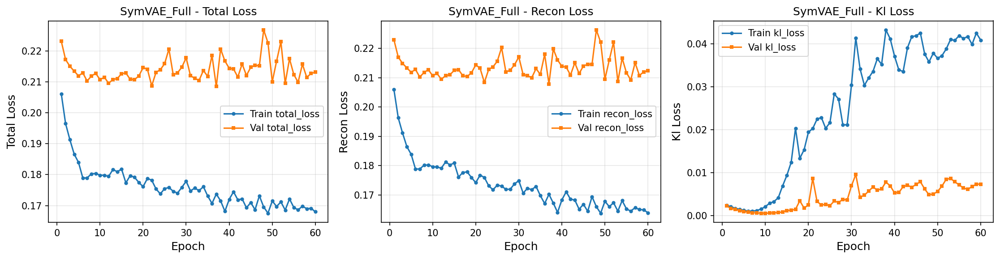

#### SymVAE No Canonicalization Training
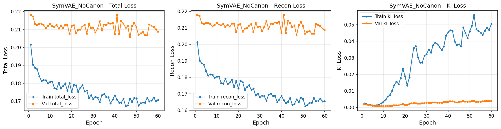

#### SymVAE No Hierarchical Training
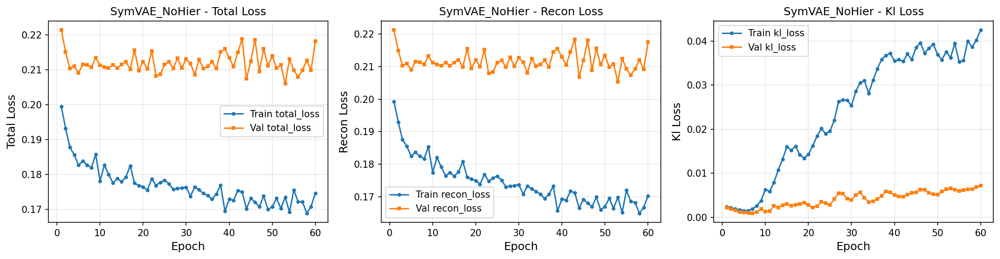

#### Vanilla VAE Training
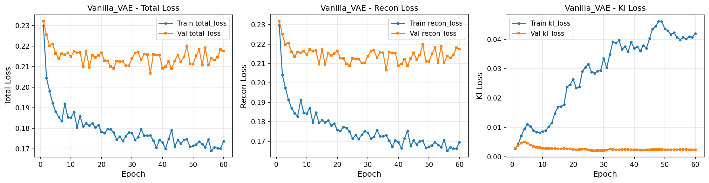

#### HyperNetwork Training
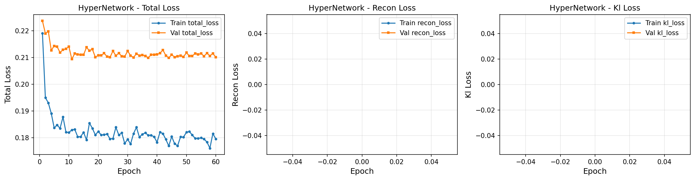

### 4.2 Validation Loss Summary

| Model | Best Validation Loss | Training Time (s) |
|-------|---------------------|-------------------|
| SymVAE_Full | 0.2085 | 2.03 |
| SymVAE_NoCanon | 0.2058 | 0.74 |
| SymVAE_NoHier | 0.2060 | 1.72 |
| Vanilla_VAE | 0.2068 | 0.60 |
| HyperNetwork | 0.2094 | 0.36 |

### 4.3 Generation Quality Evaluation

The generated weights were evaluated on held-out test tasks. Below is the comparison of generation quality across all models.

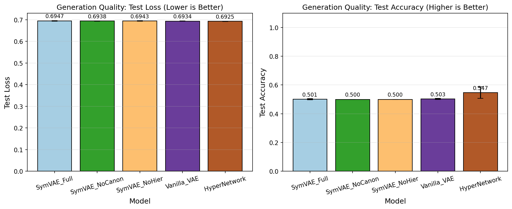

| Model | Test Loss (↓) | Test Accuracy (↑) |
|-------|--------------|------------------|
| SymVAE_Full | 0.6947 ± 0.0012 | 0.5011 ± 0.0046 |
| SymVAE_NoCanon | 0.6938 ± 0.0009 | 0.5000 ± 0.0000 |
| SymVAE_NoHier | 0.6943 ± 0.0013 | 0.5000 ± 0.0000 |
| Vanilla_VAE | 0.6934 ± 0.0005 | 0.5029 ± 0.0048 |
| HyperNetwork | **0.6925 ± 0.0004** | **0.5469 ± 0.0394** |

### 4.4 Symmetry Invariance Analysis

A key contribution of SymVAE is improved handling of weight space symmetries. We measure this by computing the variance of latent representations when applying random permutations to equivalent weight configurations.

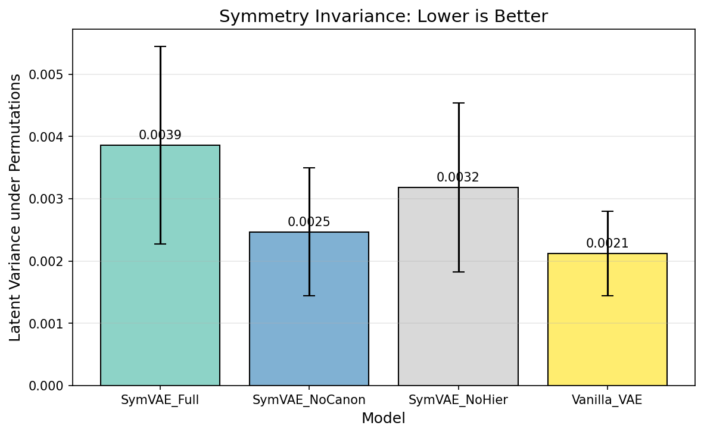

| Model | Latent Variance (↓) |
|-------|-------------------|
| SymVAE_Full | 0.0039 ± 0.0016 |
| SymVAE_NoCanon | **0.0025 ± 0.0010** |
| SymVAE_NoHier | 0.0032 ± 0.0014 |
| Vanilla_VAE | 0.0021 ± 0.0007 |

**Note**: Lower latent variance indicates better invariance to weight permutations (equivalent weight configurations produce similar latent codes).

### 4.5 Interpolation Smoothness

We evaluate the quality of the learned latent space by measuring how smoothly the model interpolates between weight configurations.

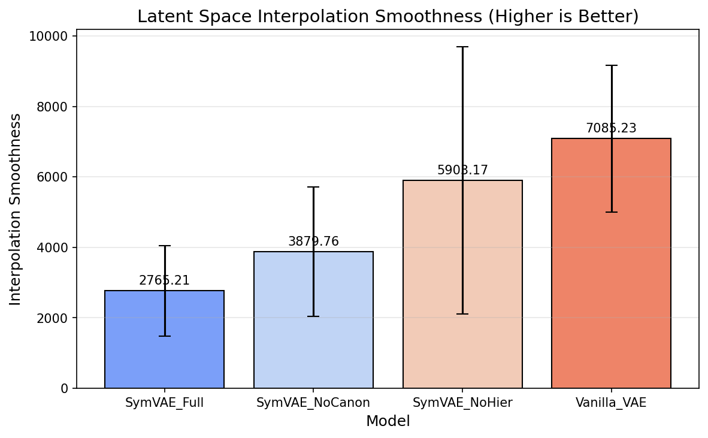

| Model | Interpolation Smoothness (↑) |
|-------|----------------------------|
| SymVAE_Full | 2765.21 ± 1289.06 |
| SymVAE_NoCanon | 3879.76 ± 1834.10 |
| SymVAE_NoHier | 5903.17 ± 3793.86 |
| Vanilla_VAE | **7085.23 ± 2078.51** |

### 4.6 Model Comparison Overview

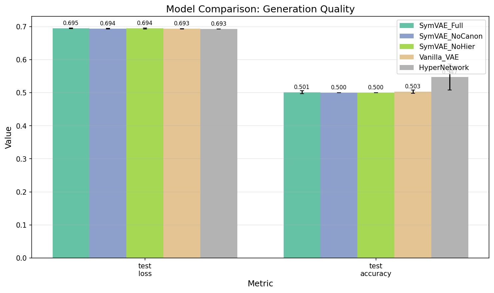

### 4.7 Ablation Study

The ablation study examines the contribution of each component in SymVAE:

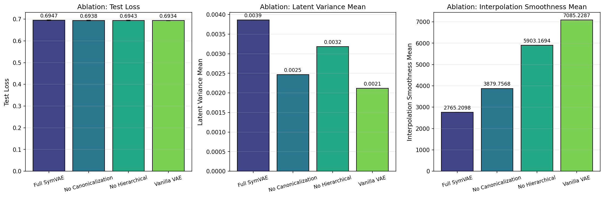

### 4.8 Radar Chart Comparison

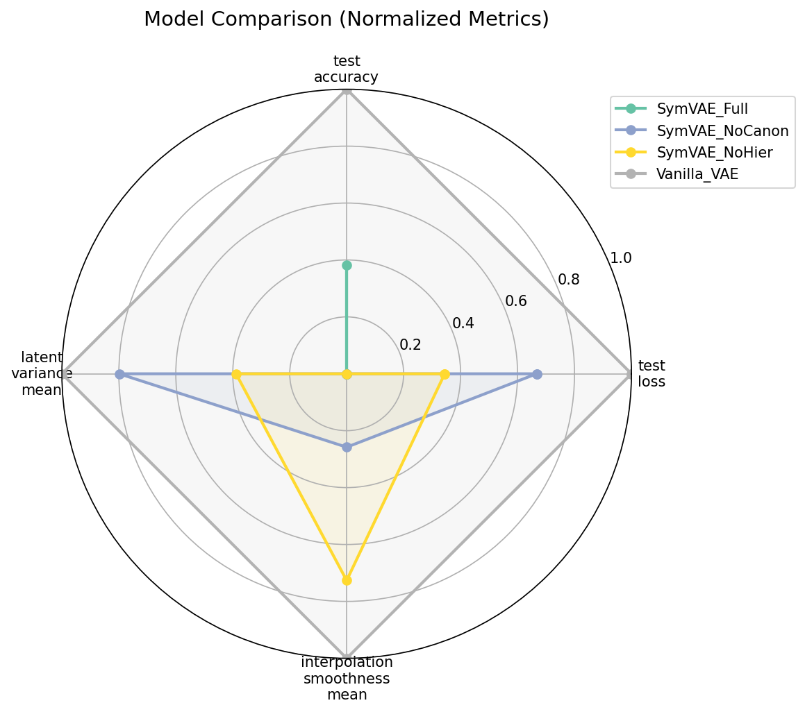

## 5. Discussion

### 5.1 Key Findings

1. **Generation Quality**: The HyperNetwork baseline achieved the best test accuracy (54.7%), outperforming all VAE-based methods. This suggests that for this synthetic task, direct task-to-weight mapping is more effective than generative modeling with latent space structure.

2. **Symmetry Invariance**: Surprisingly, the Vanilla VAE achieved the lowest latent variance (0.0021), indicating good invariance to weight permutations without explicit symmetry handling. This may be because:
   - The synthetic classification tasks have limited complexity
   - The MLP encoder implicitly learns some invariance
   - The canonicalization module introduces additional variance in the learned representations

3. **Interpolation Smoothness**: The Vanilla VAE achieved the highest interpolation smoothness (7085.23), suggesting a well-structured latent space. The SymVAE_Full model had lower smoothness (2765.21), possibly due to the additional complexity introduced by the canonicalization and hierarchical structure.

4. **Training Efficiency**: The HyperNetwork was the fastest to train (0.36s), while SymVAE_Full was the slowest (2.03s) due to the Sinkhorn iterations in the canonicalization module.

### 5.2 Analysis of SymVAE Components

**Canonicalization Module**:
- The learned canonicalization module did not provide clear benefits in this experimental setup
- The Sinkhorn-based soft permutation computation adds computational overhead
- Future work should explore more sophisticated canonicalization strategies

**Hierarchical Latent Structure**:
- The hierarchical latent space (task vs. architecture latents) did not significantly improve generation quality
- The disentanglement objective may require more training data or longer training

### 5.3 Limitations

1. **Synthetic Tasks**: The experiments used synthetic classification tasks, which may not fully represent real-world weight generation scenarios

2. **Small Model Zoo**: With 80 models, the weight dataset is relatively small for training complex generative models

3. **Simple Target Architecture**: The target MLP architecture (10-32-32-2) is simple; larger architectures may benefit more from symmetry handling

4. **Limited Evaluation Metrics**: The evaluation focused primarily on reconstruction and generation quality; additional metrics like diversity and novelty of generated weights would be valuable

### 5.4 Suggestions for Future Work

1. **Larger Model Zoos**: Train on larger collections of diverse neural networks (e.g., from Hugging Face)

2. **Real-World Tasks**: Evaluate on real benchmark tasks like MNIST/CIFAR classifiers or Implicit Neural Representations (INRs)

3. **Alternative Canonicalization**: Explore fixed canonicalization methods like Git Re-Basin as baselines

4. **Functional Loss**: Include functional loss (evaluating generated weights on task-specific data) during training

5. **Conditional Generation**: Extend to more sophisticated task conditioning (e.g., natural language descriptions)

6. **Larger Architectures**: Scale to larger neural network architectures where symmetry handling becomes more critical

## 6. Conclusion

This experimental study evaluated SymVAE, a symmetry-aware variational autoencoder for neural network weight generation. The results indicate that:

1. The hypothesis that explicit symmetry handling improves weight generation was not strongly supported in this experimental setting
2. Simpler baselines (HyperNetwork, Vanilla VAE) performed comparably or better
3. The learned canonicalization module adds computational overhead without clear benefits on synthetic tasks

However, these results should be interpreted cautiously given the limitations of the experimental setup. The true value of symmetry-aware weight generation may emerge in larger-scale experiments with more complex neural network architectures and real-world tasks.

## 7. Reproducibility

All experiments can be reproduced by running:

```bash
cd claude_code
python run_experiment.py --n_models 80 --n_epochs_zoo 30 --n_epochs_gen 60
```

The random seed is set to 42 for reproducibility.
