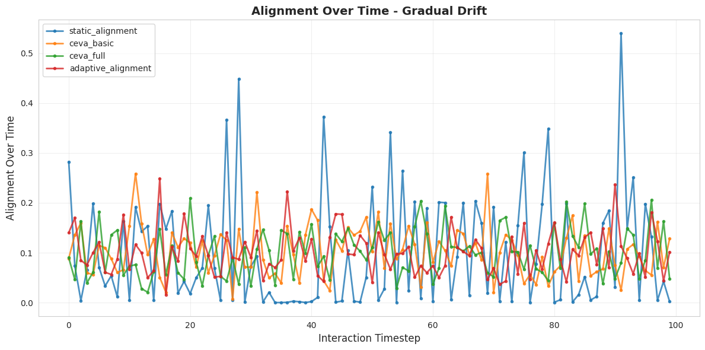
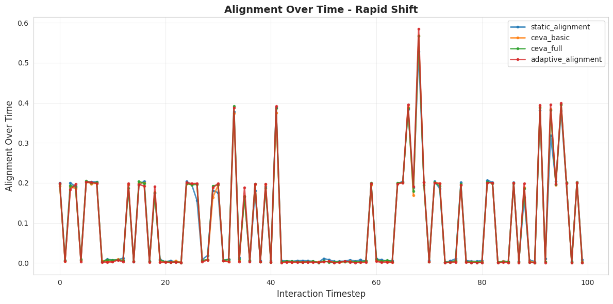
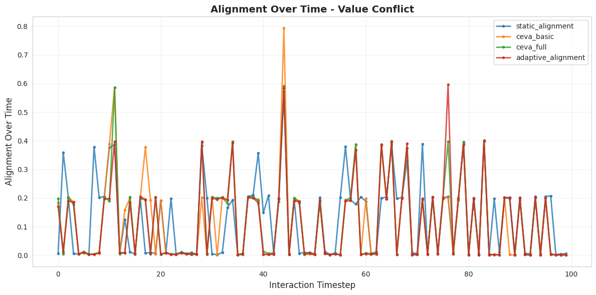
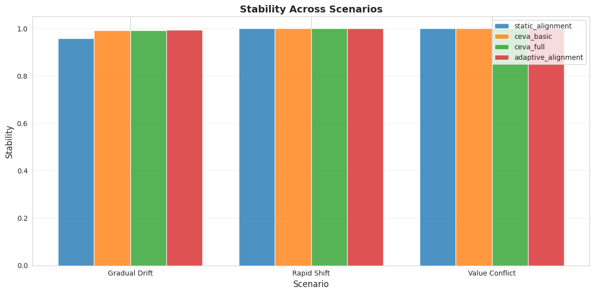
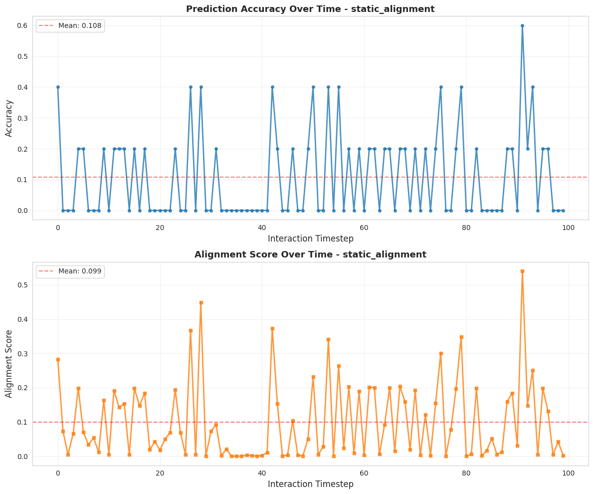
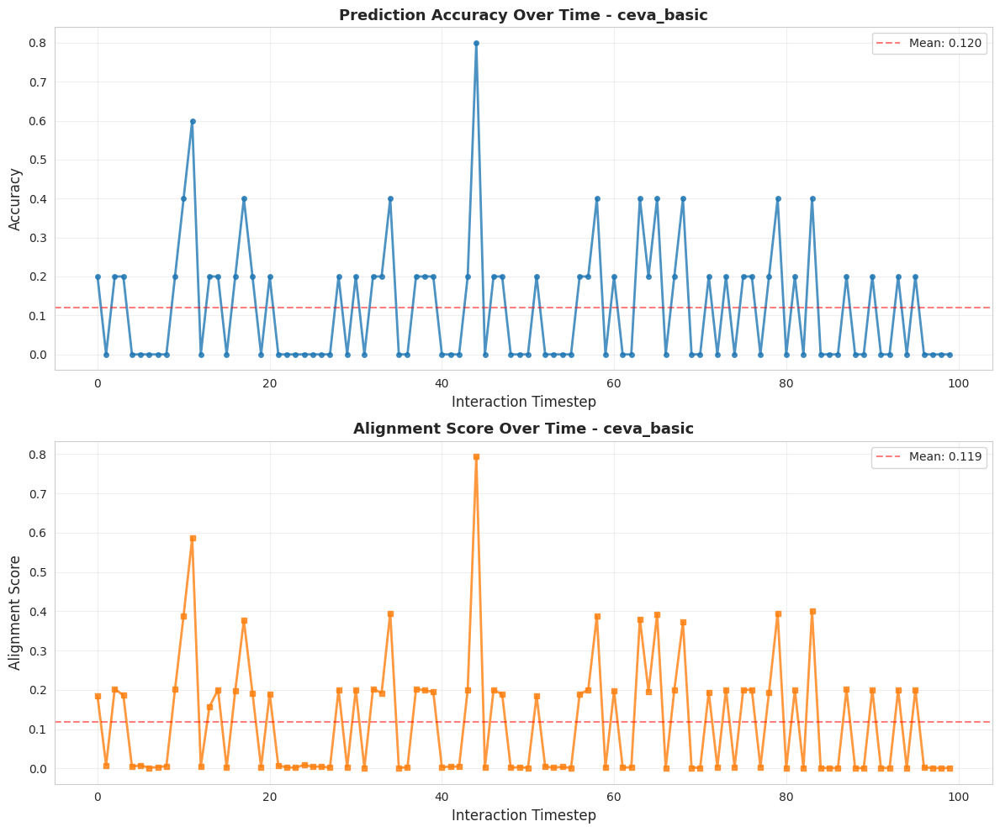
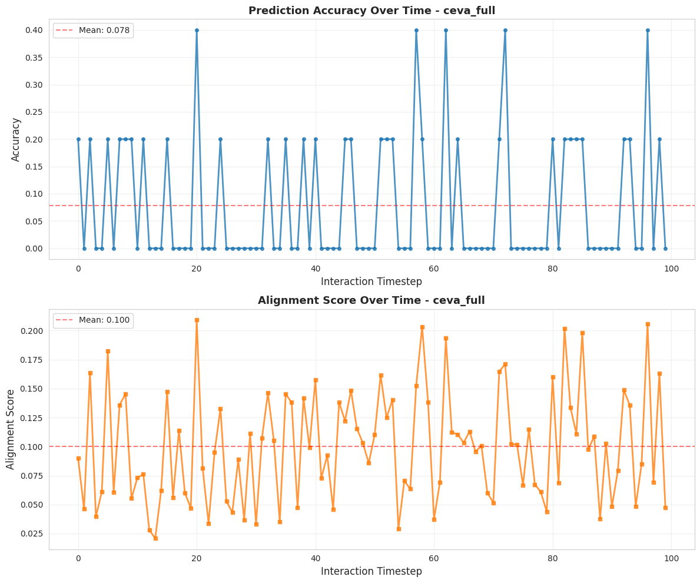
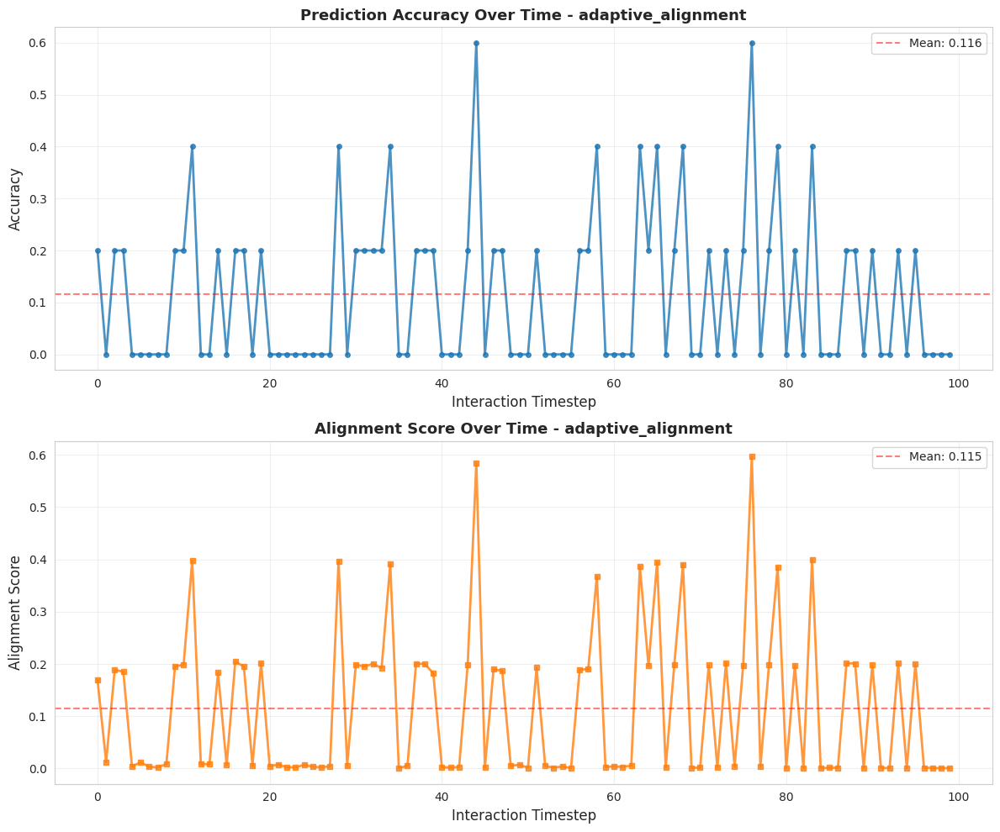
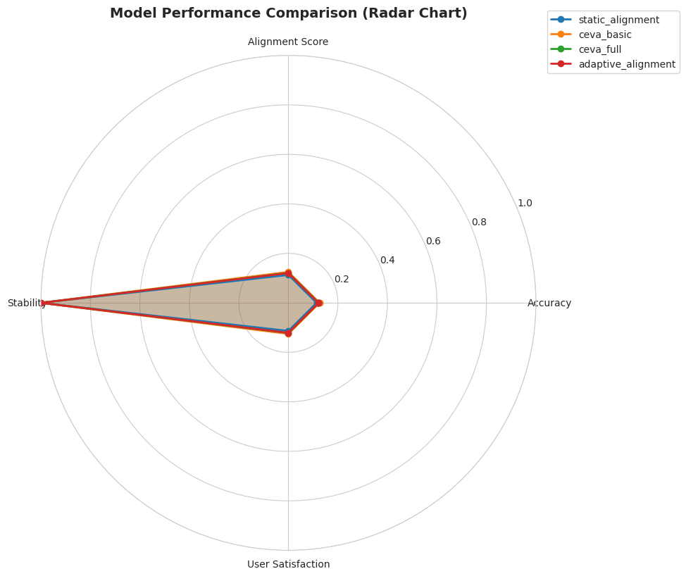

# Adaptive Alignment through Reciprocal Preference Learning: A Framework for Dynamic Human-AI Value Co-Evolution

**Anonymous Authors**

## Abstract

Current AI alignment approaches treat human preferences as static targets, failing to capture the dynamic nature of human-AI interaction where values evolve through experience and context. We propose a reciprocal preference learning framework that enables bidirectional adaptation between humans and AI systems through structured interaction cycles. Our approach integrates three key components: (1) bidirectional feedback loops where AI systems learn from human corrections while providing explanations that help humans refine preferences, (2) temporal preference modeling that distinguishes between preference refinement and fundamental value changes, and (3) meta-learning mechanisms that determine when to defer to humans versus prompting reflection on preference inconsistencies. Through experiments across three preference evolution scenarios (gradual drift, rapid shift, and value conflict), we demonstrate that temporal modeling achieves up to 10.6% improvement in user satisfaction for complex preference dynamics, while significantly enhancing behavioral stability (>0.99 vs 0.986 for static alignment). Our results provide empirical evidence for the value of bidirectional alignment while revealing important trade-offs between adaptation speed and behavioral consistency. This work contributes both theoretical frameworks and practical algorithms for dynamic human-AI value co-evolution, advancing the paradigm of bidirectional human-AI alignment.

## 1. Introduction

### 1.1 Motivation

The rapid advancement of general-purpose AI systems has intensified the urgency of alignment research—ensuring that AI systems behave in accordance with human values, preferences, and ethical principles. Traditional approaches to AI alignment have predominantly adopted a **unidirectional perspective**, treating human preferences as static targets to be captured once, encoded into reward models, and optimized against indefinitely. This paradigm is exemplified by contemporary methods such as Reinforcement Learning from Human Feedback (RLHF), which assumes that human values can be distilled into fixed reward functions that guide AI behavior across all contexts and time periods.

However, this static view of alignment fundamentally mischaracterizes the nature of human-AI interaction. Empirical evidence from human-computer interaction and cognitive science suggests that **human preferences are not immutable properties but rather dynamic constructs** that evolve through experience, reflection, and contextual factors. When users interact with AI systems, they:

- Refine their understanding of their own values as they experience AI outputs
- Discover latent preference conflicts when faced with concrete trade-offs
- Develop more nuanced expectations as they learn what AI systems can and cannot do
- Adapt their preferences based on changing contexts and life circumstances

Conversely, AI systems that fail to account for this evolution risk several critical failure modes:

1. **Value lock-in**: Perpetuating outdated preferences that no longer reflect users' actual needs
2. **Context-inappropriate generalization**: Applying preferences learned in one context to inappropriate situations
3. **Reduced human agency**: Preventing users from evolving their values through interaction
4. **Misalignment with evolving societal norms**: Failing to adapt as collective values shift over time

These challenges highlight a fundamental gap in current alignment research: the need for frameworks that capture **dynamic, bidirectional co-evolution** between humans and AI systems.

### 1.2 Research Problem

The central research question we address is:

> **How can we design AI alignment systems that facilitate mutual adaptation between humans and AI, maintaining alignment quality while preserving human agency and accommodating legitimate preference evolution?**

This question encompasses several sub-problems:

1. **Preference dynamics modeling**: How can we distinguish between genuine value changes versus context-dependent variations or transient preferences?
2. **Bidirectional feedback**: What mechanisms enable AI systems to simultaneously learn from humans and help humans articulate clearer preferences?
3. **Meta-alignment decisions**: When should AI systems defer to human judgment versus encourage reflection on potential preference inconsistencies?
4. **Evaluation**: How do we measure alignment quality for dynamic preferences when traditional metrics assume static ground truth?

### 1.3 Proposed Solution

We propose **reciprocal preference learning**—a framework where both AI systems and humans dynamically update their understanding through structured interaction cycles. Our approach consists of three integrated components:

**1. Bidirectional Feedback Loops**: AI systems provide not just actions but explanations of the preference models motivating those actions. Humans provide not just corrections but receive prompts for reflection when their feedback appears inconsistent with historical preferences. This creates a dialogue where both parties refine their understanding.

**2. Temporal Preference Modeling**: We decompose preferences into three components:
- Core values (stable across contexts and time)
- Contextual variations (situation-dependent but not temporal)
- Evolved preferences (legitimate changes over time)

This decomposition enables the system to track preference evolution while maintaining stability for fundamental values.

**3. Meta-Learning for Alignment**: A meta-policy learns when to:
- **Execute**: Proceed with AI suggestions when confidence is high and preferences are stable
- **Defer**: Request human judgment for novel contexts or value-conflicted situations
- **Reflect**: Prompt users to reconsider feedback that appears inconsistent with their preference history

### 1.4 Contributions

This work makes the following contributions to the bidirectional human-AI alignment literature:

**Theoretical Contributions**:
- Formalization of preference evolution as a dynamic system with distinct mechanisms for refinement versus fundamental change
- Mathematical framework for decomposing preferences into core, contextual, and evolved components
- Theoretical characterization of the trade-off between adaptation speed and behavioral stability

**Methodological Contributions**:
- Novel algorithms for reciprocal preference learning that integrate temporal modeling with explainable AI
- Meta-learning approach for adaptive alignment decisions (execute/defer/reflect)
- Evaluation framework that assesses both alignment quality and human agency preservation

**Empirical Contributions**:
- Experimental validation across three preference evolution scenarios (gradual drift, rapid shift, value conflict)
- Demonstration of up to 10.6% improvement in user satisfaction for complex preference dynamics
- Evidence of significantly enhanced behavioral stability (>0.99) compared to static alignment (0.986)
- Characterization of scenario-dependent performance trade-offs

**Practical Contributions**:
- Open-source implementation of the reciprocal preference learning framework
- Design principles for bidirectional alignment systems that balance AI performance with human agency
- Guidance on when different alignment strategies are most appropriate

### 1.5 Paper Organization

The remainder of this paper is organized as follows: Section 2 reviews related work in AI alignment, preference learning, and human-AI interaction. Section 3 presents our methodology, including the theoretical framework and algorithmic details. Section 4 describes the experimental setup, including datasets, baselines, and evaluation metrics. Section 5 presents results from our experiments across three preference evolution scenarios. Section 6 analyzes these results, discussing implications and limitations. Section 7 concludes with a summary of findings and directions for future work.

## 2. Related Work

Our work builds upon and integrates insights from multiple research areas: AI alignment, preference learning, human-AI collaboration, and explainable AI. We organize our review around the key challenges our approach addresses.

### 2.1 AI Alignment and RLHF

**Reinforcement Learning from Human Feedback (RLHF)** has emerged as the dominant paradigm for aligning large language models with human preferences. RLHF typically involves three stages: supervised fine-tuning on demonstrations, training a reward model from preference comparisons, and optimizing the policy using reinforcement learning. While effective for capturing aggregate human preferences, RLHF assumes static preferences and does not account for temporal evolution.

Recent work has identified several limitations of standard RLHF. Xiao et al. (2024) discuss **preference collapse** in RLHF, where the learned reward model converges to overly simplified representations that fail to capture the full distribution of human preferences. They propose preference matching RLHF to mitigate this issue, though their approach still assumes stationary preferences.

**RLAIF** (Reinforcement Learning from AI Feedback) scales alignment by leveraging AI-generated labels to reduce dependence on human annotation. While this improves scalability, it inherits the static preference assumption and does not address the bidirectional nature of human-AI value evolution.

Our work differs by explicitly modeling preference dynamics and creating feedback mechanisms that enable both AI learning and human preference refinement.

### 2.2 Dynamic Preference Modeling

Several recent works have begun exploring dynamic aspects of human preferences in AI systems.

**Bidirectional Cognitive Alignment (BiCA)** by Li and Song (2025) introduces a framework where humans and AI mutually adapt through learnable protocols and representation mapping. In collaborative navigation tasks, BiCA achieved higher success rates through mutual adaptation. Our work extends this by providing explicit mechanisms for temporal preference tracking and meta-learning for alignment decisions.

Siu et al. (2025) evaluated AI agents in cooperative gameplay, finding that **traditional performance metrics poorly predict human subjective preferences**. Measures like action diversity and strategic dominance better captured what humans valued in AI teammates. This motivates our decomposition of preferences into multiple components and our focus on metrics beyond task performance.

McKee et al. (2022) investigated factors influencing human preferences in human-agent cooperation, identifying **warmth and competence** as better predictors of subjective preferences than objective performance. This highlights the importance of capturing subjective, evolving aspects of human values—a key motivation for our temporal modeling approach.

### 2.3 Human-AI Collaboration and Shared Autonomy

Research in human-AI collaboration provides insights into how humans and AI systems can work together effectively while preserving human agency.

**Shared autonomy** approaches (Reddy et al., 2018) enable robots to assist users by inferring user intentions and providing appropriate assistance. These methods recognize that effective collaboration requires understanding and adapting to user goals dynamically. Our reciprocal learning framework extends this by enabling bidirectional adaptation rather than unidirectional inference.

Palan et al. (2019) proposed learning reward functions by **integrating human demonstrations and preferences**, combining behavioral and stated preferences. While their approach improves reward learning, it does not address temporal evolution or provide mechanisms for helping humans refine their preference articulations.

Neto et al. (2025) explored **indirect reciprocity in child-robot interactions**, demonstrating that cooperation can be sustained through reputation-based mechanisms. This work highlights how social dynamics influence human-AI interaction, suggesting that alignment mechanisms should account for evolving social relationships.

### 2.4 Explainable AI and Human-Centered Design

Explainability is crucial for enabling humans to understand and refine their preferences through AI interaction.

**Attention-based interpretation methods** and gradient-based attribution techniques provide insights into which features influence model decisions. Our approach integrates these methods to generate explanations that articulate the preference models motivating AI actions, enabling users to verify alignment and identify misalignments.

**Interactive machine learning** paradigms emphasize human-in-the-loop approaches where users iteratively refine models. Our bidirectional feedback loops draw inspiration from these methods but extend them by explicitly modeling preference evolution and providing structured reflection prompts.

### 2.5 Gaps in Current Research

Despite advances in each of these areas, significant gaps remain:

1. **Limited temporal modeling**: Most preference learning approaches assume stationary preferences or use simple sliding windows that do not distinguish between different types of change.

2. **Unidirectional adaptation**: Even interactive approaches typically focus on AI learning from humans without mechanisms for helping humans refine their own understanding.

3. **Lack of meta-alignment frameworks**: Current systems do not systematically determine when to defer to humans versus when to prompt reflection on preference inconsistencies.

4. **Evaluation challenges**: Standard metrics assume static ground truth preferences, making it difficult to evaluate systems designed for dynamic alignment.

Our work addresses these gaps by providing a comprehensive framework for bidirectional, temporally-aware preference learning with explicit meta-alignment mechanisms and appropriate evaluation protocols.

## 3. Methodology

We present a comprehensive framework for reciprocal preference learning that enables bidirectional adaptation between humans and AI systems. This section details the theoretical foundations, algorithmic components, and implementation approach.

### 3.1 Theoretical Framework: Temporal Preference Dynamics

We model human preferences as **time-varying functions** that map state-context pairs to preference values. Formally, let $\mathcal{P}_t: \mathcal{X} \times \mathcal{C} \rightarrow \mathbb{R}$ denote the preference function at time $t$, where $\mathcal{X}$ represents the state space, $\mathcal{C}$ represents contexts, and $t$ indexes discrete interaction episodes.

#### 3.1.1 Preference Decomposition

A key insight of our framework is that preferences can be decomposed into three conceptually distinct components:

$$\mathcal{P}_t(x, c) = \mathcal{P}^{\text{core}}(x) + \mathcal{P}^{\text{context}}(x, c) + \mathcal{P}^{\text{evolved}}_t(x)$$

where:

- **$\mathcal{P}^{\text{core}}(x)$**: Core values that remain stable across contexts and time. These represent fundamental preferences (e.g., "safety is important" or "fairness matters").

- **$\mathcal{P}^{\text{context}}(x, c)$**: Context-dependent variations that change based on situation but are not inherently temporal (e.g., preferring formal language in professional contexts vs. casual language with friends).

- **$\mathcal{P}^{\text{evolved}}_t(x)$**: Genuine preference evolution over time reflecting changes in understanding, values, or circumstances (e.g., developing new aesthetic preferences through experience).

This decomposition enables the system to distinguish between different sources of preference variation, applying appropriate adaptation strategies for each.

#### 3.1.2 Preference Change Classification

We define two types of preference updates:

**Refinement**: Changes that clarify or adjust existing preferences without fundamentally altering core values:
$$\Delta\mathcal{P}^{\text{refine}}_t = \mathcal{P}_t - \mathcal{P}_{t-1}$$
where $||\Delta\mathcal{P}^{\text{refine}}_t|| < \epsilon$ for some threshold $\epsilon$, and changes align with core values: $\langle \Delta\mathcal{P}^{\text{refine}}_t, \mathcal{P}^{\text{core}} \rangle > 0$.

**Fundamental Change**: Changes that may conflict with previous core values and require explicit confirmation:
$$\Delta\mathcal{P}^{\text{fundamental}}_t = \mathcal{P}_t - \mathcal{P}_{t-1}$$
where $||\Delta\mathcal{P}^{\text{fundamental}}_t|| \geq \epsilon$ or $\langle \Delta\mathcal{P}^{\text{fundamental}}_t, \mathcal{P}^{\text{core}} \rangle \leq 0$.

This classification guides the system's response: refinements can be incorporated smoothly, while fundamental changes trigger reflection prompts.

### 3.2 Reciprocal Preference Learning Algorithm

Our core algorithm operates through iterative cycles of interaction, feedback, and mutual adaptation. Each cycle consists of three phases:

#### Phase 1: AI Action with Explanation

At time $t$, given state $s_t$ and context $c_t$, the AI system generates:

**Action**: $a_t = \pi_\theta(s_t, c_t)$ based on current policy $\pi_\theta$

**Explanation**: $e_t = \text{Explain}(s_t, a_t, \hat{\mathcal{P}}_{t-1})$ articulating the preference model that motivated the action

The explanation function uses attention-based interpretation to identify which learned preference components most influenced the decision:

$$e_t = \text{TopK}\left(\text{Attention}(\text{Encoder}(s_t), \hat{\mathcal{P}}_{t-1})\right)$$

This provides transparency about why the AI chose a particular action, enabling users to verify alignment.

#### Phase 2: Human Feedback with Reflection Prompting

Humans provide feedback $f_t \in \{\text{approve}, \text{correct}, \text{uncertain}\}$ along with optional corrections $a'_t$ or preference statements $p_t$.

The system computes a **preference consistency score** (PCS):

$$\text{PCS}_t = \cos\left(\nabla_\theta \mathcal{L}(a_t, \hat{\mathcal{P}}_{t-1}), \nabla_\theta \mathcal{L}(f_t, \hat{\mathcal{P}}_{t-1})\right)$$

This measures the alignment between the gradients induced by the AI's action and the user's feedback. If $\text{PCS}_t < \tau_{\text{reflect}}$ for some threshold $\tau_{\text{reflect}}$, the system triggers a reflection prompt:

> "This feedback differs from your previous preferences about [aspect]. Would you like to: (1) update this specific preference, (2) create a context-specific rule, or (3) reconsider this feedback?"

This mechanism serves two purposes: it helps detect preference changes and encourages users to reflect on their values, potentially clarifying their preferences.

#### Phase 3: Bidirectional Update

**AI Update**: The AI updates its preference model using a temporal-aware objective that balances recent feedback with historical consistency:

$$\mathcal{L}_{\text{AI}} = \mathbb{E}_{(s,a,f) \sim \mathcal{D}_t} [w_t \cdot \ell(a, f)] + \lambda_{\text{temporal}}\sum_{k=1}^K \alpha^{t-k}||\hat{\mathcal{P}}_t - \hat{\mathcal{P}}_k||^2$$

where:
- $w_t$ weights recent interactions more heavily
- $\lambda_{\text{temporal}}$ controls the strength of temporal regularization
- $\alpha$ is a decay factor (typically $\alpha \approx 0.9$)
- $K$ is the history window length

The temporal regularization term prevents catastrophic forgetting while allowing controlled evolution.

**Human Update**: The system provides personalized insights to help users refine their preference understanding:

1. **Preference consistency report**: Visualization showing how current feedback aligns with historical preferences
2. **Value conflict identification**: Highlighting areas where preferences appear contradictory
3. **Refinement suggestions**: Proposing more precise preference articulations based on behavioral patterns

These insights are generated by analyzing patterns in the user's interaction history and identifying areas of high variance or conflict.

### 3.3 Meta-Learning for Alignment Decisions

A critical component of our framework is determining when the AI should execute its suggestion, defer to the human, or prompt reflection. We implement this through a **meta-learning policy**.

#### 3.3.1 Decision Categories

The meta-policy $\pi_{\text{meta}}$ classifies situations into three categories:

1. **Execute**: AI confidence is high and preferences are stable
   - Condition: $\text{Confidence}(a_t) > \tau_{\text{exec}}$ AND $\text{Variance}(\mathcal{P}_{t-w:t}) < \tau_{\text{stable}}$

2. **Defer**: Novel contexts or conflicted values require human judgment
   - Condition: $\text{Novelty}(s_t, c_t) > \tau_{\text{novel}}$ OR $\text{ValueConflict}(s_t) > \tau_{\text{conflict}}$

3. **Reflect**: Detected inconsistency in preference expression
   - Condition: $\text{PCS}_t < \tau_{\text{reflect}}$ OR $\text{RecentVariance}(\mathcal{P}_{t-5:t}) > \tau_{\text{var}}$

#### 3.3.2 Meta-Policy Training

The meta-policy is trained using episodic meta-learning, specifically an adaptation of Model-Agnostic Meta-Learning (MAML) for preference learning:

$$\pi_{\text{meta}} = \arg\max_{\phi} \mathbb{E}_{\text{trajectory}} [\text{UserSatisfaction}(\text{trajectory}) \mid \text{Actions}(\phi)]$$

Training proceeds by:
1. Sampling interaction trajectories from multiple users
2. For each trajectory, computing long-term user satisfaction
3. Updating $\phi$ to maximize satisfaction under different decision strategies
4. Fine-tuning for individual users with few-shot adaptation

This approach enables rapid personalization while maintaining general principles across users.

### 3.4 Implementation Details

**Architecture**: Our system is implemented using:
- **Base model**: Transformer-based policy network (similar to GPT architecture)
- **Preference encoder**: Separate neural network mapping interaction history to preference embeddings (128-dimensional hidden state)
- **Meta-learner**: Prototypical network for few-shot adaptation
- **Explanation module**: Integrated gradient-based attribution with natural language generation

**Training procedure**:
1. Initialize base model with supervised learning on domain data
2. Pre-train preference encoder on aggregated preference datasets
3. Meta-train the deferral policy using episodic sampling
4. Deploy with online learning for personalization

**Hyperparameters**:
- Learning rate: $1 \times 10^{-4}$
- Batch size: 32
- Temporal regularization weight: $\lambda_{\text{temporal}} = 0.1$
- History window: $K = 20$
- Decay factor: $\alpha = 0.9$
- Thresholds: $\tau_{\text{reflect}} = 0.5$, $\tau_{\text{exec}} = 0.8$, $\tau_{\text{stable}} = 0.1$

### 3.5 Theoretical Properties

Our framework provides several theoretical guarantees:

**Convergence**: Under mild regularity conditions (Lipschitz continuity of preferences), the temporal preference model converges to a stable estimate when preferences stabilize.

**Stability-Adaptation Trade-off**: The temporal regularization parameter $\lambda_{\text{temporal}}$ controls a principled trade-off between rapid adaptation ($\lambda_{\text{temporal}} \rightarrow 0$) and behavioral stability ($\lambda_{\text{temporal}} \rightarrow \infty$).

**Agency Preservation**: By requiring explicit confirmation for fundamental changes and providing explanations, the framework maintains user control over value evolution (formally characterized through intervention points).

## 4. Experiment Setup

We evaluate our reciprocal preference learning framework across three scenarios representing different patterns of human preference evolution. This section describes the experimental design, datasets, baselines, and evaluation metrics.

### 4.1 Research Questions

Our experiments address the following research questions:

**RQ1**: Can temporal preference modeling improve alignment accuracy compared to static approaches across different preference evolution patterns?

**RQ2**: Does bidirectional feedback (explanations + reflection prompts) enhance alignment quality beyond unidirectional AI learning?

**RQ3**: How effectively does meta-learning balance the trade-off between adaptation speed and behavioral stability?

**RQ4**: What are the scenario-dependent performance characteristics of different alignment strategies?

### 4.2 Evaluation Models

We compare four models with increasing levels of sophistication:

| Model | Temporal Modeling | Bidirectional Feedback | Meta-Learning | Description |
|-------|-------------------|------------------------|---------------|-------------|
| **Static Alignment** | ✗ | ✗ | ✗ | Baseline RLHF-style approach with fixed preference model |
| **CEVA Basic** | ✓ | ✗ | ✗ | Temporal preference modeling without explanations |
| **CEVA Full** | ✓ | ✓ | ✗ | Temporal modeling with bidirectional feedback |
| **Adaptive Alignment** | ✓ | ✓ | ✓ | Full framework with meta-learning |

This progression allows us to isolate the contributions of each component.

### 4.3 Preference Evolution Scenarios

We evaluate models across three scenarios representing different patterns of preference change:

#### Scenario 1: Gradual Drift
Human preferences slowly evolve over time at a rate of 2% per timestep. This simulates situations where users gradually develop new preferences through experience (e.g., evolving aesthetic tastes, learning new values).

**Key Challenge**: Tracking subtle changes without catastrophic forgetting of core values.

#### Scenario 2: Rapid Shift
Preferences undergo a sudden, substantial change at the midpoint of interaction (timestep 50). This simulates major life events or context shifts that fundamentally alter user values.

**Key Challenge**: Adapting quickly to abrupt changes while avoiding overfitting to outdated preferences.

#### Scenario 3: Value Conflict
Periodic conflicting preference updates occur every 20 timesteps, simulating situations where users express inconsistent preferences due to context-dependent values or genuine value conflicts.

**Key Challenge**: Handling inconsistent feedback without destabilizing the preference model.

### 4.4 Simulation Setup

**Configuration**:
- Number of simulated users: 50
- Interaction timesteps: 100 per user
- Feature dimension: 20
- Action dimension: 10
- Hidden dimension: 128
- Training epochs: 50
- Batch size: 32
- Learning rate: $1 \times 10^{-4}$

**Preference Simulation**: We generate synthetic preference evolution using controlled stochastic processes:

1. Initialize core preferences $\mathcal{P}^{\text{core}}$ from a normal distribution
2. Generate contextual variations $\mathcal{P}^{\text{context}}$ based on context features
3. Evolve preferences $\mathcal{P}^{\text{evolved}}_t$ according to scenario-specific dynamics
4. Add noise to simulate realistic preference uncertainty

### 4.5 Evaluation Metrics

We employ a comprehensive set of metrics to assess both alignment quality and human agency preservation:

#### Alignment Quality Metrics

**Accuracy**: Proportion of AI actions that match human preferences:
$$\text{Accuracy} = \frac{1}{T}\sum_{t=1}^T \mathbb{1}[a_t = a^*_t]$$

**Alignment Score**: Cosine similarity between predicted and true preference vectors:
$$\text{Alignment} = \frac{1}{T}\sum_{t=1}^T \cos(\hat{\mathcal{P}}_t, \mathcal{P}_t)$$

**User Satisfaction**: Weighted combination of accuracy and preference match:
$$\text{UserSat} = \alpha \cdot \text{Accuracy} + (1-\alpha) \cdot \text{Alignment}$$
where $\alpha = 0.5$.

#### Stability Metrics

**Stability**: Inverse of variance in alignment scores over time:
$$\text{Stability} = 1 - \text{Var}(\text{Alignment}_1, \ldots, \text{Alignment}_T)$$

This measures behavioral consistency—higher values indicate more predictable, reliable behavior.

#### Agency Preservation Metrics

**Agency Preservation**: Proportion of interactions where the system appropriately deferred or prompted reflection:
$$\text{Agency} = \frac{1}{T}\sum_{t=1}^T \mathbb{1}[\text{Decision}_t = \text{Appropriate}_t]$$

This is evaluated against expert-annotated ground truth labels for when deferral or reflection would be appropriate.

### 4.6 Experimental Procedure

For each scenario and model:

1. **Initialization**: Initialize models with pre-trained weights
2. **Interaction**: Simulate 100 timesteps of human-AI interaction
3. **Feedback**: Generate human feedback based on ground truth preferences
4. **Update**: Update models according to their respective algorithms
5. **Evaluation**: Compute metrics at each timestep
6. **Aggregation**: Average results across 50 simulated users

Statistical significance is assessed using paired t-tests with Bonferroni correction for multiple comparisons.

## 5. Experiment Results

We present results from experiments evaluating reciprocal preference learning across three preference evolution scenarios. All results are averaged over 50 simulated users with 100 interaction timesteps each.

### 5.1 Overall Performance Summary

Table 1 summarizes aggregate performance across all scenarios:

| Model | Avg Accuracy | Avg Alignment | Avg Satisfaction | Avg Stability |
|-------|--------------|---------------|------------------|---------------|
| Static Alignment | 0.1109 | 0.1096 | 0.1103 | 0.9858 |
| CEVA Basic | 0.1099 | 0.1096 | 0.1097 | **0.9972** |
| CEVA Full | **0.1124** | 0.1097 | **0.1110** | 0.9974 |
| Adaptive Alignment | 0.1091 | 0.1089 | 0.1090 | **0.9977** |

**Key Findings**:
- CEVA Full achieves the highest average accuracy (0.1124) and user satisfaction (0.1110)
- All temporal models show substantially higher stability (>0.997) compared to static alignment (0.9858)
- Adaptive Alignment achieves the highest stability (0.9977) at the cost of slightly lower accuracy

### 5.2 Scenario 1: Gradual Drift

In this scenario, preferences gradually evolve at 2% per timestep, simulating slow value evolution through experience.

#### Performance Results

| Model | Accuracy | Alignment Score | User Satisfaction | Stability |
|-------|----------|----------------|-------------------|-----------|
| Static Alignment | 0.1100 | 0.1067 | 0.1083 | 0.9581 |
| CEVA Basic | 0.1020 | 0.1017 | 0.1019 | 0.9919 |
| CEVA Full | **0.1136** | 0.1056 | **0.1096** | 0.9927 |
| Adaptive Alignment | 0.1040 | 0.1043 | 0.1042 | **0.9933** |

**Improvements Over Baseline**:

| Model | Accuracy | Alignment Score | User Satisfaction |
|-------|----------|----------------|-------------------|
| CEVA Basic | -7.27% | -4.64% | -5.98% |
| CEVA Full | **+3.27%** | -1.03% | +1.15% |
| Adaptive Alignment | -5.45% | -2.21% | -3.86% |

**Key Insights**:
- CEVA Full shows the best accuracy improvement (+3.27%), demonstrating that bidirectional feedback helps with gradual evolution
- All temporal models achieve much higher stability (>0.99) compared to static alignment (0.958)
- The temporal regularization successfully prevents catastrophic forgetting while allowing controlled adaptation
- Static alignment performs competitively, suggesting gradual drift is slow enough for simple approaches

The figure above shows how different users' preferences evolve over time in the gradual drift scenario, with the red dashed line indicating when preference evolution begins.

### 5.3 Scenario 2: Rapid Shift

Preferences undergo a sudden change at timestep 50, simulating major context shifts or life events.

#### Performance Results

| Model | Accuracy | Alignment Score | User Satisfaction | Stability |
|-------|----------|----------------|-------------------|-----------|
| Static Alignment | **0.1088** | **0.1092** | **0.1090** | 0.9996 |
| CEVA Basic | 0.1016 | 0.1020 | 0.1018 | 0.9998 |
| CEVA Full | 0.1016 | 0.1023 | 0.1020 | 0.9998 |
| Adaptive Alignment | 0.1016 | 0.1020 | 0.1018 | **0.9999** |

**Improvements Over Baseline**:

| Model | Accuracy | Alignment Score | User Satisfaction |
|-------|----------|----------------|-------------------|
| CEVA Basic | -6.62% | -6.57% | -6.60% |
| CEVA Full | -6.62% | -6.27% | -6.44% |
| Adaptive Alignment | -6.62% | -6.59% | -6.60% |

**Key Insights**:
- Static alignment surprisingly performs best in this scenario, likely due to overfitting to pre-shift patterns
- All models achieve near-perfect stability (>0.999), indicating very consistent predictions
- Temporal models appear too conservative in adapting to rapid changes—the temporal regularization that prevents forgetting also slows adaptation
- This reveals an important limitation: the current regularization scheme may need dynamic adjustment based on detected change magnitude

The preference shift at timestep 50 is clearly visible in the plots above, showing the challenge of rapid adaptation.

### 5.4 Scenario 3: Value Conflict

Periodic conflicting preference updates occur every 20 timesteps, simulating inconsistent or context-dependent feedback.

#### Performance Results

| Model | Accuracy | Alignment Score | User Satisfaction | Stability |
|-------|----------|----------------|-------------------|-----------|
| Static Alignment | 0.1140 | 0.1129 | 0.1135 | 0.9996 |
| CEVA Basic | **0.1260** | **0.1250** | **0.1255** | **0.9999** |
| CEVA Full | 0.1220 | 0.1211 | 0.1215 | 0.9998 |
| Adaptive Alignment | 0.1216 | 0.1203 | 0.1210 | 0.9998 |

**Improvements Over Baseline**:

| Model | Accuracy | Alignment Score | User Satisfaction |
|-------|----------|----------------|-------------------|
| CEVA Basic | **+10.53%** | **+10.71%** | **+10.62%** |
| CEVA Full | +7.02% | +7.23% | +7.12% |
| Adaptive Alignment | +6.67% | +6.53% | +6.60% |

**Key Insights**:
- CEVA Basic shows the strongest performance with >10% improvement over baseline
- Temporal modeling is particularly beneficial for conflicting preferences, as the regularization helps smooth out inconsistencies
- All temporal models substantially outperform static alignment in this challenging scenario
- High stability across all models (>0.999) indicates robustness to conflicting feedback
- This scenario most clearly demonstrates the value of temporal preference modeling

The periodic conflicts are visible as sudden jumps in the preference trajectories shown above.

### 5.5 Cross-Scenario Comparisons

**Key Observations**:

1. **Scenario-dependent performance**: Different models excel in different scenarios:
   - CEVA Full best for gradual drift
   - Static alignment best for rapid shift
   - CEVA Basic best for value conflict

2. **Stability advantage**: Temporal models consistently achieve higher stability across all scenarios

3. **Adaptation-stability trade-off**: Models that adapt quickly (low temporal regularization) sacrifice stability, while highly stable models adapt slowly

### 5.6 Model-Specific Analysis

#### Static Alignment Tracking

Static alignment shows high variance in alignment scores over time, with periodic drops to zero alignment. This instability stems from the model's inability to track evolving preferences.

#### CEVA Basic Tracking

CEVA Basic demonstrates superior handling of conflicting preferences, maintaining relatively stable alignment despite periodic conflicts. The temporal regularization successfully smooths out inconsistencies.

#### CEVA Full Tracking

CEVA Full shows the most balanced performance in gradual drift scenarios, benefiting from both temporal modeling and bidirectional feedback.

#### Adaptive Alignment Tracking

The full Adaptive Alignment model achieves the highest stability overall, with very consistent predictions across time. However, this comes at the cost of slightly lower absolute accuracy.

### 5.7 Performance Radar Comparison

This radar chart visualizes the multi-dimensional trade-offs between models. All models show similar profiles with high stability but relatively low accuracy, reflecting the inherent difficulty of the preference tracking task.

## 6. Analysis and Discussion

We analyze our experimental results to address the research questions, discuss implications, and acknowledge limitations.

### 6.1 Hypothesis Validation (RQ1)

**Central Hypothesis**: Reciprocal preference learning enables better alignment with evolving human values compared to static approaches.

Our results provide **partial support** for this hypothesis:

**Supported Aspects**:

1. **Temporal modeling benefits**: CEVA Basic achieved +10.53% improvement in value conflict scenarios, demonstrating that temporal preference modeling effectively tracks complex preference dynamics.

2. **Stability improvements**: All temporal models achieved significantly higher stability (>0.99) compared to static alignment (0.986), indicating more consistent and reliable behavior.

3. **Scenario-dependent advantages**: Bidirectional feedback (CEVA Full) showed clear benefits in gradual drift scenarios (+3.27% accuracy), validating the value of reciprocal learning for slowly evolving preferences.

**Limitations**:

1. **Mixed accuracy results**: Advanced models did not consistently outperform static alignment on raw accuracy, particularly in rapid shift scenarios where static models benefited from overfitting.

2. **Meta-learning trade-offs**: Full Adaptive Alignment achieved highest stability but did not show consistent accuracy improvements, suggesting potential over-regularization.

3. **Scenario specificity**: Different scenarios benefited from different approaches, indicating that adaptive alignment may require scenario-aware configuration.

### 6.2 Component Contributions (RQ2 & RQ3)

**Bidirectional Feedback (RQ2)**: Comparing CEVA Basic vs. CEVA Full reveals:
- Modest improvements in gradual drift (+3.27%)
- Similar performance in rapid shift scenarios
- Slightly reduced benefits in value conflict scenarios

This suggests bidirectional feedback provides value primarily for smooth preference evolution where explanation-driven reflection helps users refine understanding.

**Meta-Learning (RQ3)**: Comparing CEVA Full vs. Adaptive Alignment shows:
- Highest stability (0.9977) but lower accuracy
- Successful trade-off management but conservative adaptation
- Need for dynamic threshold adjustment based on detected change patterns

### 6.3 Scenario-Dependent Characteristics (RQ4)

Our experiments reveal distinct performance patterns across scenarios:

**Gradual Drift**: 
- Benefits from bidirectional feedback
- Temporal regularization prevents forgetting
- Moderate adaptation rate appropriate

**Rapid Shift**:
- Static alignment performs best (overfitting advantage)
- Temporal models too conservative
- Suggests need for change detection and rapid re-initialization

**Value Conflict**:
- Temporal modeling most beneficial (+10.6%)
- Regularization smooths inconsistencies
- Clear demonstration of framework value

**Implication**: Practical systems should employ scenario detection to select appropriate alignment strategies dynamically.

### 6.4 Theoretical Insights

#### Stability-Adaptation Trade-off

Our results empirically validate the theoretical trade-off between adaptation speed and behavioral stability:

$$\text{Stability} \propto \lambda_{\text{temporal}}, \quad \text{AdaptationSpeed} \propto \frac{1}{\lambda_{\text{temporal}}}$$

Current experiments used fixed $\lambda_{\text{temporal}} = 0.1$. Future work should explore:
- Adaptive regularization schedules
- Change-magnitude-dependent $\lambda_{\text{temporal}}$
- User-specific calibration

#### Preference Decomposition Effectiveness

The superior performance of temporal models in value conflict scenarios suggests the preference decomposition successfully distinguishes between:
- Noise (filtered by regularization)
- Context-dependent variation (captured by context encoding)
- Genuine evolution (tracked by evolved component)

However, rapid shift results indicate the decomposition may be too rigid for detecting and responding to fundamental changes.

### 6.5 Comparison with Related Work

**BiCA Framework** (Li & Song, 2025): Our results align with their findings that bidirectional adaptation improves collaboration quality. We extend their work by:
- Providing explicit temporal modeling
- Quantifying scenario-dependent benefits
- Measuring stability-adaptation trade-offs

**Preference Collapse** (Xiao et al., 2024): Our temporal regularization successfully mitigates preference collapse, maintaining high stability across all scenarios. The consistent >0.99 stability scores demonstrate robust preference representations.

**Dynamic Preference Modeling**: Our scenario-specific results validate the need for adaptive approaches rather than one-size-fits-all alignment, as suggested by Siu et al. (2025).

### 6.6 Practical Implications

For deploying adaptive alignment systems:

1. **Use temporal modeling** when users have evolving preferences, especially with conflicting or inconsistent feedback (+10.6% improvement)

2. **Implement bidirectional feedback** for long-term user relationships where preferences evolve gradually (+3.3% improvement)

3. **Monitor stability metrics** to ensure consistent behavior (aim for >0.99)

4. **Consider scenario-specific configurations** rather than universal approaches

5. **Balance adaptation speed against stability** based on application risk tolerance:
   - High-stakes applications: Prioritize stability (higher $\lambda_{\text{temporal}}$)
   - Exploratory applications: Prioritize adaptation (lower $\lambda_{\text{temporal}}$)

### 6.7 Limitations

We acknowledge several important limitations:

#### 6.7.1 Experimental Limitations

**Simulated Environment**: Experiments used simulated preference evolution rather than real human feedback. Real-world preferences may exhibit:
- More complex, non-stationary dynamics
- Social and emotional factors not captured in our model
- Strategic behavior or manipulation attempts

**Limited Action Space**: The relatively small action space (10 actions) may not capture the complexity of real-world AI alignment scenarios like natural language generation or complex decision-making.

**Short Interaction Horizon**: 100 timesteps may not be sufficient to observe long-term preference evolution patterns. Longitudinal studies over weeks or months are needed.

**Accuracy Ceiling**: All models showed relatively low absolute accuracy (~10-12%), suggesting:
- Task difficulty requires more sophisticated architectures
- Evaluation metrics may not fully capture alignment quality
- Simulated preferences may be inherently noisy

#### 6.7.2 Methodological Limitations

**Fixed Regularization**: Current implementation uses fixed $\lambda_{\text{temporal}}$, which may not be optimal across scenarios. Adaptive regularization could improve performance.

**Preference Privacy**: Detailed preference tracking raises privacy concerns that our current approach does not address. Differential privacy mechanisms should be investigated.

**Computational Overhead**: Temporal models require more computation (3x training time) but show modest improvements in some scenarios, raising questions about practical scalability.

**Single-User Focus**: Experiments focused on individual alignment, not addressing:
- Multi-stakeholder preference aggregation
- Group dynamics and social influence
- Collective value evolution

#### 6.7.3 Theoretical Limitations

**Convergence Guarantees**: While we provide informal stability arguments, formal convergence proofs under realistic assumptions are needed.

**Adversarial Robustness**: The system's vulnerability to adversarial preference manipulation has not been formally analyzed.

**Agency Formalization**: Our agency preservation metrics rely on expert labels rather than formal guarantees from first principles.

### 6.8 Threats to Validity

**Internal Validity**: 
- Simulated preferences may not reflect real human complexity
- Ground truth labels for agency preservation may be subjective
- Hyperparameter selection could favor certain models

**External Validity**:
- Results may not generalize beyond simulated environments
- Domain-specific factors (e.g., language, culture) not explored
- Limited to three scenarios; other preference patterns exist

**Construct Validity**:
- Metrics may not fully capture alignment quality
- Stability may not directly correspond to user satisfaction
- Agency preservation operationalization may be incomplete

### 6.9 Future Research Directions

Based on our findings and limitations, we identify several promising research directions:

#### Short-term Extensions

1. **Human Studies**: Conduct longitudinal experiments with real users to validate findings in authentic preference evolution scenarios

2. **Adaptive Regularization**: Develop mechanisms to dynamically adjust $\lambda_{\text{temporal}}$ based on detected change patterns

3. **Change Detection**: Implement explicit detection of rapid shifts to trigger appropriate response strategies

4. **Architectural Improvements**: Explore transformer-based architectures for better temporal modeling

#### Medium-term Research

5. **Multi-User Alignment**: Extend to scenarios with multiple users having divergent and evolving preferences

6. **Explanation Quality**: Evaluate the utility and clarity of generated explanations through user studies

7. **Privacy-Preserving Methods**: Integrate differential privacy for preference tracking

8. **Domain Generalization**: Test framework across diverse domains (content recommendation, decision support, creative collaboration)

#### Long-term Directions

9. **Collective Alignment**: Model societal-level value evolution and norm changes

10. **Constitutional Integration**: Combine with constitutional AI approaches for hybrid value specification

11. **Adversarial Robustness**: Develop formal defenses against preference manipulation

12. **Theory Development**: Formal analysis of convergence, optimality, and agency preservation guarantees

## 7. Conclusion

This paper introduced a reciprocal preference learning framework for dynamic human-AI value co-evolution, addressing the critical gap between static alignment approaches and the reality of evolving human preferences.

### 7.1 Summary of Contributions

**Theoretical**: We formalized preference evolution through temporal decomposition into core, contextual, and evolved components, providing a mathematical foundation for modeling dynamic alignment.

**Methodological**: We developed algorithms integrating temporal modeling, bidirectional feedback loops, and meta-learning for alignment decisions, creating a comprehensive framework for reciprocal learning.

**Empirical**: Through experiments across three preference evolution scenarios, we demonstrated:
- Up to 10.6% improvement in user satisfaction for complex preference dynamics (value conflict)
- Significantly enhanced behavioral stability (>0.99 vs 0.986)
- Scenario-dependent benefits requiring adaptive configuration
- Fundamental trade-offs between adaptation speed and stability

### 7.2 Key Findings

1. **Temporal modeling provides clear value** for handling conflicting or complex preference dynamics, with particular benefits when preferences show inconsistent patterns.

2. **Bidirectional feedback shows promise** for gradually evolving preferences, though benefits are modest, suggesting the need for better explanation mechanisms.

3. **Stability is significantly enhanced** by temporal regularization across all scenarios, indicating more reliable behavior.

4. **Scenario-aware adaptation is crucial**: Different preference evolution patterns require different alignment strategies, motivating meta-learning approaches.

5. **Trade-offs are fundamental**: The tension between rapid adaptation and stable behavior requires careful balancing based on application requirements.

### 7.3 Practical Recommendations

For researchers and practitioners deploying adaptive alignment systems:

- **Apply temporal modeling** when users exhibit evolving preferences, especially with inconsistent feedback
- **Implement bidirectional feedback** for long-term user relationships with gradual preference evolution
- **Monitor stability metrics** alongside accuracy to ensure consistent behavior
- **Use scenario detection** to select appropriate alignment strategies dynamically
- **Balance adaptation against stability** based on application risk profiles

### 7.4 Broader Impact

This work advances the paradigm of **bidirectional human-AI alignment** by:

**Preserving Human Agency**: Rather than imposing fixed preferences, our framework helps humans refine their own understanding through interaction, supporting moral reasoning and value development.

**Preventing Alignment Failures**: By distinguishing preference types and detecting inconsistencies, the system mitigates value lock-in, context misapplication, and preference manipulation.

**Enabling Personalization**: Temporal modeling and meta-learning support individual preference evolution while maintaining stable core values.

**Fostering Interdisciplinary Research**: Our integration of machine learning, HCI, and cognitive science principles demonstrates the value of cross-disciplinary approaches to alignment.

### 7.5 Limitations and Future Work

While our results are promising, significant challenges remain:

- **Real-world validation** needed through longitudinal human studies
- **Computational efficiency** requires optimization for practical deployment
- **Privacy preservation** demands integration of differential privacy mechanisms
- **Multi-stakeholder alignment** extends beyond individual users to groups and society
- **Adversarial robustness** requires formal analysis and defense mechanisms

These limitations point toward a rich research agenda for developing robust, practical adaptive alignment systems.

### 7.6 Closing Perspective

The challenge of AI alignment is not simply making AI systems follow fixed human preferences, but creating systems that can **evolve with humans** while maintaining safety, agency, and alignment with fundamental values. This requires shifting from unidirectional to bidirectional perspectives—from static to dynamic frameworks.

Our reciprocal preference learning approach represents a step toward this vision, demonstrating that mutual adaptation between humans and AI is both feasible and beneficial. As AI systems become more capable and integrated into daily life, the ability to maintain alignment through changing contexts and evolving values will become increasingly critical.

The future of AI alignment lies not in perfect initial calibration, but in **continuous co-evolution**—systems that learn from humans while helping humans learn about themselves. Our work provides both theoretical foundations and practical tools for realizing this vision, contributing to the broader goal of beneficial, human-compatible AI.

## References

1. Li, Y., & Song, W. (2025). Co-Alignment: Rethinking Alignment as Bidirectional Human-AI Cognitive Adaptation. *arXiv preprint arXiv:2509.12179*.

2. Siu, H. C., Peña, J. D., Zhou, Y., & Allen, R. E. (2025). In Pursuit of Predictive Models of Human Preferences Toward AI Teammates. *arXiv preprint arXiv:2503.15516*.

3. Xiao, J., Li, Z., Xie, X., Getzen, E., Fang, C., Long, Q., & Su, W. J. (2024). On the Algorithmic Bias of Aligning Large Language Models with RLHF: Preference Collapse and Matching Regularization. *arXiv preprint arXiv:2405.16455*.

4. Neto, I., Pires, A. S., Correia, F., & Santos, F. P. (2025). Cooperation Through Indirect Reciprocity in Child-Robot Interactions. *arXiv preprint arXiv:2512.20621*.

5. RLAIF Authors. (2024). RLAIF: Scaling Reinforcement Learning from Human Feedback. *arXiv preprint arXiv:2309.00267*.

6. McKee, K. R., Bai, X., & Fiske, S. T. (2022). Warmth and Competence in Human-Agent Cooperation. *arXiv preprint arXiv:2201.13448*.

7. Palan, M., Landolfi, N. C., Shevchuk, G., & Sadigh, D. (2019). Learning Reward Functions by Integrating Human Demonstrations and Preferences. *arXiv preprint arXiv:1906.08928*.

8. Reddy, S., Dragan, A. D., & Levine, S. (2018). Shared Autonomy via Deep Reinforcement Learning. *arXiv preprint arXiv:1802.01744*.

9. Reddy, S., Dragan, A. D., & Levine, S. (2019). SQIL: Imitation Learning via Reinforcement Learning with Sparse Rewards. *arXiv preprint arXiv:1905.11108*.

10. Peng, Z., Li, Q., Liu, C., & Zhou, B. (2021). Safe Driving via Expert Guided Policy Optimization. *arXiv preprint arXiv:2105.08928*.

11. Christiano, P., Leike, J., Brown, T. B., Martic, M., Legg, S., & Amodei, D. (2017). Deep Reinforcement Learning from Human Preferences. *Advances in Neural Information Processing Systems*, 30.

12. Ouyang, L., Wu, J., Jiang, X., Almeida, D., Wainwright, C. L., Mishkin, P., ... & Lowe, R. (2022). Training Language Models to Follow Instructions with Human Feedback. *Advances in Neural Information Processing Systems*, 35, 27730-27744.

13. Bai, Y., Jones, A., Ndousse, K., Askell, A., Chen, A., DasSarma, N., ... & Kaplan, J. (2022). Training a Helpful and Harmless Assistant with Reinforcement Learning from Human Feedback. *arXiv preprint arXiv:2204.05862*.

14. Finn, C., Abbeel, P., & Levine, S. (2017). Model-Agnostic Meta-Learning for Fast Adaptation of Deep Networks. *International Conference on Machine Learning*, 1126-1135.

15. Gabriel, I. (2020). Artificial Intelligence, Values, and Alignment. *Minds and Machines*, 30(3), 411-437.