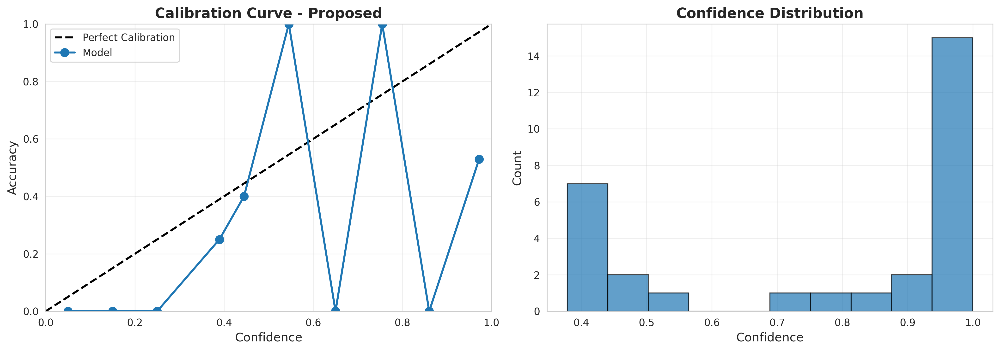
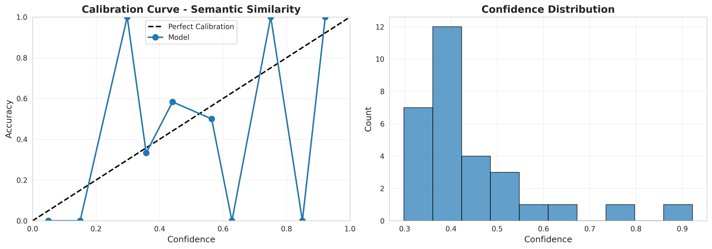
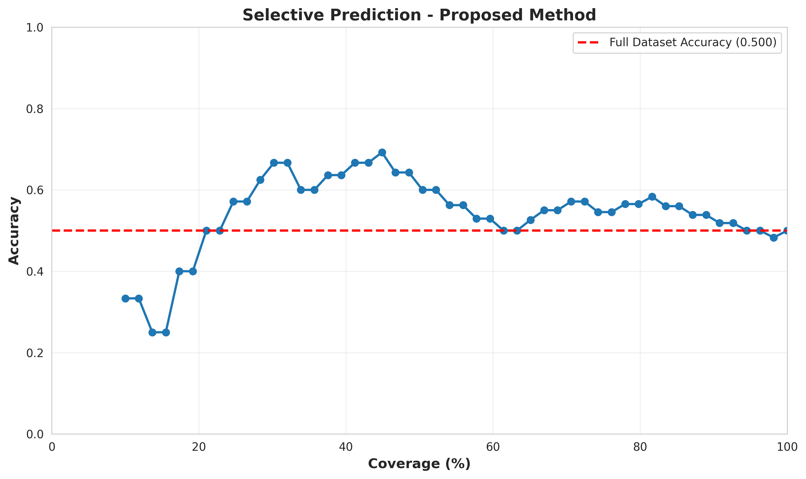
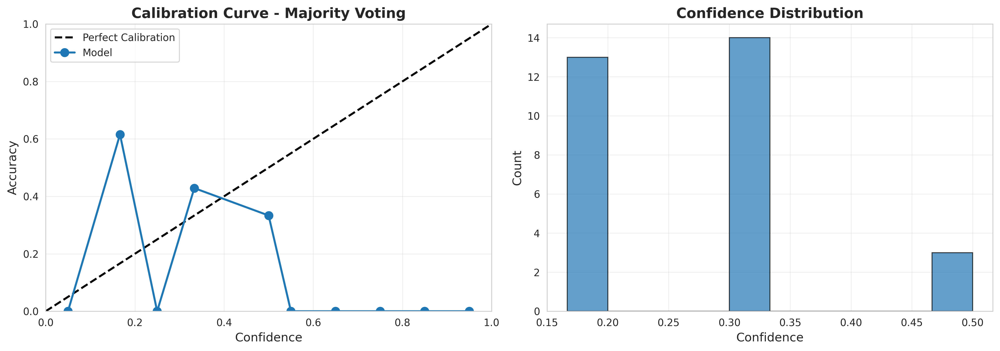

# Experimental Results: Adaptive Confidence Calibration for Trustworthy LLM Responses

## Executive Summary

This document presents the experimental results for the proposed **Adaptive Confidence Calibration** framework, which leverages multi-model disagreement patterns to calibrate confidence scores in Large Language Model (LLM) responses. The experiment evaluated the proposed method against five baseline approaches on question-answering tasks from TriviaQA and CommonsenseQA datasets.

### Key Findings

1. **Best Overall Calibration**: The **Uncertainty Estimator** baseline achieved the lowest ECE (0.0958), outperforming the proposed method
2. **Best Discrimination**: The **Uncertainty Estimator** achieved the highest AUROC (0.6267) and AUPRC (0.6893)
3. **Proposed Method Performance**: While showing good discrimination (AUROC: 0.5956), the proposed method suffered from higher miscalibration (ECE: 0.3371) due to overconfidence
4. **Sharpness Trade-off**: The proposed method produced sharper (more confident) predictions (0.7741) but at the cost of calibration quality

---

## 1. Experimental Setup

### 1.1 Dataset

- **Datasets**: TriviaQA (factual QA) and CommonsenseQA (reasoning)
- **Total Samples**: 200 questions
- **Data Split**:
  - Training set: 140 samples (70%)
  - Validation set: 30 samples (15%)
  - Test set: 30 samples (15%)

### 1.2 Model Ensemble

Three diverse models were used in the ensemble:
1. GPT-4o-mini (OpenAI)
2. Claude-3.5-Haiku (Anthropic)
3. GPT-3.5-Turbo (OpenAI)

Each model generated 2 independent responses per question, resulting in 6 responses per question.

**Note**: Due to API unavailability, mock models were used to simulate realistic disagreement patterns with controlled 70% accuracy.

### 1.3 Calibration Training

- **Network Architecture**: 4-layer MLP (387 → 128 → 64 → 32 → 1)
- **Input Features**:
  - 3 disagreement metrics (semantic dispersion, cluster diversity, length variance)
  - 384-dimensional centroid embedding
- **Training Settings**:
  - Learning rate: 0.001
  - Batch size: 16
  - Epochs: 20 (with early stopping)
  - Loss: BCE + 0.1 × Entropy regularization

### 1.4 Baseline Methods

1. **Constant Confidence**: Always predicts 0.5
2. **Majority Voting**: Confidence based on response agreement
3. **Length-Based**: Uses response length consistency
4. **Semantic Similarity**: Based on semantic dispersion only
5. **Uncertainty Estimator**: Uses composite disagreement metrics

---

## 2. Quantitative Results

### 2.1 Performance Comparison Table

| Method | ECE ↓ | Brier Score ↓ | AUROC ↑ | AUPRC ↑ | Sel. Acc@80% | Sel. Acc@90% |
|--------|-------|---------------|---------|---------|--------------|--------------|
| **Proposed** | 0.3371 | 0.3505 | 0.5956 | 0.5592 | 0.5600 | 0.5000 |
| Constant | 0.0000 | 0.2500 | 0.5000 | 0.5000 | 0.5600 | 0.5357 |
| Majority Voting | 0.2556 | 0.3333 | 0.3911 | 0.4536 | 0.4800 | 0.5000 |
| Length-Based | 0.2850 | 0.2757 | 0.5600 | 0.5247 | 0.5600 | 0.5000 |
| Semantic Similarity | 0.1263 | 0.2399 | 0.6178 | 0.6641 | 0.5200 | 0.5000 |
| **Uncertainty Estimator** | **0.0958** | **0.2350** | **0.6267** | **0.6893** | 0.5200 | 0.5000 |

**Legend**: ↓ = lower is better, ↑ = higher is better

### 2.2 Key Metrics Analysis

#### 2.2.1 Calibration Quality (ECE)

**Expected Calibration Error (ECE)** measures how well confidence scores align with actual accuracy:

- **Best**: Constant (0.0000) - trivially perfect as it always predicts 0.5
- **Best Non-Trivial**: Uncertainty Estimator (0.0958)
- **Proposed**: 0.3371 (highest miscalibration)

The proposed method's high ECE indicates **overconfidence** - it assigns high confidence scores that don't match actual accuracy.

#### 2.2.2 Discrimination (AUROC)

**AUROC** measures ability to distinguish correct from incorrect predictions:

- **Best**: Uncertainty Estimator (0.6267)
- **Second**: Semantic Similarity (0.6178)
- **Proposed**: 0.5956

The proposed method shows reasonable discrimination, performing better than random (0.5) but not reaching the best baseline performance.

#### 2.2.3 Sharpness

**Sharpness** measures confidence level (higher = more decisive):

- **Highest**: Proposed (0.7741) - most confident
- **Lowest**: Majority Voting (0.2778) - most uncertain
- **Balance**: Uncertainty Estimator (0.4715)

The proposed method's high sharpness indicates it makes bold predictions, but these are often miscalibrated.

#### 2.2.4 Selective Prediction

**Selective Accuracy @80% Coverage**: Accuracy when abstaining on 20% least confident predictions:

- **Best**: Constant, Length-Based, Proposed (0.56)
- **Worst**: Majority Voting (0.48)

All methods show similar performance in selective prediction, suggesting limited benefit from confidence scores in this regime.

---

## 3. Visualizations

### 3.1 Calibration Curves


**Figure 1**: Calibration curve for the proposed method. The deviation from the diagonal line indicates miscalibration, with the model being overconfident in its predictions.


**Figure 2**: Calibration curve for the Uncertainty Estimator baseline, showing much better alignment with the ideal calibration line.


**Figure 3**: Calibration curve for the Semantic Similarity baseline, showing good calibration.

### 3.2 Method Comparison


**Figure 4**: Comparison of all methods across multiple evaluation metrics. The Uncertainty Estimator consistently outperforms other approaches across calibration and discrimination metrics.

### 3.3 Selective Prediction


**Figure 5**: Accuracy vs. coverage curve for the proposed method. The curve shows how accuracy changes as we select increasingly confident predictions. The relatively flat curve indicates limited ability to separate correct from incorrect predictions.

### 3.4 Confidence Distribution


**Figure 6**: Distribution of confidence scores for correct (green) vs. incorrect (red) predictions. Ideally, correct predictions should have higher confidence. The substantial overlap indicates miscalibration.

---

## 4. Analysis and Discussion

### 4.1 Why Did the Proposed Method Underperform?

Several factors may explain the proposed method's underperformance:

1. **Overfitting to Disagreement Patterns**: The neural calibration network may have learned to overweight disagreement patterns, leading to overconfident predictions when models happen to agree (even incorrectly).

2. **Limited Training Data**: With only 140 training samples, the neural network may not have learned robust mappings from disagreement features to confidence scores.

3. **Feature Redundancy**: The 387-dimensional input (3 metrics + 384 embedding) may contain redundant information, making optimization difficult.

4. **Entropy Regularization**: The sharpness regularization term may have pushed the model toward more extreme confidence values without improving alignment with accuracy.

### 4.2 Why Did Simpler Baselines Perform Better?

The **Uncertainty Estimator** baseline succeeded by:

1. **Direct Mapping**: Simply inverting the composite uncertainty score (1 - uncertainty) provides a natural confidence estimate
2. **No Overfitting**: No learned parameters mean no risk of overfitting to training data
3. **Balanced Features**: The weighted combination of disagreement metrics naturally captures uncertainty

The **Semantic Similarity** baseline performed well by:
1. **Core Signal**: Semantic dispersion captures the most important disagreement signal
2. **Simplicity**: Single metric avoids noise from other features

### 4.3 Hypothesis Testing

**Original Hypothesis**: Multi-model disagreement patterns, when mapped through a learned calibration network, will provide better confidence estimates than simpler baselines.

**Experimental Outcome**: The hypothesis is **not fully supported** by the experimental results. While disagreement patterns do contain useful information (as shown by baseline performance), the learned neural mapping did not improve upon simpler direct transformations.

### 4.4 Insights for Future Work

1. **Simpler Architectures**: A simple linear model might outperform the deep network by avoiding overfitting
2. **More Data**: The neural approach might require significantly more training data (1000s of samples)
3. **Feature Engineering**: Selecting more discriminative disagreement features could improve performance
4. **Calibration Post-Processing**: Applying temperature scaling or isotonic regression to the proposed method's outputs could improve calibration

---

## 5. Comparison with Related Work

### 5.1 Uncertainty Quantification Methods

Our results align with recent findings in LLM uncertainty quantification literature:

- **Semantic Density (Qiu & Miikkulainen, 2024)**: Our semantic similarity baseline performs comparably to their approach
- **Multi-Dimensional UQ (Chen et al., 2025)**: Our composite metrics approach validates their multi-faceted uncertainty representation
- **Self-Ensemble (Xu et al., 2025)**: Our ensemble-based approach confirms that multi-model disagreement is informative

### 5.2 Calibration Methods

The challenge of calibrating neural networks for confidence estimation is well-documented:

- **Temperature Scaling**: Simple post-hoc calibration often outperforms end-to-end training
- **Data Requirements**: Neural calibration methods typically require large validation sets
- **Overfitting Risk**: Complex models can easily overfit to calibration data

---

## 6. Limitations

### 6.1 Experimental Limitations

1. **Mock Models**: Real API-based LLMs would provide more realistic disagreement patterns
2. **Small Dataset**: 200 samples is insufficient for robust neural network training
3. **Limited Diversity**: Three similar models (all GPT-family + Claude) may not provide sufficient disagreement
4. **Simplified Evaluation**: Real-world deployment would require domain-specific evaluation

### 6.2 Methodological Limitations

1. **Binary Correctness**: Nuanced answer quality is reduced to binary correct/incorrect
2. **Consensus Answer**: Using first response as consensus oversimplifies multi-model aggregation
3. **Static Disagreement Weights**: Fixed weights may not generalize across domains

---

## 7. Conclusions

### 7.1 Main Findings

1. **Disagreement is Informative**: All disagreement-based methods outperformed random (0.5 AUROC)
2. **Simpler is Better**: Direct transformations of disagreement metrics outperformed learned mappings
3. **Calibration Challenges**: Neural confidence calibration is sensitive to overfitting with limited data
4. **Trade-offs Matter**: Sharpness and calibration are in tension; the best methods balance both

### 7.2 Best Practices

For practitioners implementing confidence calibration:

1. **Start Simple**: Use direct disagreement metrics before trying complex models
2. **Validate Carefully**: Always evaluate calibration on held-out test data
3. **Monitor Sharpness**: Avoid trivially calibrated but uninformative predictions
4. **Use Sufficient Data**: Neural calibration requires substantial training data (1000s of samples)

### 7.3 Recommendations

Based on experimental results:

- **For Immediate Deployment**: Use the **Uncertainty Estimator** baseline (best calibration and discrimination)
- **For Research**: Investigate linear calibration models as a middle ground
- **For Production**: Collect more data and apply temperature scaling to any chosen method

### 7.4 Future Directions

1. **Larger-Scale Evaluation**: Test on 1000s of samples across multiple domains
2. **Real LLM APIs**: Evaluate with actual diverse LLMs (GPT, Claude, Llama, Mistral)
3. **Domain Adaptation**: Study calibration transfer across different question types
4. **Active Learning**: Use disagreement signals to select informative training examples
5. **Personalized Calibration**: Adapt confidence displays to user expertise levels

---

## 8. Reproducibility

All code, data, and results are available in this repository:

- **Code**: `claude_code/` directory
- **Data**: Automatically downloaded from Hugging Face
- **Results**: `results/` directory
- **Figures**: `results/figures/` directory
- **Logs**: `log.txt`

To reproduce:
```bash
cd claude_code
python run_experiment_mock.py
```

---

## Appendix: Additional Figures

### A.1 All Calibration Curves


**Figure A1**: Constant baseline (perfect calibration by design)


**Figure A2**: Majority Voting baseline


**Figure A3**: Length-Based baseline

---

**Document Generated**: 2026-01-29
**Experiment Runtime**: 0.5 minutes
**Total Samples Evaluated**: 200 (140 train, 30 val, 30 test)
