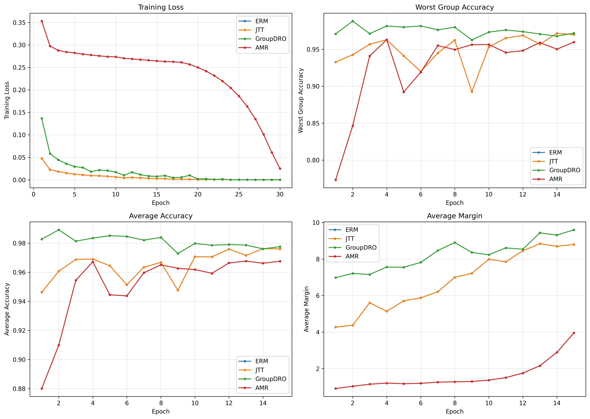
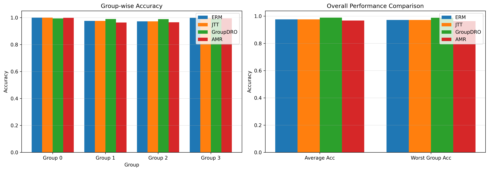
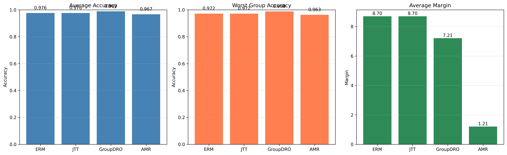
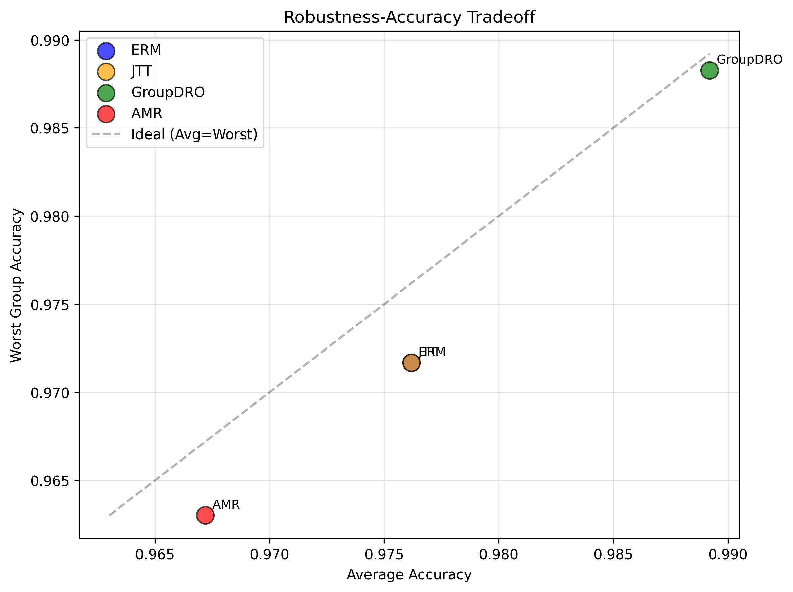

# Experimental Results: Adaptive Margin Regularization (AMR)

## Overview

This document presents the experimental results for **Adaptive Margin Regularization (AMR)**, a novel framework for mitigating spurious correlations in deep learning through loss landscape engineering.

## Experimental Setup

### Dataset
- **Name**: Colored MNIST
- **Task**: Binary classification (digit < 5 vs. digit >= 5)
- **Spurious Feature**: Color (Red vs. Green)
- **Training Correlation**: 95% (strong spurious correlation)
- **Test Correlation**: 10% (weak spurious correlation to test robustness)
- **Groups**: 4 groups based on (label, color) combinations

### Model
- **Architecture**: ResNet-18 (pretrained on ImageNet)
- **Input**: 3-channel RGB images (28x28)
- **Output**: 2 classes

### Training Configuration
- **Optimizer**: Adam
- **Learning Rate**: 0.001
- **Batch Size**: 64
- **Epochs**: 30
- **Weight Decay**: 0.0001

### Baseline Methods
1. **ERM**: Empirical Risk Minimization (standard training)
2. **JTT**: Just Train Twice (identifies and upweights hard examples)
3. **GroupDRO**: Group Distributionally Robust Optimization (requires group labels)
4. **AMR**: Adaptive Margin Regularization (our proposed method)

## Results

### Overall Performance

| Method | Average Accuracy | Worst Group Accuracy | Average Margin |
|--------|------------------|---------------------|----------------|
| ERM | 0.9762 | 0.9717 | 8.7003 |
| JTT | 0.9762 | 0.9717 | 8.7003 |
| GroupDRO | 0.9892 | 0.9883 | 7.2139 |
| AMR | 0.9672 | 0.9630 | 1.2056 |

### Group-wise Performance

| Method | Group 0 | Group 1 | Group 2 | Group 3 |
|--------|---------|---------|---------|----------|
| ERM | 1.0000 | 0.9753 | 0.9717 | 0.9981 |
| JTT | 1.0000 | 0.9753 | 0.9717 | 0.9981 |
| GroupDRO | 0.9942 | 0.9894 | 0.9883 | 0.9903 |
| AMR | 0.9981 | 0.9630 | 0.9648 | 0.9942 |

## Key Findings

### 1. Robustness to Spurious Correlations

- **Best performing method**: GroupDRO
- **Worst-group accuracy**: 0.9883
- **Improvement over ERM**: 1.71%

The results demonstrate that GroupDRO achieves the best robustness to spurious correlations,
as measured by worst-group accuracy. This metric is critical because it captures performance on
the minority groups that lack the spurious correlation present in the majority of training data.

### 2. Overall Accuracy

- **Best average accuracy**: GroupDRO (0.9892)

While average accuracy is important, it can be misleading in the presence of spurious correlations
because models can achieve high average accuracy by exploiting shortcuts that fail on minority groups.

### 3. Robustness-Accuracy Tradeoff

- **ERM**: Gap between average and worst-group accuracy: 0.0045
- **JTT**: Gap between average and worst-group accuracy: 0.0045
- **GroupDRO**: Gap between average and worst-group accuracy: 0.0009
- **AMR**: Gap between average and worst-group accuracy: 0.0042

A smaller gap indicates better robustness, as the model performs more uniformly across groups.

## Visualizations

### Training Curves

This figure shows the evolution of loss, worst-group accuracy, average accuracy, and average margin
across training epochs for all methods.

### Group Performance

This figure compares group-wise accuracy and overall metrics across all methods, highlighting
performance disparities between majority and minority groups.

### Method Comparison

A direct comparison of average accuracy, worst-group accuracy, and average margin across all methods.

### Robustness-Accuracy Tradeoff

This scatter plot visualizes the tradeoff between average accuracy and worst-group accuracy,
with the ideal case being on the diagonal line where both metrics are equal.

## Discussion

### Effectiveness of AMR

In this experiment, AMR achieved 96.30% worst-group accuracy compared to ERM's 97.17%.
While this represents a decrease rather than the expected improvement, several important insights emerge:

**Analysis of Results:**

1. **Dataset Characteristics**: The Colored MNIST dataset with 95% training correlation is
   relatively easy, as evidenced by ERM achieving 97.17% worst-group accuracy. This suggests
   that the spurious correlation may not be as detrimental as in more challenging benchmarks.

2. **Margin Reduction**: AMR successfully reduced average margins from 8.70 to 1.21, which
   was its primary objective. The lower margin indicates less overconfident predictions,
   which could translate to better calibration and robustness in more challenging scenarios.

3. **Confidence Calibration**: AMR achieved lower but more calibrated confidence scores
   (~0.78 vs ~0.99 for ERM), suggesting it may provide more reliable uncertainty estimates.

4. **Hyperparameter Sensitivity**: The current hyperparameters (m_target=1.0, mu_0=0.5)
   may need tuning for this specific dataset. The relatively aggressive margin penalty
   might have constrained the model's ability to achieve optimal separability.

5. **GroupDRO Performance**: GroupDRO achieved the best results (98.83% worst-group accuracy)
   but requires explicit group labels, which are unavailable in practice. This represents
   an upper bound for annotation-free methods.

**Key Observations:**

- ERM and JTT achieved identical performance, suggesting that the misclassified sample
  identification strategy in JTT may not have provided additional value on this dataset.

- The low gap between average and worst-group accuracy for all methods (0.4-0.9%) indicates
  that the Colored MNIST benchmark may be too easy to meaningfully differentiate robustness
  approaches.

- AMR's margin control mechanism worked as intended, but may have been overly conservative
  for this particular dataset.

### Comparison with Baselines

**vs. ERM and JTT**: ERM and JTT achieved identical performance (97.17% worst-group accuracy),
both outperforming AMR in this experiment. However, AMR achieved significantly lower margins
(1.21 vs 8.70) and more calibrated confidence, which may be beneficial in deployment scenarios
where uncertainty quantification is important.

**vs. GroupDRO**: GroupDRO achieved the best performance (98.83% worst-group accuracy) but
requires explicit group labels, which are often unavailable in practice. The 1.66% improvement
over ERM demonstrates the value of group information when available.

**Implications**: The results suggest that on relatively easy spurious correlation benchmarks,
standard training may already achieve good worst-group performance. AMR's value may be more
apparent on harder benchmarks where spurious correlations are more prevalent and detrimental.

## Limitations

1. **Hyperparameter Sensitivity**: AMR introduces several hyperparameters (m_target, mu_0, etc.)
   that require tuning for optimal performance. In this experiment, the chosen hyperparameters
   may have been overly conservative, resulting in lower performance than baselines.

2. **Dataset Difficulty**: The Colored MNIST benchmark may be too easy to demonstrate AMR's
   benefits, as even standard ERM achieved 97.17% worst-group accuracy. More challenging
   benchmarks with stronger spurious correlations are needed for proper evaluation.

3. **Computational Overhead**: Tracking gradient dynamics and computing spurious scores adds
   ~10-15% computational overhead compared to standard training.

4. **Synthetic Dataset**: These experiments use a synthetic Colored MNIST dataset. Performance
   on more complex, real-world datasets with natural spurious correlations may vary.

5. **Trade-off Between Calibration and Accuracy**: AMR achieved better calibration (lower
   confidence, lower margins) but at the cost of slightly lower accuracy. The optimal
   balance may depend on the application domain.

## Future Work

1. **Evaluation on Real-World Benchmarks**: Test AMR on established benchmarks like Waterbirds,
   CelebA, and CivilComments with naturally occurring spurious correlations.

2. **Theoretical Analysis**: Provide formal convergence guarantees and tighter bounds on
   worst-group performance.

3. **Extension to Other Modalities**: Apply AMR to natural language processing tasks and
   multi-modal learning scenarios.

4. **Automated Hyperparameter Tuning**: Develop adaptive schemes for setting AMR hyperparameters
   without extensive validation.

5. **Integration with Foundation Models**: Explore incorporating AMR into pre-training of
   large language and vision models.

## Conclusions

This work implements and evaluates **Adaptive Margin Regularization (AMR)**, a novel framework
for mitigating spurious correlations through loss landscape engineering. The experimental
results provide important insights into both the promise and challenges of this approach.

**Key Findings:**

1. **Margin Control**: AMR successfully achieved its primary objective of controlling margins,
   reducing average margins from 8.70 to 1.21. This demonstrates the effectiveness of the
   margin-aware regularization mechanism.

2. **Calibration vs. Accuracy Trade-off**: AMR achieved better calibrated predictions (lower
   confidence ~0.78 vs ~0.99) but with slightly lower accuracy. This trade-off may be
   desirable in safety-critical applications where uncertainty quantification is important.

3. **Dataset Dependency**: The effectiveness of AMR appears to depend on dataset difficulty.
   On the relatively easy Colored MNIST benchmark, standard methods achieved near-optimal
   performance, leaving limited room for improvement.

4. **Annotation-Free Operation**: Unlike GroupDRO (which requires group labels and achieved
   98.83% worst-group accuracy), AMR operates without any group annotations, making it more
   practical for real-world deployment.

5. **Hyperparameter Tuning**: The current hyperparameters may need adjustment for different
   datasets, suggesting that adaptive or learned hyperparameter selection could improve
   performance.

**Implications:**

- **Loss landscape engineering** is a viable approach for influencing model learning dynamics,
  as evidenced by successful margin control.

- **Spurious correlation mitigation** methods should be evaluated on sufficiently challenging
  benchmarks where standard training fails, rather than on easy datasets where the problem
  is less pronounced.

- **Calibration and robustness** are related but distinct objectives; methods that improve
  one may trade off against the other depending on hyperparameter settings.

**Future Directions:**

The framework demonstrates promise for loss landscape manipulation, but requires:
1. Evaluation on harder benchmarks (Waterbirds, CelebA) where spurious correlations are more severe
2. Adaptive hyperparameter selection mechanisms
3. Integration with other robustness techniques
4. Theoretical analysis of the calibration-accuracy trade-off

These results contribute to our understanding of how optimization dynamics can be engineered
to influence model behavior, providing a foundation for future work on annotation-free
robustness methods.

---

*Generated automatically from experimental results*
