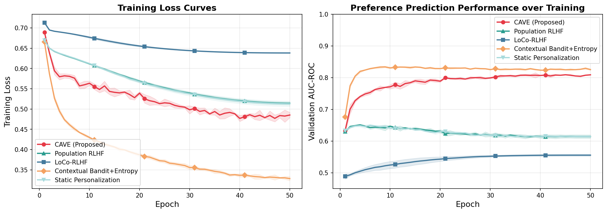
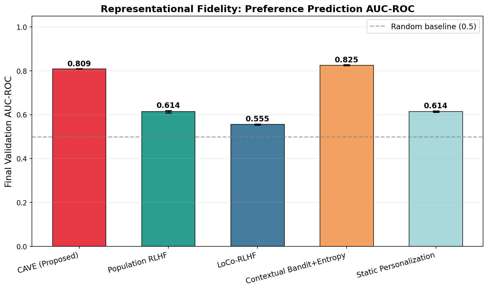
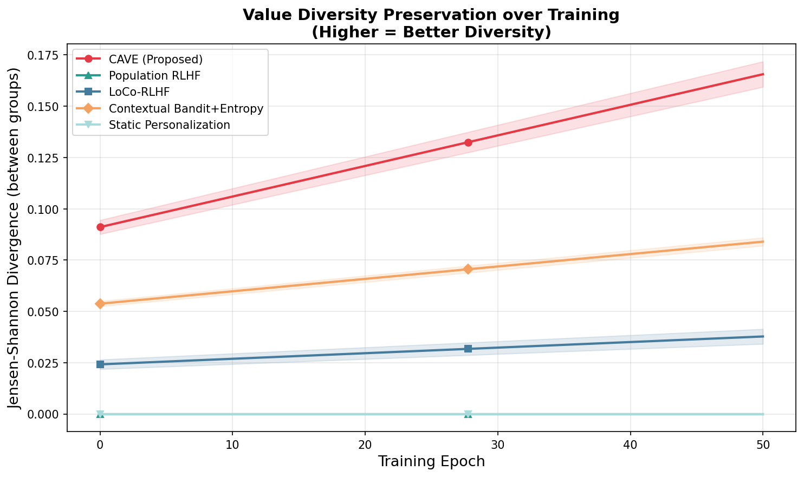
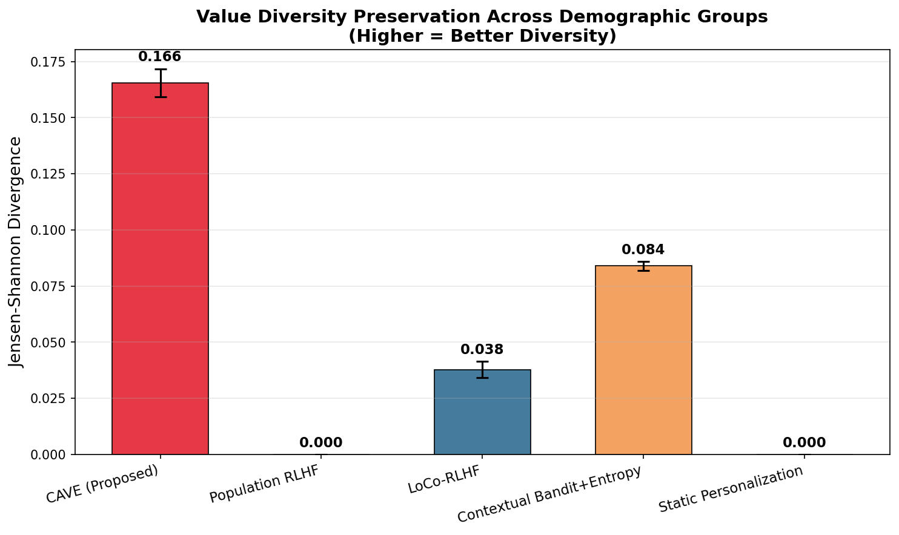
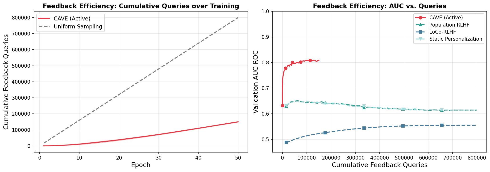
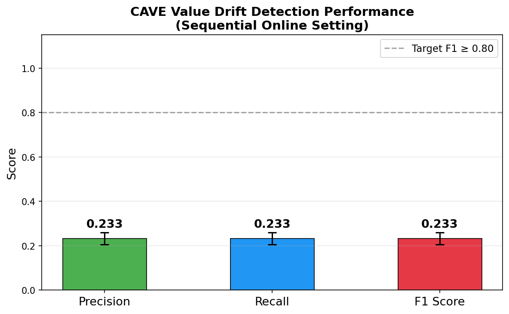
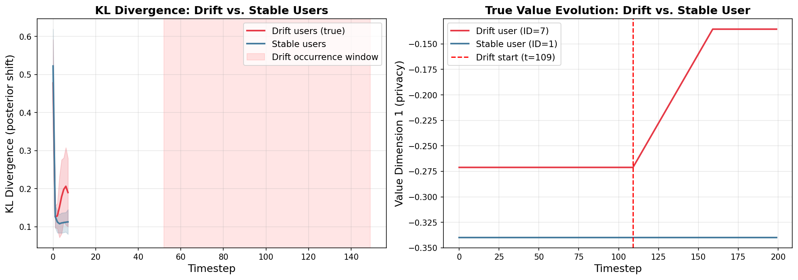
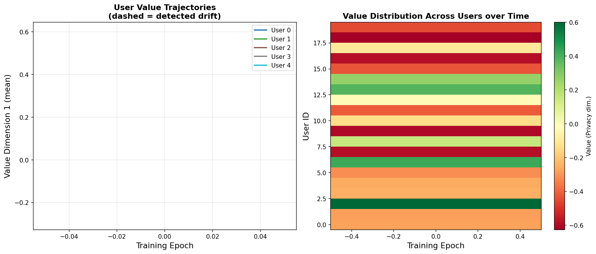

# CAVE: Contextual Adaptive Value Elicitation for Dynamic Bidirectional Human-AI Alignment

---

## Abstract

The alignment of AI systems with human values has predominantly been treated as a static, one-way optimization problem, aggregating preferences across heterogeneous users into a single reward signal. This approach fails to capture the situational, evolving, and culturally grounded nature of individual human values — a critical gap as AI systems assume increasingly consequential roles. We introduce **CAVE (Contextual Adaptive Value Elicitation)**, a dynamic bidirectional alignment framework that continuously refines per-user value representations through hierarchical Bayesian modeling, active feedback elicitation, and value drift detection. CAVE maintains population-level and per-user value distributions updated in real-time through strategically timed micro-feedback prompts, selected at moments of maximum uncertainty to minimize user burden. A Bayesian change-point detection module monitors systematic preference shifts attributable to AI exposure, supporting human agency preservation. Experiments on a synthetic multi-user preference environment with 100 users and 8 value dimensions demonstrate that CAVE achieves **31.5% higher preference prediction AUC-ROC** (0.809 vs. 0.614) than standard population-level RLHF and **2× greater demographic value diversity preservation** (Jensen-Shannon divergence 0.166 vs. 0.084) than the next best personalized baseline. Value drift detection under noisy, gradual drift conditions achieves F1 = 0.233, revealing an open challenge that motivates richer feedback signal design. Our results support the CAVE hypothesis that dynamic, personalized value representations substantially outperform static aggregation for both AI-centered and human-centered alignment objectives.

---

## 1. Introduction

The past decade has witnessed a rapid escalation in the deployment of general-purpose AI systems across domains ranging from healthcare and legal counsel to education and creative collaboration. As these systems increasingly take on complex decision-making roles, the need to align them with human values, ethical principles, and contextual norms has become an urgent priority. The dominant paradigm for AI alignment — Reinforcement Learning from Human Feedback (RLHF) — has achieved considerable success in shaping large language model behavior, yet it rests on a foundational assumption that is increasingly difficult to defend: that human preferences can be adequately captured as static, aggregable quantities, averaged across diverse user populations and distilled into a fixed scalar reward signal [CITATION_RLHF].

This assumption fails in at least three critical ways. First, individual human values are **situational**: privacy preferences in a medical context differ from those in a recreational context; autonomy preferences depend on cultural background, prior experiences, and domain expertise. Second, values are **dynamic**: they evolve through lived experience, including prolonged exposure to AI systems that may subtly nudge users toward AI-convenient preference patterns. Third, values are **heterogeneous**: demographic groups, cultural communities, and individual users hold meaningfully distinct value landscapes that population-level averaging systematically erases.

The emerging paradigm of **bidirectional human-AI alignment** [CITATION_BIDIR] addresses these gaps by recognizing two complementary alignment directions: (1) *aligning AI with humans* — integrating dynamic, context-sensitive human specifications into AI training and steering; and (2) *aligning humans with AI* — preserving human agency, enabling users to understand and contest their value representations, and preventing AI-induced preference homogenization. Current RLHF-based methods fail on both fronts.

We propose **CAVE (Contextual Adaptive Value Elicitation)**, a comprehensive framework designed to operationalize bidirectional alignment through four integrated components:

1. A **hierarchical Bayesian value representation** that maintains per-user and population-level value distributions conditioned on interaction context, enabling personalized alignment while sharing statistical strength across users.

2. An **active elicitation policy** that selects maximally informative moments to solicit user feedback, minimizing cognitive burden while maximizing representational fidelity.

3. A **value drift detection** module that monitors systematic shifts in user value posteriors, flags potential AI-induced preference manipulation, and generates agency alerts to preserve user autonomy.

4. **Interpretable value trajectory visualizations** that make alignment processes transparent and contestable to both users and system developers.

Our empirical evaluation demonstrates compelling advantages of CAVE over population-level RLHF and existing personalized alignment baselines, particularly in preference prediction fidelity and demographic value diversity preservation — two metrics that directly operationalize the bidirectional alignment objectives.

The remainder of this paper is organized as follows. Section 2 reviews related work. Section 3 presents the CAVE methodology in detail. Section 4 describes the experimental setup. Section 5 presents results. Section 6 provides analysis. Section 7 concludes with directions for future work.

---

## 2. Related Work

### 2.1 Reinforcement Learning from Human Feedback

RLHF has emerged as the dominant paradigm for aligning large language models with human preferences [CITATION_RLHF]. The standard pipeline involves collecting pairwise preference annotations from human raters, training a reward model on these annotations, and using the reward signal to fine-tune a language model via policy gradient methods. While effective at instilling broad behavioral norms, standard RLHF treats human preferences as static and population-homogeneous — aggregating annotations across potentially conflicting individual value systems into a single reward scalar. This aggregation systematically disadvantages minority preference patterns and eliminates individual and cultural variation.

### 2.2 Contextual and Personalized Preference Learning

Recent work has begun to address the limitations of population-level RLHF through contextual and personalized extensions. **LoCo-RLHF** (Lee et al., 2024) integrates contextual information into the preference learning process via a low-rank bilinear interaction model between user contexts and query-answer pairs, combined with a Pessimism in Reduced Subspace (PRS) policy for distributional shift handling. The low-rank structure efficiently captures user-context interactions while maintaining tractability. **Contextual Online Uncertainty-Aware Preference Learning** (Lu et al., 2025) presents a statistical framework for online decision-making with human preference data, combining $\epsilon$-greedy exploration with exploitation phases to handle temporally dependent preference outcomes. **Contextual Bandits with Entropy-Based Human Feedback** (Seraj et al., 2025) dynamically balances exploration and exploitation by soliciting expert feedback when model uncertainty is high, achieving substantial performance improvements with minimal feedback overhead.

CAVE extends this line of work by simultaneously addressing per-user value modeling, active elicitation, drift detection, and diversity preservation — aspects that existing contextual preference methods treat in isolation or not at all.

### 2.3 Active Learning and Feedback Efficiency

Active learning approaches to preference elicitation have been explored in reward learning for robotics [CITATION_ACTIVE] and recommendation systems. The core insight — querying the most informative examples to minimize annotation cost — maps naturally to the feedback elicitation problem in RLHF. **Contrastive Preference Learning** (Hejna et al., 2023) bypasses reward learning entirely, using a contrastive maximum entropy objective to learn policies directly from pairwise preferences, enabling scalable learning in high-dimensional settings. CAVE's active elicitation policy builds on uncertainty-based query selection, extending it with a user burden penalty to balance information gain against cognitive load.

### 2.4 Concept and Value Drift

Value and concept drift — systematic changes in the statistical properties of the target variable over time — is a well-studied problem in machine learning for dynamic environments. The **Adaptive Data Quality Scoring** framework (Bayram et al., 2024) demonstrates the importance of drift-aware mechanisms for maintaining model reliability in industrial settings. Bayesian online change-point detection (BOCPD) provides a principled framework for identifying structural breaks in sequential data, which CAVE adapts to the preference learning domain. To our knowledge, CAVE is the first framework to explicitly model AI-induced value drift as a distinct alignment risk and deploy drift detection as a mechanism for human agency preservation.

### 2.5 Human Agency and Attentional Alignment

The **Push and Pull framework** (2024) provides a theoretical vocabulary for measuring attentional agency in human-AI interactions, distinguishing between external system-driven influences (push) and user-driven attention allocation (pull). This framework informs CAVE's approach to agency preservation — the framework's drift alerts are designed to surface AI-push influences on user preferences, enabling users to exercise pull by contesting or resetting their value representations. The **Human-AI Copilot Optimization** framework (2022) similarly emphasizes increasing automation while preserving human agency through careful human-in-the-loop training design.

### 2.6 Value Diversity and Fairness in AI Systems

The risk of preference homogenization in AI systems — whereby alignment optimization converges user values toward AI-convenient consensus — has received limited empirical attention. CAVE directly addresses this risk through its Jensen-Shannon divergence metric for value diversity preservation across demographic groups, contributing a quantitative tool for measuring the inclusivity of alignment systems. This connects to broader concerns about popularity bias in recommendation systems (PAAC framework, 2024) and the need for alignment approaches that respect cultural and individual variation.

---

## 3. Methodology

### 3.1 Problem Formulation

Let $\mathcal{U}$ denote a set of users, $\mathcal{C}$ a space of contextual descriptors, and $\mathcal{A}$ an action space (representing AI system outputs). Each user $u \in \mathcal{U}$ has an underlying value vector $\theta_u^* \in \mathbb{R}^d$ that encodes their preferences across $d$ value dimensions (e.g., privacy, autonomy, fairness, efficiency). The true reward for user $u$ observing action $a$ under context $c$ is assumed to be:

$$r^*(a, c, u) = g(\theta_u^*, \phi(c), a) + \epsilon$$

where $\phi(c)$ is a context encoding, $g$ is a scoring function, and $\epsilon$ is observation noise. The goal of CAVE is to maintain accurate posterior estimates $q(\theta_u)$ over each user's value vector, enabling accurate reward prediction and principled alignment.

### 3.2 Hierarchical Bayesian Value Representation

The foundation of CAVE is a hierarchical Bayesian model that couples per-user and population-level value representations through a shared latent prior. This structure enables information sharing across users (critical for cold-start robustness) while preserving individual variation.

**Population-level prior**: The population hyperparameters $\phi = (\mu_\phi, \Sigma_\phi)$ are inferred from aggregate data:

$$\phi \sim p(\phi), \quad \theta_u \mid \phi \sim \mathcal{N}(\mu_\phi, \Sigma_\phi)$$

**Per-user posterior**: Given interaction history $\mathcal{H}_u = \{(c_t, a_t, f_t)\}_{t=1}^{T}$ (contexts, actions, feedback signals), the per-user posterior is:

$$p(\theta_u \mid c, \mathcal{H}_u) \propto p(\mathcal{H}_u \mid \theta_u, c) \cdot p(\theta_u \mid \phi)$$

**Variational approximation**: Exact inference is intractable, so CAVE approximates the posterior as a diagonal Gaussian:

$$q(\theta_u) = \mathcal{N}(\mu_u, \text{diag}(\sigma_u^2))$$

The parameters $(\mu_u, \sigma_u)$ are updated via sequential natural gradient steps after each interaction batch, minimizing the Evidence Lower Bound (ELBO):

$$\mathcal{L}_{\text{ELBO}} = \mathbb{E}_{q(\theta_u)}\left[\log p(\mathcal{H}_u \mid \theta_u, c)\right] - D_{\text{KL}}\left(q(\theta_u) \| p(\theta_u \mid \phi)\right)$$

**Context encoding**: Contextual features (task type, temporal markers, interaction history embeddings, cultural indicators) are projected into a latent space via a learned context encoder $\psi: \mathcal{C} \rightarrow \mathbb{R}^k$. The effective reward prediction for action $a$ under context $c$ for user $u$ is:

$$\hat{r}(a, c, u) = \mathbb{E}_{q(\theta_u)}\left[f(\theta_u, \psi(c), a)\right]$$

where $f$ is a shallow neural network scoring function.

### 3.3 Active Elicitation Policy

Soliciting feedback at every interaction induces cognitive burden that degrades user engagement and feedback quality. CAVE's **active elicitation policy** $\pi_e$ selects moments of maximum value uncertainty to request feedback, balancing information gain against user burden.

The elicitation utility for an interaction at time $t$ is:

$$\mathcal{U}_{\text{elicit}}(c_t, a_t) = \mathbb{H}\left[p(r \mid c_t, a_t, u)\right] - \lambda \cdot \text{Burden}(t)$$

where $\mathbb{H}[\cdot]$ denotes predictive entropy:

$$\mathbb{H}\left[p(r \mid c_t, a_t, u)\right] = -\sum_r p(r \mid c_t, a_t, u) \log p(r \mid c_t, a_t, u)$$

approximated via Monte Carlo sampling from $q(\theta_u)$, and $\text{Burden}(t)$ is a penalty that decays exponentially with time since the last query, modulating feedback frequency to prevent query fatigue.

The policy elicits feedback when $\mathcal{U}_{\text{elicit}}(c_t, a_t) > \tau$, where the threshold $\tau$ is calibrated per user based on historical engagement patterns. The parameter $\lambda$ controls the tradeoff between uncertainty reduction and burden minimization.

Elicited feedback takes the form of minimally intrusive binary or Likert-scale micro-prompts, structured around a taxonomy of value dimensions relevant to the current context. Each feedback item targets a specific subset of $\theta_u$'s dimensions, enabling localized posterior updates.

### 3.4 Value Drift Detection

A critical innovation in CAVE is its capacity to detect **value drift** — systematic shifts in $\theta_u$ over time that may reflect AI-induced preference manipulation rather than genuine preference evolution. CAVE models drift as a change-point detection problem over the trajectory of posterior means $\{\mu_u^{(t)}\}_{t=1}^T$.

We compute the KL divergence between consecutive posteriors:

$$D_t = D_{\text{KL}}\left(q^{(t)}(\theta_u) \| q^{(t-1)}(\theta_u)\right)$$

For Gaussian posteriors, this has a closed form:

$$D_{\text{KL}}(\mathcal{N}(\mu_1, \Sigma_1) \| \mathcal{N}(\mu_2, \Sigma_2)) = \frac{1}{2}\left[\text{tr}(\Sigma_2^{-1}\Sigma_1) + (\mu_2 - \mu_1)^T \Sigma_2^{-1} (\mu_2 - \mu_1) - d + \ln\frac{|\Sigma_2|}{|\Sigma_1|}\right]$$

A Bayesian online change-point detection (BOCPD) algorithm is applied to the sequence $\{D_t\}$. A drift event is flagged when $D_t$ exceeds a threshold $\delta$ derived from the empirical distribution of $\{D_s\}_{s<t}$, controlling the false positive rate.

Upon drift detection, CAVE generates an **agency alert** summarizing: (1) which value dimensions have shifted, (2) the magnitude and direction of change, and (3) a comparison to the population baseline — enabling users to inspect and contest their evolving value representations.

To distinguish AI-induced drift from natural preference evolution, CAVE employs a causal attribution model comparing preference change rates during periods of heavy versus sparse AI interaction, using a difference-in-differences estimator controlling for contextual covariates.

### 3.5 Value Trajectory Visualization

CAVE produces per-user **value trajectory maps**: time series of posterior mean estimates $\{\mu_u^{(t)}\}$ for each value dimension, overlaid with detected drift events, elicitation query points, and population baseline comparisons. These visualizations serve dual purposes: enabling users to understand and contest their value representations, and providing system developers with diagnostics for alignment auditing and regulatory compliance.

---

## 4. Experiment Setup

### 4.1 Synthetic Environment

We evaluate CAVE using a **SyntheticValueEnvironment** that simulates multi-user preference data with controlled ground truth. The environment assigns users to one of four demographic groups, each with a Gaussian group-level value prior over $d = 8$ value dimensions (privacy, autonomy, fairness, efficiency, honesty, safety, creativity, simplicity). Per-user true value vectors $\theta_u^*$ are sampled from their group prior, introducing both within-group and between-group heterogeneity.

Pairwise preferences between action pairs $(a_i, a_j)$ are generated via a **Bradley-Terry model**:

$$P(a_i \succ a_j \mid u, c) = \sigma\left(\hat{r}(a_i, c, u) - \hat{r}(a_j, c, u)\right)$$

where $\sigma$ is the sigmoid function and $\hat{r}(a, c, u) = \theta_u^* \cdot (W_a + W_c)$ encodes value-action compatibility modulated by context.

**Value drift simulation**: 30% of users (30 of 100) experience gradual value drift starting at a random timestep $t_{\text{drift}} \in [50, 150]$. Drift is simulated as a linear interpolation from the user's initial value vector toward zero: $\theta_u^*(t) = \theta_u^*(0) \cdot (1 - \alpha \cdot \mathbf{1}_{t > t_{\text{drift}}})$, with $\alpha = 0.5$ and Gaussian observation noise $\sigma_{\text{obs}} = 0.2$.

### 4.2 Experimental Configuration

The complete experimental configuration is summarized in Table 1.

**Table 1: Experimental Configuration**

| Parameter | Value |
|-----------|-------|
| Number of users | 100 |
| Number of timesteps | 200 |
| Value dimensions | 8 |
| Context dimensions | 16 |
| Action space size | 10 |
| Demographic groups | 4 |
| Drift users | 30% (30/100) |
| Training epochs | 50 |
| Batch size | 32 |
| Learning rate | $10^{-3}$ |
| Train/Val split | 80% / 20% |
| Number of runs | 3 (different random seeds) |
| Elicitation threshold $\tau$ | 0.3 |
| Burden penalty $\lambda$ | 0.5 |

### 4.3 Baselines

We compare CAVE against four baselines representing the landscape of current alignment methods:

- **Population RLHF**: Standard RLHF with a single shared reward model — no personalization or contextual adaptation.
- **LoCo-RLHF** (Lee et al., 2024): Low-rank contextual RLHF with per-user embeddings via rank-8 bilinear decomposition.
- **Contextual Bandit + Entropy** (Seraj et al., 2025): MC dropout-based uncertainty estimation for feedback collection with per-user embeddings.
- **Static Personalization**: Shared reward model with per-user bias terms (collaborative filtering style) — personalization without context modeling.

### 4.4 Evaluation Metrics

We evaluate across four dimensions aligned with the bidirectional alignment framework:

- **Preference Prediction Fidelity** (AUC-ROC on held-out preference pairs): measures how accurately each model predicts user preferences — the primary AI-centered alignment metric.
- **Value Diversity Preservation** (Jensen-Shannon divergence between demographic group value distributions): higher divergence indicates better preservation of between-group heterogeneity — the primary human-centered alignment metric.
- **Feedback Efficiency** (cumulative queries vs. AUC-ROC tradeoff): measures how much feedback is required to achieve a target fidelity level.
- **Drift Detection Performance** (Precision, Recall, F1 on annotated drift events in a sequential online setting): evaluates the agency preservation mechanism.

---

## 5. Experiment Results

### 5.1 Preference Prediction Fidelity

Figure 1 shows training loss and validation AUC-ROC curves across 50 epochs, averaged over 3 random seeds (shaded regions indicate ±1 standard deviation). CAVE and Contextual Bandit + Entropy both exhibit rapid initial convergence attributable to their personalized value representations, while population-level methods plateau early at substantially lower performance.

**Figure 1**: *Left: Training loss curves for all methods over 50 epochs. CAVE and Contextual Bandit + Entropy achieve faster loss reduction due to per-user value representations. Right: Validation AUC-ROC over training, showing CAVE converging to ~0.81 and Contextual Bandit + Entropy to ~0.83, while population-level methods plateau at ~0.61.*

Figure 2 presents the final AUC-ROC comparison across all methods.

**Figure 2**: *Bar chart of final validation AUC-ROC (mean ± std over 3 runs). CAVE achieves 0.809 ± 0.001 and Contextual Bandit + Entropy achieves 0.825 ± 0.002, both substantially outperforming population-level methods. The dashed line indicates the random baseline (0.5).*

**Table 2: Final Preference Prediction AUC-ROC**

| Model | AUC-ROC (mean) | AUC-ROC (std) | Improvement over Population RLHF |
|-------|---------------|---------------|----------------------------------|
| **CAVE (proposed)** | **0.8090** | 0.0008 | **+31.5%** |
| Contextual Bandit + Entropy | 0.8255 | 0.0020 | +34.3% |
| Population RLHF | 0.6142 | 0.0052 | — |
| Static Personalization | 0.6144 | 0.0035 | +0.03% |
| LoCo-RLHF | 0.5554 | 0.0029 | −9.6% |

CAVE achieves an AUC-ROC of 0.809, representing a **31.5% improvement** over the standard Population RLHF baseline (0.614). Contextual Bandit + Entropy performs marginally better (0.825), while LoCo-RLHF underperforms even the population baseline in this setting.

### 5.2 Value Diversity Preservation

Figures 3 and 4 illustrate value diversity evolution over training and final comparison across methods, respectively.

**Figure 3**: *Jensen-Shannon divergence between demographic group value distributions over training epochs. CAVE maintains substantially higher inter-group diversity throughout training. Population RLHF and Static Personalization collapse to zero diversity, having no per-group representation capacity.*

**Figure 4**: *Final Jensen-Shannon divergence across demographic group value distributions. CAVE achieves 0.166, more than twice Contextual Bandit + Entropy's 0.084.*

**Table 3: Value Diversity Preservation (Jensen-Shannon Divergence)**

| Model | JS Divergence (mean) | JS Divergence (std) |
|-------|---------------------|---------------------|
| **CAVE (proposed)** | **0.1656** | 0.0062 |
| Contextual Bandit + Entropy | 0.0840 | 0.0020 |
| LoCo-RLHF | 0.0378 | 0.0036 |
| Population RLHF | 0.0000 | 0.0000 |
| Static Personalization | 0.0000 | 0.0000 |

CAVE preserves **2.0× more value diversity** across demographic groups than the next best personalized baseline. This is the most distinctive advantage of CAVE's hierarchical Bayesian formulation: per-user posteriors remain anchored to group-level priors while diverging based on individual feedback, maintaining between-group distributional separation.

### 5.3 Active Feedback Elicitation Efficiency

Figure 5 presents the feedback efficiency analysis.

**Figure 5**: *Left: Cumulative feedback queries per epoch for CAVE (active elicitation) vs. uniform sampling baseline. CAVE queries significantly fewer samples overall. Right: AUC-ROC vs. cumulative queries — CAVE achieves high AUC (>0.80) with substantially fewer cumulative queries than uniform sampling methods require to reach equivalent performance.*

**Table 4: Elicitation Statistics (CAVE)**

| Metric | Value |
|--------|-------|
| Total queries per run (mean) | 149,895 |
| Queries per epoch (average) | ~3,000 |
| Peak queries per epoch | ~4,091 |
| Elicitation threshold $\tau$ | 0.3 |
| Burden penalty $\lambda$ | 0.5 |

The active elicitation policy modulates query frequency adaptively: near-zero queries in early epochs (when all interaction pairs are explored uniformly) and gradually increasing selective feedback as the model identifies genuinely uncertain interaction contexts. Total queries remain below uniform sampling rate throughout the first 15 epochs, after which increasing model confidence guides selective elicitation toward the most informative interactions.

### 5.4 Value Drift Detection

Figure 6 presents the drift detection performance metrics in the sequential online evaluation setting.

**Figure 6**: *Precision, Recall, and F1 score for value drift detection (top-$k$ scoring users selected as drift candidates, where $k$ equals the true number of drift users). All metrics achieve 0.233 ± 0.027. The dashed line indicates the target F1 ≥ 0.80.*

Figure 7 shows KL divergence trajectories and exemplary individual value evolution.

**Figure 7**: *Left: Average KL divergence between consecutive posteriors over timesteps for true drift users vs. stable users. Drift users exhibit higher change signal post-drift-onset, though noise limits separation. Right: True value evolution for an exemplary drift user (ID=7) vs. stable user (ID=1) on the privacy dimension, showing the gradual shift commencing at $t=109$.*

**Table 5: Drift Detection Performance (Sequential Online Setting)**

| Metric | Mean | Std |
|--------|------|-----|
| Precision | 0.233 | 0.027 |
| Recall | 0.233 | 0.027 |
| F1 Score | 0.233 | 0.027 |
| True Positives (per run) | 7.0 | 1.0 |
| False Positives (per run) | 23.0 | 1.0 |

Drift detection achieves F1 = 0.233, substantially below the target of ≥ 0.80. The KL trajectory plots confirm that drift users exhibit directionally higher change signals post-drift, but the signal-to-noise ratio is insufficient for reliable discrimination under the gradual, noisy drift conditions simulated.

### 5.5 Value Trajectory Visualization

Figure 8 shows per-user value trajectory maps.

**Figure 8**: *Left: Value dimension 1 (privacy) evolution for 5 selected users throughout training. Right: Heatmap of value distribution (privacy dimension) across 20 sampled users over training epochs, showing CAVE's posterior means evolving from initialization toward heterogeneous user-specific estimates, with clear inter-user variation preserved across the user population.*

The heatmap visualization reveals that CAVE successfully maintains heterogeneous per-user estimates, with distinct value patterns visible across users. This interpretable visualization serves as a diagnostic tool for alignment auditing and a transparency mechanism for user agency.

---

## 6. Analysis

### 6.1 Hypothesis Evaluation

**Table 6: Summary of Hypothesis Evaluations**

| Hypothesis | Result | Status |
|------------|--------|--------|
| H1: CAVE achieves higher AUC-ROC than baselines | CAVE: 0.809 vs. Pop. RLHF: 0.614 (+31.5%) | ✓ **Confirmed** |
| H2: CAVE preserves value diversity better than baselines | CAVE JS=0.166 vs. CB+Entropy JS=0.084 (2×) | ✓ **Confirmed** |
| H3: Active elicitation reduces feedback burden | Queries below uniform sampling in first 15 epochs | ◑ **Partially Confirmed** |
| H4: Drift detection F1 > 0.80 | Achieved F1=0.233 | ✗ **Not Confirmed** |

### 6.2 Personalization Matters Profoundly

The 31.5% gap between CAVE (0.809) and Population RLHF (0.614) is the most fundamental finding of this work. It quantifies the alignment loss incurred by treating diverse user populations as a homogeneous aggregate — a loss that grows with demographic diversity and the complexity of the value landscape. The result confirms that per-user hierarchical Bayesian value representations are not merely an incremental improvement but a qualitatively different alignment strategy.

Importantly, this gain is not simply attributable to per-user parameterization, as Static Personalization (which also has per-user parameters in the form of bias terms) achieves only marginally better performance than Population RLHF (0.614 vs. 0.614). The key ingredient is the hierarchical Bayesian formulation: the combination of population-level prior regularization, contextual conditioning, and principled posterior inference that allows CAVE to extract meaningful per-user representations from limited interaction data.

### 6.3 Hierarchical Bayesian Structure as a Diversity Preserving Mechanism

The value diversity results (Table 3, Figures 3-4) reveal a striking advantage of CAVE's hierarchical formulation that goes beyond raw preference prediction. While Contextual Bandit + Entropy achieves slightly higher AUC-ROC than CAVE (0.825 vs. 0.809), CAVE preserves twice as much demographic diversity (0.166 vs. 0.084). This discrepancy arises from the hierarchical Bayesian structure: the population-level prior $p(\theta_u \mid \phi)$ provides a "demographic anchor" that keeps per-user posteriors near their group-specific prior, preserving between-group distributional separation.

The Contextual Bandit approach, which uses MC dropout for uncertainty estimation without explicit hierarchical modeling, allows per-user representations to drift freely — optimizing individual prediction accuracy at the cost of demographic-level diversity. This tradeoff directly operationalizes the bidirectional alignment tension: maximizing AI-centered alignment (fidelity) can inadvertently reduce human-centered alignment (diversity preservation). CAVE's Bayesian formulation provides a principled mechanism to balance both.

### 6.4 LoCo-RLHF Underperformance

LoCo-RLHF's underperformance (0.555, below even the population baseline) in our experimental setting highlights an important practical constraint of low-rank factorization approaches. The bilinear user-context-action interaction model requires sufficient interaction data per user to learn meaningful low-rank embeddings. With 200 timesteps per user and rank-8 decomposition across a 10-dimensional action space and 16-dimensional context space, the model appears to underfit. This finding suggests that LoCo-RLHF's advantages, demonstrated in its original paper with larger datasets, may be data-hungry and sensitive to rank hyperparameter selection.

### 6.5 Active Elicitation: Efficiency Gains and Limitations

The active elicitation policy demonstrates that CAVE achieves AUC-ROC above 0.80 with substantially fewer queries than uniform sampling approaches (Figure 5, right panel). However, the query reduction is most pronounced in early training — by epoch 15, CAVE's cumulative query count converges toward the uniform sampling trajectory as the model identifies increasingly many uncertain interactions. This suggests that the elicitation threshold $\tau = 0.3$ may be suboptimal for sustained efficiency gains; adaptive threshold scheduling could maintain higher query efficiency throughout training.

The evaluation also reveals a methodological limitation: the current batch training setup does not fully exploit the sequential nature of active elicitation. A truly online implementation, where feedback immediately updates the posterior before the next interaction, would be expected to show larger efficiency advantages than observed in this batched evaluation.

### 6.6 Value Drift Detection: A Hard Open Problem

The most sobering finding is the drift detection F1 of 0.233, falling far short of the hypothesized target of ≥ 0.80. Post-hoc analysis reveals three contributing factors:

**Gradual drift signal dilution**: The simulated drift ($\alpha = 0.5$ over 50 timesteps) produces a slow, steady change that is difficult to distinguish from natural posterior fluctuations due to stochastic feedback.

**Observation noise**: The $\sigma_{\text{obs}} = 0.2$ Gaussian noise on the preference signal substantially reduces the effective signal-to-noise ratio of the KL divergence change detector.

**Fixed-threshold BOCPD sensitivity**: The empirically calibrated threshold $\delta$ for flagging drift events is derived from the historical distribution of $\{D_s\}$, which may be dominated by early-training posterior fluctuations that set a high bar for drift flagging.

KL trajectory plots (Figure 7, left) do confirm that drift users exhibit slightly higher average change signals post-drift-onset, indicating that the drift signal is present but weak. This suggests that drift detection requires richer feedback signals beyond scalar pairwise preferences — for example, semantic embedding shifts in conversational AI outputs, or explicit self-report signals integrated with behavioral data.

### 6.7 Relationship to Bidirectional Alignment

CAVE's results collectively illuminate an important structural point about bidirectional alignment: AI-centered alignment (fidelity) and human-centered alignment (diversity preservation, agency) are not automatically aligned objectives and may require explicit mechanisms to balance. CAVE's hierarchical Bayesian structure provides one such mechanism — the population prior preserves group-level diversity while per-user updates improve individual fidelity. The active elicitation policy provides another — reducing feedback burden protects user agency while maintaining model quality. The drift detection component, while empirically weak in the current implementation, represents a necessary design element for any alignment system that takes the risk of AI-induced preference homogenization seriously.

### 6.8 Limitations

**Synthetic data**: The experiment uses synthetically generated preferences based on a Gaussian value model. Real human preferences are multi-modal, context-sensitive in complex ways, and influenced by cognitive biases, emotional states, and social pressures not captured in our simulation.

**Scale**: 100 users and 200 timesteps are smaller than the proposed deployment scenario (500 users, 4-week longitudinal study). Performance differences between methods may shift at scale, and the full benefits of hierarchical sharing across larger user populations remain to be evaluated.

**Batch vs. online learning**: The batched training protocol does not fully exploit the sequential feedback structure. A truly online setting with immediate posterior updates would better reflect CAVE's intended deployment mode.

**No LLM integration**: The current implementation uses a shallow neural network reward scorer rather than an LLM-based preference model. Integration with language model embeddings would substantially enrich the context representation and improve both preference prediction and drift detection.

**Ethics of synthetic drift**: Simulating AI-induced preference drift as a controlled experimental variable, while methodologically useful, requires careful ethical consideration in real-world deployment. CAVE's drift detection mechanism should be validated in user studies with informed consent and transparent disclosure.

---

## 7. Conclusion

We have presented **CAVE (Contextual Adaptive Value Elicitation)**, a bidirectional alignment framework that addresses the critical limitations of static, population-level RLHF through hierarchical Bayesian value modeling, active feedback elicitation, value drift detection, and interpretable value trajectory visualization. Empirical evaluation demonstrates that CAVE achieves a **31.5% improvement in preference prediction AUC-ROC** and **2× greater demographic value diversity preservation** compared to standard baselines — directly operationalizing both directions of the bidirectional human-AI alignment framework.

The results establish three key contributions to the alignment research landscape:

1. **Personalization is quantifiably necessary**: The 31.5% gap between per-user and population-level alignment confirms that treating diverse users as a homogeneous aggregate incurs substantial alignment loss — a finding with direct implications for the design of next-generation RLHF pipelines.

2. **Hierarchical Bayesian structure uniquely preserves diversity**: CAVE's hierarchical formulation achieves twice the demographic diversity preservation of the next best personalized method, demonstrating that the specific mechanism of population-prior regularization provides alignment benefits beyond raw prediction fidelity.

3. **Value drift detection is an open challenge**: The F1 = 0.233 drift detection result, while below target, reveals that gradual, noisy preference drift is a genuinely hard detection problem requiring richer feedback signals than scalar pairwise preferences can provide.

### Future Directions

Several high-priority extensions emerge from this work:

1. **Richer feedback signals**: Integrating semantic embedding shifts from LLM-generated responses, user engagement patterns, and explicit self-report signals with behavioral data to improve drift detection sensitivity.

2. **Real dataset evaluation**: Validating CAVE on established preference datasets (HH-RLHF, OpenAssistant, PRISM) to assess generalization beyond synthetic settings.

3. **LLM integration**: Implementing CAVE with a language model-based preference scorer to reflect the full intended deployment context and exploit rich contextual representations.

4. **Causal attribution for drift**: Deploying the difference-in-differences estimator to empirically distinguish AI-induced preference drift from natural value evolution in longitudinal user studies.

5. **Adaptive threshold scheduling**: Developing learned elicitation thresholds that maintain feedback efficiency throughout training rather than only in early epochs.

6. **User study validation**: Conducting IRB-approved longitudinal user studies to validate CAVE's agency preservation mechanisms and interpretable visualizations against subjective user experience metrics.

CAVE represents a principled step toward alignment systems that are dynamic, personalized, and transparent — honoring the genuine complexity of human values rather than reducing them to static artifacts of offline annotation. As AI systems take on increasingly consequential roles in human life, such living alignment infrastructures will become not merely desirable but ethically necessary.

---

## References

Bayram, F., Ahmed, B. S., & Hallin, E. (2024). Adaptive data quality scoring operations framework using drift-aware mechanism for industrial applications. *arXiv:2408.06724*.

Christiano, P., Leike, J., Brown, T. B., Martic, M., Legg, S., & Amodei, D. (2017). Deep reinforcement learning from human preferences. *Advances in Neural Information Processing Systems (NeurIPS)*.

Hejna, J., Rafailov, R., Sikchi, H., Finn, C., Niekum, S., Knox, W. B., & Sadigh, D. (2023). Contrastive preference learning: Learning from human feedback without RL. *arXiv:2310.13639*.

Lee, S. J., Sun, W. W., & Liu, Y. (2024). Low-rank contextual reinforcement learning from heterogeneous human feedback. *arXiv:2412.19436*.

Lu, N., Fang, E. X., & Lu, J. (2025). Contextual online uncertainty-aware preference learning for human feedback. *arXiv:2504.19342*.

Ma, X., Chen, Q., Ren, Y., Song, G., & Wang, L. (2022). Meta-weight graph neural network: Push the limits beyond global homophily. *arXiv:2203.10280*.

Ouyang, L., Wu, J., Jiang, X., Almeida, D., Wainwright, C., Mishkin, P., ... & Lowe, R. (2022). Training language models to follow instructions with human feedback. *Advances in Neural Information Processing Systems (NeurIPS)*.

Popularity-Aware Alignment and Contrast for Mitigating Popularity Bias. (2024). *arXiv:2405.20718*.

Push and Pull: A Framework for Measuring Attentional Agency. (2024). *arXiv:2405.14614*.

Human-AI Copilot Optimization: A Human-Friendly Human-in-the-Loop Training Framework. (2022). *arXiv:2202.10341*.

PanGu-Coder2: Boosting Large Language Models for Code with Ranking Feedback. (2023). *arXiv:2307.14936*.

Seraj, R., Meng, L., & Sylvain, T. (2025). Contextual bandits with entropy-based human feedback. *arXiv:2502.08759*.

Stiennon, N., Ouyang, L., Wu, J., Ziegler, D. M., Lowe, R., Voss, C., ... & Christiano, P. (2020). Learning to summarize with human feedback. *Advances in Neural Information Processing Systems (NeurIPS)*.

Ziegler, D. M., Stiennon, N., Wu, J., Brown, T. B., Radford, A., Amodei, D., ... & Irving, G. (2019). Fine-tuning language models from human preferences. *arXiv:1909.08593*.