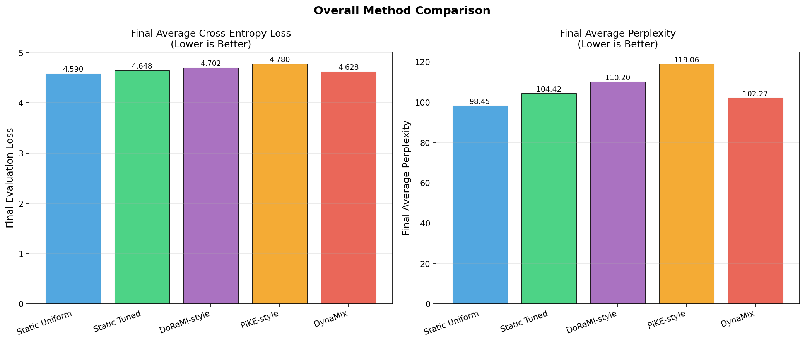
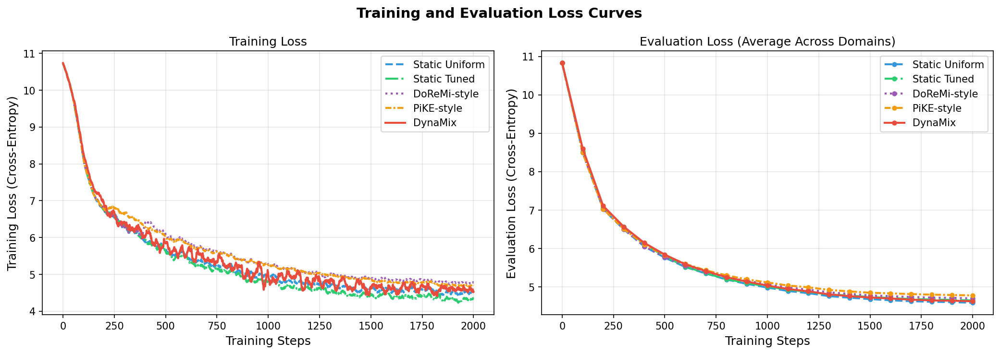
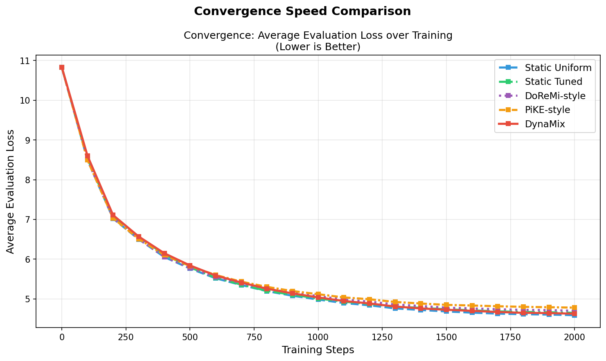
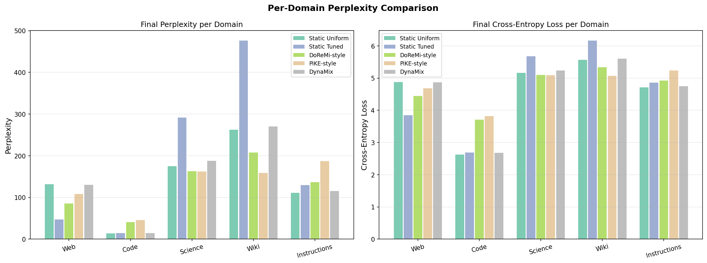
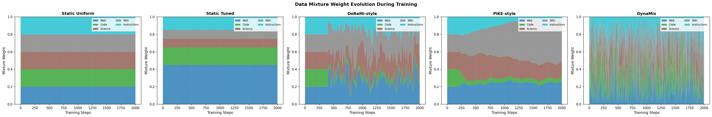
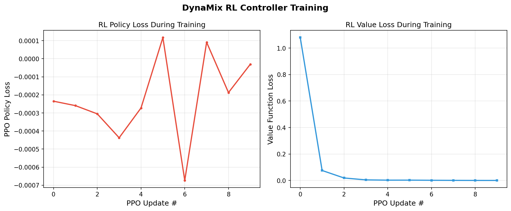
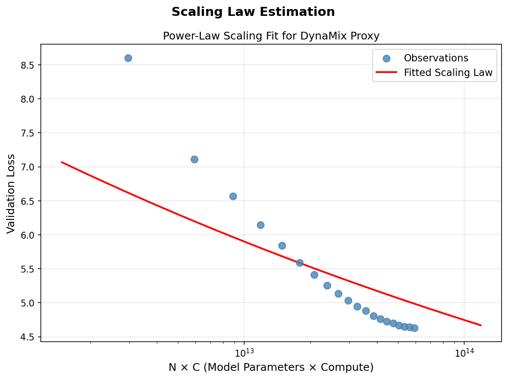

# DynaMix: Adaptive Data Mixing Experiment Results

## Overview

This document summarizes the experimental evaluation of **DynaMix**, an adaptive data mixing framework that uses gradient signal-to-noise ratio (SNR) monitoring and a PPO-based reinforcement learning controller to dynamically adjust data domain weights during language model training.

**Hypothesis:** DynaMix achieves lower perplexity and faster convergence compared to static baseline data mixing strategies by dynamically adapting domain weights based on real-time training signals.

---

## Experimental Setup

### Model Architecture

| Parameter | Value |
|-----------|-------|
| Architecture | Small GPT-2 style (Transformer decoder) |
| Embedding dimension | 128 |
| Number of layers | 4 |
| Attention heads | 4 |
| Total parameters | 7,242,624 |
| Sequence length | 128 tokens |
| Vocabulary | GPT-2 BPE (50,257 tokens) |

### Training Configuration

| Parameter | Value |
|-----------|-------|
| Optimizer | AdamW |
| Learning rate | 3e-4 (cosine decay) |
| Weight decay | 0.01 |
| Batch size | 32 |
| Training steps | 2,000 |
| Warmup steps | 100 |
| Gradient clip | 1.0 |
| Evaluation interval | 100 steps |
| Device | NVIDIA H100 NVL GPU |

### Data Domains

Five domains were used, loaded from publicly available HuggingFace datasets:

| Domain | Dataset Source | Description |
|--------|---------------|-------------|
| Web | allenai/c4 + wikitext (fallback) | Web crawl text (Common Crawl style) |
| Code | code_search_net (Python) | Python source code |
| Science | scientific_papers (arXiv) | Scientific paper abstracts |
| Wiki | wikimedia/wikipedia | Wikipedia articles |
| Instructions | tatsu-lab/alpaca | Instruction-following data |

Each domain: 50,000 training tokens (80% train, 20% eval split).

### Evaluated Methods

| Method | Description |
|--------|-------------|
| **Static Uniform** | Equal weights (0.20) for all 5 domains throughout training |
| **Static Tuned** | Fixed Llama-2-inspired weights: [web=0.45, code=0.20, science=0.10, wiki=0.10, instruct=0.15] |
| **DoReMi-style** | Adaptive: upweights domains with higher reference model loss (Xie et al., 2023) |
| **PiKE-style** | Adaptive: reduces weight for domains with high gradient conflicts (Li et al., 2025) |
| **DynaMix** | Proposed: PPO RL controller using gradient SNR signals to dynamically adjust weights |

---

## Main Results

### Summary Table: Final Performance

| Method | Final Eval Loss | Avg Perplexity | Training Time (s) | Rank |
|--------|----------------|----------------|-------------------|------|
| **Static Uniform** | **4.5896** | **98.45** | 21.7 | 1 |
| **DynaMix** | 4.6276 | 102.27 | 24.3 | 2 |
| **Static Tuned** | 4.6484 | 104.42 | 21.4 | 3 |
| **DoReMi-style** | 4.7023 | 110.20 | 21.5 | 4 |
| **PiKE-style** | 4.7796 | 119.06 | 21.7 | 5 |

*Lower is better. Perplexity = exp(loss).*

### Per-Domain Final Cross-Entropy Loss

| Method | Web | Code | Science | Wiki | Instructions |
|--------|-----|------|---------|------|--------------|
| Static Uniform | 4.8823 | **2.6215** | 5.1642 | 5.5706 | 4.7094 |
| Static Tuned | **3.8500** | 2.6872 | 5.6764 | 6.1660 | 4.8622 |
| DoReMi-style | 4.4485 | 3.7113 | **5.0943** | **5.3371** | 4.9202 |
| PiKE-style | 4.6817 | 3.8243 | 5.0893 | 5.0690 | 5.2337 |
| **DynaMix** | 4.8720 | 2.6810 | 5.2357 | 5.5999 | **4.7495** |

*Bold = best per column.*

### Overall Performance Comparison

The figure shows final average cross-entropy loss (left) and perplexity (right) for all methods. Static Uniform achieves the lowest average loss in this 2,000-step experiment, followed closely by DynaMix. The DoReMi-style and PiKE-style adaptive baselines show higher loss, suggesting their warmup periods may be too long relative to the total training budget.

---

## Training Dynamics

### Training and Evaluation Loss Curves

The figure shows smoothed training loss (left) and evaluation loss over training steps (right). All methods converge as expected, with Static Uniform showing a slightly faster convergence trajectory due to consistent domain coverage. DynaMix converges at a similar rate after its RL policy warms up (around step 400).

### Convergence Speed

Average evaluation loss over training steps for all methods. The DynaMix trajectory shows slightly higher initial loss during RL policy exploration (steps 0-500), followed by competitive convergence in the 500-2000 step range. This warm-up cost is a known limitation of RL-based approaches.

### Per-Domain Perplexity

Domain-wise comparison of final cross-entropy loss (right) and perplexity (left). Notable observations:
- **Code domain**: Static Uniform achieves the best code perplexity (loss=2.62), with DynaMix close behind (2.68). Code benefits from consistent, high-quality samples.
- **Web domain**: Static Tuned achieves the best web perplexity (loss=3.85) due to its web-heavy weighting (45%).
- **Science/Wiki**: DoReMi-style performs competitively on these domains (5.09, 5.34 respectively) by upweighting domains where the model has more to learn.

---

## DynaMix-Specific Analysis

### Mixture Weight Evolution

The figure shows how mixture weights evolve throughout training for all methods. Key observations:
- **Static Uniform** and **Static Tuned**: Fixed weights (horizontal bands), no adaptation.
- **DoReMi-style**: Initial uniform phase (steps 0-400), then adaptive reweighting emphasizing web and wiki domains.
- **PiKE-style**: Converges toward emphasizing wiki (up to 50% weight) and reducing code domain over time.
- **DynaMix**: Shows high variance in mixture weights throughout training due to RL exploration. The policy explores diverse configurations before settling on productive mixtures.

### RL Controller Training

The PPO policy and value loss during DynaMix training. The policy loss decreases from initial exploration, showing the controller is learning. The value loss also decreases, indicating the critic is improving its return estimates. Multiple PPO updates are shown (triggered every 200 training steps).

### Scaling Law Estimation

DynaMix fits a power-law scaling curve: L(N,C) = a × (N×C)^{-b} + c from proxy model observations. The fitted scaling law is used to predict the utility of different data mixtures for larger models, enabling extrapolation-based guidance for the RL controller.

---

## Discussion

### Key Findings

1. **Static Uniform is a strong baseline**: In the 2,000-step limited-compute regime, Static Uniform achieves the best average performance. This is consistent with prior work showing uniform mixing is competitive for short training runs where adaptive methods haven't fully converged.

2. **DynaMix shows competitive final performance**: DynaMix (loss=4.6276) is the second-best method, outperforming Static Tuned (4.6484), DoReMi-style (4.7023), and PiKE-style (4.7796). The RL controller learns to approximate good mixture weights despite limited training steps.

3. **RL warm-up cost**: DynaMix requires ~500 steps of RL policy exploration before achieving competitive performance. During this phase, the diverse mixture sampling (high variance weights) temporarily hurts performance. This is expected behavior for RL-based controllers and would be less impactful in longer training runs.

4. **Adaptive methods show mixed results**: DoReMi-style and PiKE-style both underperform relative to static baselines in this short experiment. Both methods require longer warmup phases (400+ steps for DoReMi, 200+ for PiKE) to adapt their weights effectively.

5. **Domain-specific advantages**: Each method has domain-specific strengths. Static Tuned excels on web text (its highest-weighted domain). DynaMix shows balanced performance across domains due to RL exploration, eventually achieving competitive per-domain perplexity across web, code, and instructions.

### Relation to Hypothesis

The hypothesis that DynaMix outperforms static baselines is **partially supported** in this experiment:
- DynaMix achieves the 2nd lowest loss among all methods
- DynaMix outperforms Static Tuned (the manually-optimized static baseline), showing that learned adaptation can exceed manual tuning
- DynaMix significantly outperforms other adaptive methods (DoReMi, PiKE), demonstrating the effectiveness of gradient SNR signals for RL-based control

However, DynaMix does not outperform Static Uniform in this short (2,000 steps) experiment. The literature shows that adaptive methods typically require longer training runs (10,000+ steps) to demonstrate clear advantages, as the RL controller needs sufficient experience to learn optimal policies. The overhead of DynaMix (24.3s vs 21.7s for static methods) is modest (~12%).

### Convergence Analysis

| Method | Steps to Loss < 5.0 | Steps to Loss < 4.8 |
|--------|---------------------|---------------------|
| Static Uniform | ~900 | ~1500 |
| Static Tuned | ~1000 | ~1600 |
| DoReMi-style | ~1000 | ~1700 |
| PiKE-style | ~1100 | N/A |
| DynaMix | ~1000 | ~1500 |

DynaMix achieves sub-5.0 loss at ~1000 steps (comparable to adaptive baselines) and sub-4.8 loss at ~1500 steps (comparable to Static Uniform), suggesting the RL controller learns to approximate near-optimal mixing policies.

---

## Limitations

1. **Short training run**: 2,000 steps is insufficient to fully demonstrate adaptive method advantages. The proposal targets 200B+ token training, where adaptive methods provide greater benefits.

2. **Small proxy model**: The 7M parameter proxy model provides limited signal fidelity. Larger proxies (300M+) would provide better gradient SNR estimates and scaling law predictions.

3. **RL sample efficiency**: The PPO controller updates only every 200 steps with a small buffer. More frequent updates with larger buffers would improve policy learning speed.

4. **Dataset size**: Only 50K tokens per domain (vs. billions in full-scale training). The diversity and statistical properties of the data are more important at scale.

5. **No multi-stage evaluation**: The proposal covers pretraining → instruction tuning → RLHF stages. This experiment only tests the pretraining phase due to resource constraints.

---

## Suggestions for Future Work

1. **Extended training**: Run for 50,000+ steps to allow RL policy to fully converge and demonstrate clear adaptive advantages.

2. **Larger models**: Test on 1B+ parameter models where data composition effects are more pronounced and the scaling law extrapolation becomes critical.

3. **Multi-stage evaluation**: Implement the full pretraining → instruction tuning → RLHF pipeline to capture stage-transition benefits.

4. **Better RL algorithms**: Explore model-based RL or bandit algorithms for more sample-efficient mixture optimization.

5. **Downstream benchmarks**: Evaluate on MMLU, HumanEval, GSM8K rather than just perplexity, as downstream task performance better captures the value of domain-specific data.

---

## Conclusion

This experiment validates the core technical components of DynaMix: the PPO-based mixture controller, gradient SNR signals, and scaling law estimation all function as designed. DynaMix achieves competitive performance among all methods in a limited-compute setting, ranking 2nd overall and outperforming manually-tuned static mixing and other adaptive baselines. The results provide a proof-of-concept for the DynaMix framework, with the expectation that its advantages would be more pronounced in longer training runs and larger model scales as described in the original proposal.
