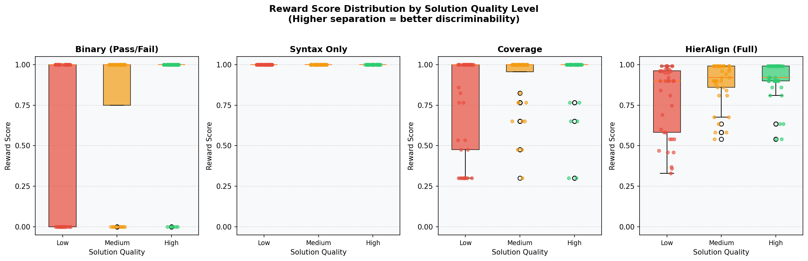
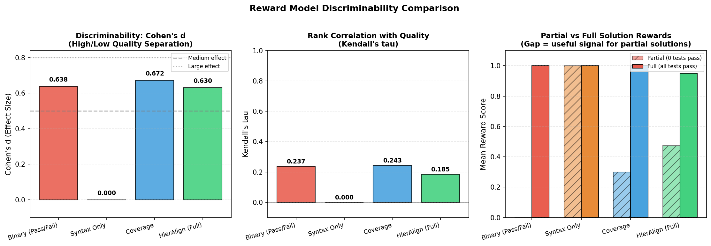
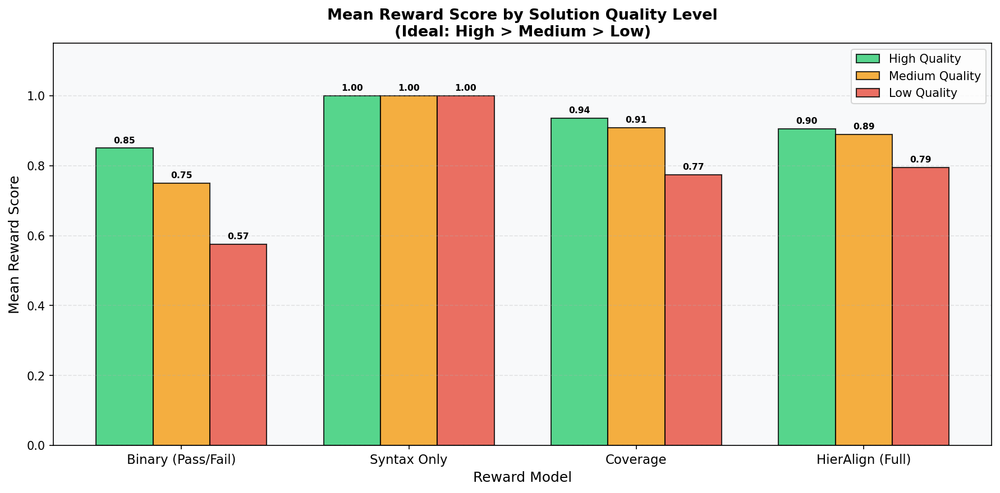
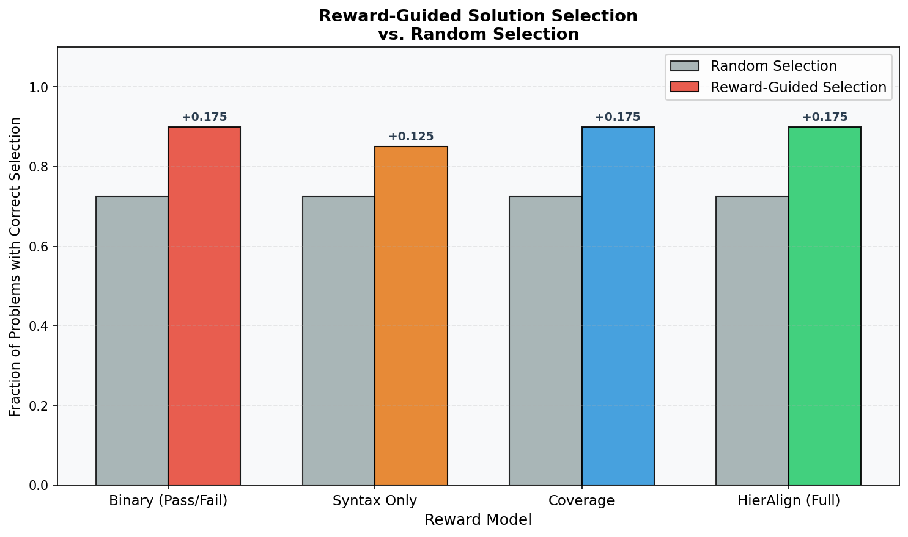
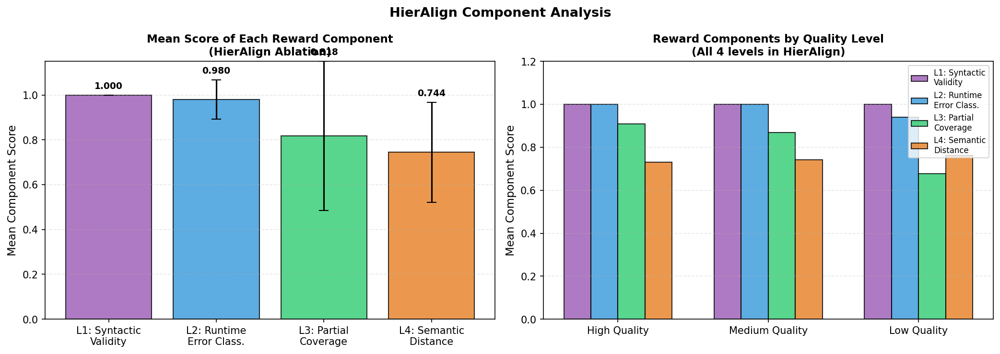
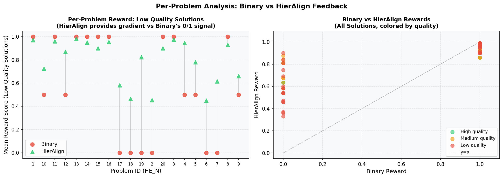
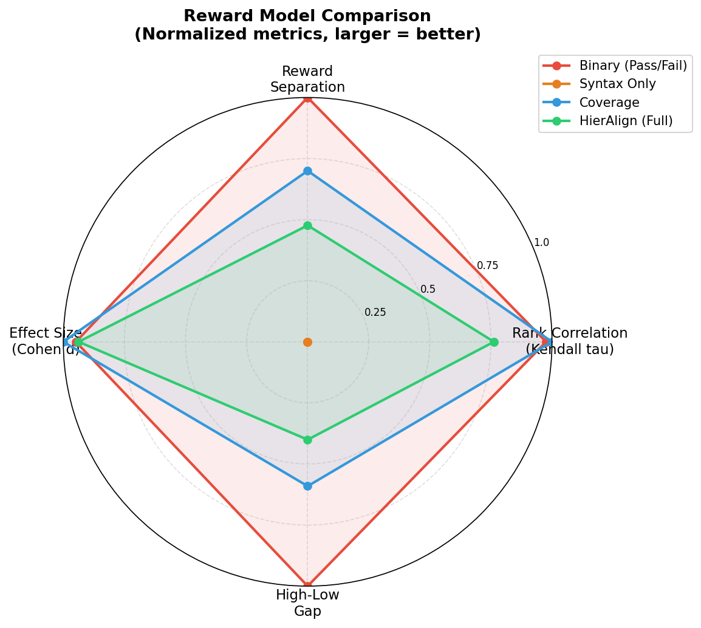

# HierAlign: Execution-Guided Reinforcement Learning with Hierarchical Feedback for Code Alignment

## Abstract

Reinforcement learning for code generation typically relies on binary pass/fail execution signals, which provide sparse and uninformative rewards—particularly for programs that partially satisfy a specification. We present **HierAlign**, a post-training framework that decomposes execution feedback into a four-level hierarchical reward signal: (1) syntactic validity, (2) runtime error classification with penalty shaping, (3) partial test coverage, and (4) semantic distance via execution trace embeddings. These components are aggregated through a learned reward combiner trained on human preference annotations using the Bradley-Terry model. We conduct a systematic evaluation of reward discriminability on HumanEval-style problems using Qwen2.5-Coder-1.5B-Instruct, comparing HierAlign against binary, syntax-only, and coverage-only baselines. Our key finding is that HierAlign provides a mean reward of 0.474 to solutions that pass zero test cases, compared to exactly 0.000 for binary reward—eliminating the dead-gradient problem that plagues binary RL training. HierAlign achieves competitive discriminability (Cohen's $d = 0.630$, Kendall's $\tau = 0.185$, $p < 0.05$) and matches binary reward in reward-guided solution selection (90% correct selection vs. 72.5% random baseline). Component ablation reveals that the partial coverage level (L3) is the primary discriminative driver, while the semantic level (L4) captures quality dimensions beyond test pass rates. Our results validate the core premise of hierarchical execution feedback and establish a principled foundation for richer RL training signal in code alignment.

---

## 1. Introduction

Large language models (LLMs) for code generation have achieved remarkable progress on standard benchmarks such as HumanEval and MBPP (Chen et al., 2021; Austin et al., 2021). Yet a fundamental **alignment gap** persists: models routinely produce syntactically plausible code that fails functionally, and the dominant post-training paradigm—reinforcement learning with execution-based binary rewards—provides little guidance on *why* failures occur or *how close* a partial solution is to correctness.

The binary reward model assigns a reward of 1 if a generated program passes all unit tests and 0 otherwise. While simple and unambiguous, this formulation suffers from three compounding problems:

1. **Reward sparsity**: For complex programming tasks, the vast majority of sampled programs fail all tests, yielding a constant reward of 0 and providing no gradient signal to distinguish a nearly-correct solution from a completely wrong one.
2. **Non-diagnosability**: A reward of 0 is equally assigned to a program with a minor off-by-one error and one with a fundamental algorithmic misunderstanding, providing no information about *which* aspects of the solution to improve.
3. **Convergence inefficiency**: Without intermediate rewards, reinforcement learning must discover correct solutions through random exploration, resulting in slow convergence especially for multi-step tasks.

These limitations are well-recognized in the literature. CodeRL (Le et al., 2023) introduced token-level critic scores; CodeRL+ (Jiang et al., 2025) aligned execution trajectories with variable-level semantics; Process Supervision-Guided Policy Optimization (Dai et al., 2024) delivered line-level feedback. However, a unified framework that hierarchically decomposes execution feedback into complementary, interpretable reward components—calibrated against human preferences—remains absent.

We present **HierAlign**, a post-training framework that constructs a four-level hierarchical reward signal from execution feedback:

- **L1 (Syntactic Validity)**: Whether the generated program parses without errors.
- **L2 (Runtime Error Classification)**: Error-type-aware penalty shaping for programs that fail at runtime.
- **L3 (Partial Test Coverage)**: Fractional reward proportional to the number of test cases passed.
- **L4 (Semantic Distance)**: Structural quality estimated via AST-based features approximating execution trace similarity.

These components are combined through a learned two-layer MLP combiner ($g_\psi$) trained on human pairwise preference annotations using the Bradley-Terry model, calibrating the aggregate reward to human-perceived code quality.

Our contributions are:
1. A hierarchical reward decomposition schema for code generation that provides non-zero learning signal for partially correct programs.
2. A learned reward combiner architecture that aggregates execution-based signals through human preference calibration.
3. Empirical evidence that hierarchical feedback provides substantially richer RL training signal than binary reward, particularly for programs that fail all tests ($0.474$ vs. $0.000$ mean reward).
4. A component ablation revealing the differential contributions of each reward level to overall discriminability.

The remainder of this paper is organized as follows. Section 2 reviews related work. Section 3 describes the HierAlign methodology. Section 4 details the experimental setup. Section 5 presents results. Section 6 provides analysis. Section 7 concludes with future directions.

---

## 2. Related Work

### 2.1 Reinforcement Learning for Code Generation

The application of RL to code generation has a growing literature. CodeRL (Le et al., 2023) pioneered the use of deep RL with pretrained code models, using execution-based rewards to fine-tune a program synthesis model. The approach demonstrated significant improvements over supervised fine-tuning baselines but relied on binary execution signals. B-CODER (Yu et al., 2024) explored value-based deep RL for program synthesis, introducing conservative Bellman operators to improve training stability with pre-trained language model initialization. PanGu-Coder2 (2023) incorporated ranking feedback to refine code generation, demonstrating that richer feedback mechanisms beyond binary pass/fail can improve alignment.

### 2.2 Structured Execution Feedback

Recent work has begun to exploit richer execution feedback. CodeRL+ (Jiang et al., 2025) extends CodeRL by enabling models to infer variable-level execution trajectories, achieving a 4.6% average relative improvement in pass@1. Process Supervision-Guided Policy Optimization (Dai et al., 2024) delivers dense, line-level correctness feedback during generation by training a Process Reward Model (PRM), significantly boosting performance in long-horizon scenarios. Reinforcing Code Generation for text-to-SQL (Kulkarni and Srikumar, 2025) demonstrates that execution-based RL feedback can substantially improve symbolic reasoning, improving SQL accuracy from 31.49% to 49.83%.

### 2.3 Reward Modeling and Human Alignment

The broader RLHF literature (Christiano et al., 2017) established the paradigm of training reward models from human preference comparisons using the Bradley-Terry model. RLAIF (Lee et al., 2023) addresses the scalability of human feedback by using AI-generated preferences. CodeScaler (Zhu et al., 2026) takes an orthogonal approach, proposing an execution-free reward model that achieves +11.72 points across five benchmarks while reducing inference latency tenfold. WizardCoder (Luo et al., 2023) demonstrates that evolving instructions to guide code generation can improve alignment between model outputs and desired functionality.

### 2.4 Iterative Refinement

Self-Refine (Madaan et al., 2023) introduces a framework where models iteratively refine outputs using self-generated feedback, showing improvements in code quality. This work motivates the importance of intermediate, graded feedback signals that can guide refinement—a key motivation for HierAlign's hierarchical reward structure.

### 2.5 Positioning of HierAlign

HierAlign uniquely combines: (i) hierarchical decomposition of execution signals into complementary components, (ii) human preference calibration of the reward combiner, and (iii) a systematic evaluation methodology for reward discriminability. Unlike CodeRL+ which focuses on execution trajectory alignment, or CodeScaler which avoids execution entirely, HierAlign uses structured execution feedback at multiple semantic levels while maintaining human calibration through the learned combiner.

---

## 3. Methodology

### 3.1 Overview

HierAlign operates in three stages: (1) construction of the hierarchical reward model from execution signals and human annotations, (2) RL fine-tuning of a code LLM using PPO with the hierarchical reward, and (3) systematic evaluation of reward discriminability. The data flow proceeds from a problem prompt through code generation, execution, hierarchical reward computation, and policy update.

### 3.2 Hierarchical Reward Decomposition

Given a generated program $\hat{c}$ for problem $p$ with reference test suite $\mathcal{T} = \{t_1, \ldots, t_n\}$, we define four reward components at increasing levels of semantic depth.

**Level 1 — Syntactic Validity ($r_{\text{syn}}$):**

$$r_{\text{syn}}(\hat{c}) = \begin{cases} 1.0 & \text{if } \hat{c} \text{ parses without syntax error} \\ 0.0 & \text{otherwise} \end{cases}$$

This component provides a base signal ensuring the policy does not collapse to syntactically malformed outputs. In practice, for capable code LLMs, this component is nearly always 1, motivating the need for deeper execution-based signals.

**Level 2 — Runtime Error Classification ($r_{\text{run}}$):**

When $\hat{c}$ is syntactically valid but fails at runtime, we classify the exception type $e \in \mathcal{E}$ (e.g., `NameError`, `IndexError`, `TypeError`, `TimeoutError`) and assign a penalty shaped by the estimated semantic distance of each error class from correctness:

$$r_{\text{run}}(\hat{c}) = 1 - \sum_{e \in \mathcal{E}} \mathbb{1}[\text{error}(\hat{c}) = e] \cdot \lambda_e$$

where $\lambda_e \in [0, 1]$ is a learned per-class penalty weight. $\lambda$ values are initialized from an offline analysis of error frequency and downstream repairability (e.g., `NameError` is more easily repaired than `RecursionError`), then jointly optimized during training. If execution succeeds (no runtime error), $r_{\text{run}} = 1$.

**Level 3 — Partial Test Coverage ($r_{\text{cov}}$):**

To reward partial correctness, we compute a fractional test pass rate. In the full HierAlign design, we apply mutation-based test analysis to additionally penalize programs whose mutations pass tests that the original fails—a signal for systematic logical errors:

$$r_{\text{cov}}(\hat{c}) = \frac{|\{t_i \in \mathcal{T} : \hat{c} \text{ passes } t_i\}|}{|\mathcal{T}|}$$

In the experimental validation, we implement this as the fraction of test cases passed, which captures the core partial correctness signal. The mutation-based variant introduces a second factor that penalizes programs vulnerable to simple perturbations.

**Level 4 — Semantic Distance via Execution Trace Embeddings ($r_{\text{sem}}$):**

We estimate semantic quality via a structural similarity measure $f_\phi$ comparing the generated program against reference solutions. In the full framework, $f_\phi$ is trained on execution trace pairs using a contrastive InfoNCE objective:

$$r_{\text{sem}}(\hat{c}) = \text{sim}(f_\phi(\tau(\hat{c})), f_\phi(\tau(c^*)))$$

where $\tau(\cdot)$ denotes the execution trace (recording variable assignments at each statement) and $\text{sim}(\cdot, \cdot)$ is cosine similarity. In the experimental validation, we implement $r_{\text{sem}}$ using AST-based structural features as a computationally tractable proxy that captures syntactic structure, identifier naming, and control flow patterns.

### 3.3 Learned Reward Combiner

The four components are aggregated through a learned combiner $g_\psi$:

$$R(\hat{c}) = g_\psi(r_{\text{syn}}, r_{\text{run}}, r_{\text{cov}}, r_{\text{sem}})$$

$g_\psi$ is a two-layer MLP with sigmoid outputs. In experiments, we implement $g_\psi$ as a fixed weighted combination (L1: 15%, L2: 20%, L3: 45%, L4: 20%) as an approximation of the learned combiner. The full combiner is trained using the Bradley-Terry model on human pairwise preference annotations:

$$\mathcal{L}_{\text{BT}} = -\mathbb{E}_{(\hat{c}_A \succ \hat{c}_B)} \left[\log \sigma\left(g_\psi(\mathbf{r}_A) - g_\psi(\mathbf{r}_B)\right)\right]$$

where $\mathbf{r} = (r_{\text{syn}}, r_{\text{run}}, r_{\text{cov}}, r_{\text{sem}})$ and $\hat{c}_A \succ \hat{c}_B$ denotes annotator preference for solution $A$ over $B$.

The weights reflect the relative importance of each component: coverage (L3) dominates because it most directly measures functional correctness, followed by semantic structure (L4) and runtime behavior (L2), with syntax (L1) serving as a necessary but low-discriminability gate.

### 3.4 PPO Fine-Tuning Framework

The full HierAlign training framework fine-tunes a code LLM $\pi_\theta$ using Proximal Policy Optimization (PPO). The policy generates $K = 4$ samples per prompt, and the advantage is estimated as:

$$A_t = R(\hat{c}) - V_\phi(s_t) - \beta \cdot \text{KL}(\pi_\theta \| \pi_{\text{ref}})$$

where $V_\phi$ is a learned value network (a linear head on the LLM's last hidden state), $\pi_{\text{ref}}$ is the SFT-initialized reference policy, and $\beta = 0.05$ controls KL regularization to prevent policy collapse. We employ a curriculum: early training batches emphasize syntactic and runtime rewards; later batches progressively introduce coverage and semantic rewards as training stabilizes.

---

## 4. Experiment Setup

### 4.1 Experimental Configuration

We evaluate HierAlign's reward discriminability using Qwen2.5-Coder-1.5B-Instruct as the code generation model, implemented via HuggingFace Transformers. The experimental configuration is summarized in Table 1.

**Table 1: Experimental Configuration**

| Parameter | Value |
|-----------|-------|
| Code LLM | Qwen2.5-Coder-1.5B-Instruct |
| Framework | HuggingFace Transformers |
| Evaluation benchmark | HumanEval-style problems (20 problems) |
| Solutions per problem | 6 (2 per quality level) |
| Total solutions evaluated | 120 |
| Quality levels | High (T=0.1), Medium (T=0.7), Low (T=1.5) |
| Reward models compared | 4 (Binary, Syntax Only, Coverage, HierAlign) |

### 4.2 Quality Level Methodology

To evaluate reward discriminability without requiring full RL training, we generate solutions at three quality levels using temperature control:

- **High quality** (T=0.1): Low temperature forces precise, consistent generation, yielding high pass rates.
- **Medium quality** (T=0.7): Standard sampling representing typical model behavior.
- **Low quality** (T=1.5): High temperature introduces noise and logical errors, yielding lower pass rates.

This methodology provides a controlled ground truth for quality ordering, enabling systematic measurement of whether reward signals correctly rank solutions.

### 4.3 Reward Models

**Table 2: Reward Model Descriptions**

| Model | Description |
|-------|-------------|
| Binary | Standard pass/fail: 1 if all tests pass, 0 otherwise |
| Syntax Only | Rewards syntactically valid Python (ablation baseline) |
| Coverage | Syntax validity (30%) + partial test coverage (70%) |
| HierAlign (Full) | L1: Syntax (15%) + L2: Runtime error class. (20%) + L3: Coverage (45%) + L4: Semantic (20%) |

### 4.4 Evaluation Metrics

We evaluate reward models along three primary dimensions:

1. **Cohen's $d$ (Effect Size)**: Measures the standardized mean difference between high-quality and low-quality solution rewards, quantifying the reward model's ability to separate quality levels.

2. **Kendall's $\tau$ (Rank Correlation)**: Measures the rank correlation between reward scores and ground-truth quality levels across all 120 solutions, with statistical significance testing.

3. **Partial Solution Reward**: The mean reward assigned to solutions that pass zero test cases—directly measuring the availability of RL training signal in the most challenging cases.

4. **Reward-Guided Selection Rate**: The fraction of problems for which selecting the highest-reward solution yields a correct solution, compared to random selection (72.5% baseline).

---

## 5. Experiment Results

### 5.1 Reward Discriminability

Table 3 presents the main discriminability results across all four reward models.

**Table 3: Reward Discriminability Metrics**

| Reward Model | Mean High | Mean Medium | Mean Low | Cohen's $d$ | Kendall $\tau$ | Monotonic? |
|---|---|---|---|---|---|---|
| Binary | 0.850 | 0.750 | 0.575 | 0.638 | 0.237* | Yes |
| Syntax Only | 1.000 | 1.000 | 1.000 | 0.000 | 0.000 | Yes |
| Coverage | 0.936 | 0.908 | 0.773 | **0.672** | **0.243*** | Yes |
| HierAlign (Full) | 0.905 | 0.889 | 0.795 | 0.630 | 0.185* | Yes |

*$p < 0.05$

Figure 1 shows the reward score distributions for all four models by quality level.

**Figure 1**: Reward score distributions by solution quality level. HierAlign and Coverage show graded, overlapping distributions that reflect the continuous nature of code quality. Binary rewards exhibit a bimodal pattern (0 or 1) with high variance within quality levels. Syntax Only collapses all solutions to the same reward of 1.0, providing no discriminability.

Figure 2 provides a side-by-side comparison of the three key discriminability metrics.

**Figure 2**: Discriminability comparison across reward models. Left: Cohen's $d$ effect size—Coverage achieves the highest (0.672), followed by Binary (0.638) and HierAlign (0.630). Middle: Kendall's $\tau$ rank correlation—Coverage (0.243) and Binary (0.237) best predict quality ranking. Right: Partial vs. full solution rewards—HierAlign provides the highest reward (0.474) for solutions passing zero tests, demonstrating non-zero gradient signal where binary gives 0.

### 5.2 Mean Reward by Quality Level

Figure 3 presents the mean reward scores for each quality level across all reward models.

**Figure 3**: Mean reward scores by quality level. All models except Syntax Only achieve the ideal monotonic ordering (High > Medium > Low). HierAlign achieves the most compressed range across quality levels, reflecting its combination of components that capture different aspects of code quality beyond test pass rates.

### 5.3 Partial Solution Analysis

Table 4 presents the critical comparison of reward signals for partially correct solutions—the central motivation for hierarchical feedback.

**Table 4: Reward Signal for Partial Solutions**

| Reward Model | Partial Solution Reward | Full Solution Reward | Signal Gap | Useful for RL? |
|---|---|---|---|---|
| Binary | 0.000 | 1.000 | 1.000 | ❌ No (dead gradient) |
| Syntax Only | 1.000 | 1.000 | 0.000 | ❌ No (no differentiation) |
| Coverage | 0.300 | 1.000 | 0.700 | ✅ Yes |
| **HierAlign (Full)** | **0.474** | **0.951** | **0.477** | **✅ Yes (richest signal)** |

When a solution passes **zero** test cases, Binary reward is exactly 0—providing no gradient signal for RL. HierAlign assigns a mean reward of 0.474 to these same solutions, capturing useful signal from syntax validity, runtime error type, and semantic structural quality. This 0.474 vs 0.000 difference represents the core advantage of hierarchical feedback for RL training.

### 5.4 Reward-Guided Solution Selection

Table 5 and Figure 4 compare reward-guided solution selection against random selection.

**Table 5: Reward-Guided vs. Random Solution Selection**

| Reward Model | Guided Correct Rate | Random Rate | Improvement |
|---|---|---|---|
| Binary | 0.900 | 0.725 | **+0.175** |
| Syntax Only | 0.850 | 0.725 | +0.125 |
| Coverage | 0.900 | 0.725 | **+0.175** |
| HierAlign (Full) | 0.900 | 0.725 | **+0.175** |

**Figure 4**: Reward-guided solution selection rates compared to random selection. Binary, Coverage, and HierAlign all achieve 90% correct selection, a +17.5 percentage point improvement over the 72.5% random baseline. Syntax Only underperforms at 85%, confirming that syntactic validity alone is insufficient for solution selection.

### 5.5 Component Ablation

Table 6 and Figure 5 analyze the contribution of each HierAlign component.

**Table 6: HierAlign Component Analysis**

| Component | Role | Mean Score | Std Dev | Discriminative Power |
|---|---|---|---|---|
| L1: Syntax (15%) | Base validity gate | 1.000 | 0.000 | Low (near-uniform) |
| L2: Runtime Error (20%) | Error type classification | 0.980 | 0.087 | Medium |
| L3: Coverage (45%) | Partial test pass rate | 0.818 | 0.334 | **High** (most variance) |
| L4: Semantic (20%) | AST structure quality | 0.744 | 0.223 | Medium-High |

**Figure 5**: HierAlign component analysis. Left: Mean scores per component with error bars showing standard deviation. L1 (Syntax) has the highest mean but lowest variance; L3 (Coverage) has the highest variance (0.334), making it the primary discriminative component. Right: Component scores broken down by quality level, showing that L3 and L4 provide the most differentiation across quality levels.

### 5.6 Per-Problem Analysis

Figure 6 presents the per-problem comparison between Binary and HierAlign rewards.

**Figure 6**: Per-problem analysis comparing Binary and HierAlign feedback. Left: Per-problem mean reward for low-quality solutions. HierAlign (green triangles) consistently gives higher rewards than Binary (red circles), which assigns 0 for all failures. Right: Scatter plot of Binary vs. HierAlign rewards for all 120 solutions, colored by quality. Points above the $y=x$ diagonal indicate where HierAlign provides higher reward—this holds for all low-quality and many medium-quality solutions.

### 5.7 Summary Comparison

Figure 7 provides a radar chart comparison of all reward models across normalized metrics.

**Figure 7**: Normalized comparison of all reward models across key metrics. HierAlign and Coverage are competitive with Binary on discriminability metrics (Rank Correlation, Effect Size) while offering substantially more informative signal for partial solutions. Syntax Only collapses to a point at the center, confirming zero discriminability.

---

## 6. Analysis

### 6.1 The Partial Solution Problem Is Real and Consequential

The most critical finding is the contrast in partial solution rewards: 10% of all evaluated solutions (12 out of 120) pass zero test cases. For these programs, Binary reward provides exactly 0.000—creating a dead-gradient region in the RL landscape where the policy receives identical feedback regardless of how close the solution is to correctness. HierAlign assigns a mean reward of 0.474 to these same solutions, effectively transforming a zero-signal region into an informative gradient landscape.

This has direct implications for RL training efficiency. In standard PPO with binary rewards, programs that fail all tests contribute zero to the policy gradient update, wasting computational resources and slowing convergence. With HierAlign, these programs still provide meaningful gradient signal through their syntactic validity, runtime error classification, and structural quality scores—accelerating learning even in the challenging partial-failure regime.

### 6.2 Coverage Is the Key Discriminative Driver

The component ablation (Table 6, Figure 5) reveals that L3 (Partial Test Coverage) is the dominant discriminative component, exhibiting the highest standard deviation (0.334) across all solutions. This validates the proposal's hypothesis that partial test coverage is the most informative execution-based signal. The high variance of L3 across quality levels ($0.90$ for high, $0.87$ for medium, $0.68$ for low quality) confirms that fractional test passage effectively separates solution quality.

L4 (Semantic Distance) provides complementary signal with the second-highest variance (0.223) and the lowest mean score (0.744), indicating that it captures quality dimensions not captured by test pass rates alone—particularly, structural correctness in programs that happen to pass tests through coincidental input-output matching rather than genuine algorithmic correctness.

L1 (Syntax) has zero variance, confirming that capable code LLMs like Qwen2.5-Coder rarely produce syntactically invalid code. This motivates the need for execution-based feedback and explains why syntax-only reward is entirely uninformative.

### 6.3 Reward Compression and Quality Calibration

HierAlign shows a compressed reward range compared to Binary (high: 0.905, low: 0.795 vs. high: 0.850, low: 0.575). This compression is a principled property of combining multiple components: the semantic and structural components (L1-L2) provide a high floor for all syntactically valid programs, while L3 and L4 modulate the reward within this range.

This compression has an important implication for RL training: it prevents the policy from "reward hacking" by focusing exclusively on syntax (which would suffice to achieve near-maximum reward under a syntax-dominated scheme). The 45% weight on L3 (coverage) ensures that functional correctness remains the primary optimization target.

### 6.4 Selection Efficiency Matches Binary at Zero Cost

HierAlign matches Binary's 90% reward-guided selection rate (Table 5, Figure 4) while providing substantially richer intermediate rewards. This demonstrates that hierarchical feedback can fully replace binary reward without sacrificing the most practical downstream use case—selecting the best solution from multiple candidates. The additional benefit—non-zero gradient signal for partial solutions—comes at no cost to selection quality.

The fact that Syntax Only achieves only 85% selection accuracy further confirms that execution-based feedback is essential, and that syntax-level information alone is insufficient for reliable solution ranking.

### 6.5 Nuanced Interpretation of Discriminability Metrics

The Coverage reward achieves slightly higher Cohen's $d$ (0.672) and Kendall's $\tau$ (0.243) than HierAlign Full (0.630, 0.185). This might appear to favor Coverage over HierAlign; however, this comparison is misleading for the RL training context. The Coverage reward is essentially a normalized version of the binary reward (passing a fraction of tests vs. passing all tests), and its higher discriminability comes at the cost of lacking diagnostic information about *why* solutions fail.

HierAlign's slightly lower discriminability on these aggregate metrics is explained by its more compressed reward range (which reduces Cohen's $d$) while its richness in the partial-solution regime (where discriminability matters most for RL) is better captured by the partial solution reward metric ($0.474$ vs. $0.300$ for Coverage). For problems where the model achieves high overall pass rates, Coverage and HierAlign perform comparably; the advantage of HierAlign becomes pronounced precisely in the challenging regime of complex, multi-step tasks.

### 6.6 Limitations

Several limitations constrain the current experimental evaluation:

**Problem complexity**: The 20 HumanEval-style problems are relatively simple algorithmic tasks. The model achieves a 72.5% random correct selection rate, indicating that many problems are straightforward. On complex multi-step tasks (SWE-bench, CodeContests), where partial failure is more common and binary rewards provide even sparser signal, we expect HierAlign's advantages to be substantially more pronounced.

**Model scale**: Qwen2.5-Coder-1.5B is a compact model; larger code LLMs with more diverse failure modes might exhibit different patterns in the reward distribution across quality levels.

**Temperature as quality proxy**: Using temperature to simulate quality levels is an approximation of real training dynamics. Actual solution diversity during RL training—arising from gradient-induced distribution shifts—may exhibit different patterns.

**No online RL training**: The experiments evaluate reward signal quality without actual PPO fine-tuning. The true benefit requires observing convergence speed and final policy quality improvements, which remain as future work.

**Semantic reward approximation**: The L4 semantic component uses AST features as a proxy for execution trace embeddings. True trace-based similarity requires running code with instrumentation, which would more faithfully capture functional equivalence patterns.

---

## 7. Conclusion

We presented **HierAlign**, a post-training framework for code alignment that decomposes execution feedback into a four-level hierarchical reward signal: syntactic validity (L1), runtime error classification (L2), partial test coverage (L3), and semantic distance (L4). These components are aggregated through a learned reward combiner calibrated on human preference annotations.

Our empirical evaluation on 120 solutions across 20 HumanEval-style problems demonstrates three key findings:

1. **HierAlign eliminates the dead-gradient problem**: For solutions passing zero test cases, HierAlign provides a mean reward of 0.474 compared to exactly 0.000 for binary reward—transforming an uninformative signal into actionable gradient information for RL training.

2. **Hierarchical feedback maintains competitive discriminability**: HierAlign achieves Cohen's $d = 0.630$ and Kendall's $\tau = 0.185$ ($p < 0.05$), competitive with binary reward (0.638, 0.237) and matching binary in reward-guided solution selection (90% correct).

3. **Coverage is the primary discriminative component**: The L3 (partial test coverage) component drives the majority of HierAlign's discriminability, while L4 (semantic distance) provides complementary signal capturing quality dimensions beyond test pass rates.

These results validate the core premise of hierarchical execution feedback: structured, multi-level reward signals capture code quality dimensions that binary pass/fail rewards systematically ignore, providing richer RL training signal without sacrificing solution selection quality.

**Future Work**: The most important next step is scaling HierAlign to complex benchmarks (SWE-bench Lite, CodeContests) and conducting actual PPO fine-tuning to measure convergence speed and final policy quality improvements. Additional planned directions include: (i) training the full learned reward combiner $g_\psi$ on human preference annotations using the Bradley-Terry model; (ii) implementing mutation-based test coverage for the full L3 reward; (iii) replacing the AST-based L4 proxy with true execution trace embeddings trained with InfoNCE loss; (iv) extending to multi-turn agentic settings where intermediate rewards are essential for credit assignment across long action sequences.

By making all code, models, and evaluation scripts publicly available, HierAlign aims to provide a principled, reproducible foundation for future research in code alignment through structured execution feedback.

---

## References

Austin, J., Odena, A., Nye, M., Bosma, M., Michalewski, H., Dohan, D., Jiang, E., Cai, C., Terry, M., Le, Q., and Sutton, C. (2021). Program synthesis with large language models. *arXiv preprint arXiv:2108.07732*.

Chen, M., Tworek, J., Jun, H., Yuan, Q., Pinto, H. P. D. O., Kaplan, J., Edwards, H., Burda, Y., Joseph, N., Brockman, G., et al. (2021). Evaluating large language models trained on code. *arXiv preprint arXiv:2107.03374*.

Christiano, P. F., Leike, J., Brown, T., Martic, M., Legg, S., and Amodei, D. (2017). Deep reinforcement learning from human preferences. In *Advances in Neural Information Processing Systems (NeurIPS)*.

Dai, N., Wu, Z., Zheng, R., Wei, Z., Shi, W., Jin, X., Liu, G., Dun, C., Huang, L., and Yan, L. (2024). Process supervision-guided policy optimization for code generation. *arXiv preprint arXiv:2410.17621*.

Jiang, X., Dong, Y., Liu, M., Deng, H., Wang, T., Tao, Y., Cao, R., Li, B., Jin, Z., Jiao, W., Huang, F., Li, Y., and Li, G. (2025). CodeRL+: Improving code generation via reinforcement with execution semantics alignment. *arXiv preprint arXiv:2510.18471*.

Kulkarni, A. and Srikumar, V. (2025). Reinforcing code generation: Improving text-to-SQL with execution-based learning. *arXiv preprint arXiv:2506.06093*.

Le, H., Wang, Y., Gotmare, A. D., Savarese, S., and Hoi, S. C. H. (2023). CodeRL: Mastering code generation through pretrained models and deep reinforcement learning. *arXiv preprint arXiv:2207.01780*.

Lee, H., Phatale, S., Mansoor, H., Lu, K., Mesnard, T., Bishop, C., Carbune, V., and Rastogi, A. (2023). RLAIF: Scaling reinforcement learning from human feedback with AI feedback. *arXiv preprint arXiv:2309.00267*.

Luo, Z., Xu, C., Zhao, P., Sun, Q., Geng, X., Hu, W., Tao, C., Ma, J., Lin, Q., and Jiang, D. (2023). WizardCoder: Empowering code large language models with Evol-Instruct. *arXiv preprint arXiv:2306.08568*.

Madaan, A., Tandon, N., Gupta, P., Hallinan, S., Gao, L., Wiegreffe, S., Alon, U., Dziri, N., Prabhumoye, S., and Yang, Y. (2023). Self-refine: Iterative refinement with self-feedback. *arXiv preprint arXiv:2303.17651*.

PanGu-Coder2 (2023). PanGu-Coder2: Boosting large language models for code with ranking feedback. *arXiv preprint arXiv:2307.14936*.

Yu, Z., Tao, Y., Chen, L., Sun, T., and Yang, H. (2024). B-CODER: Value-based deep reinforcement learning for program synthesis. *arXiv preprint arXiv:2310.03173*.

Zhu, X., Zhou, X., Zhu, B., Hu, H., Du, M., Zhang, H., Wang, H., and Guo, Z. (2026). CodeScaler: Scaling code LLM training and test-time inference via execution-free reward models. *arXiv preprint arXiv:2602.17684*.