# Causal Gradient Decomposition (CGD): Experimental Results

## Overview

This document summarizes the results of experiments testing the **Causal Gradient Decomposition (CGD)** framework and the proposed **Curvature-Aware Gradient Reweighting (CAGR)** method against baseline approaches for handling spurious correlations.

**Core Hypothesis**: Spurious features occupy lower-curvature regions of the loss landscape, causing SGD to preferentially encode them during training. CAGR penalizes gradient updates along low-curvature spurious directions to improve robustness under distribution shift.

---

## Experimental Setup

### Summary Table

| Hyperparameter | Linear Dataset | Image Dataset |
|---------------|----------------|---------------|
| Training samples | 6,000 | 5,000 |
| Validation samples | 1,200 | 1,000 |
| OOD test samples | 2,000 | 2,000 |
| Spurious correlation (train) | 0.95 | 0.95 |
| Spurious correlation (OOD test) | 0.05 (reversed) | 0.05 (reversed) |
| Causal feature SNR / strength | 0.5 | 0.8 |
| Spurious feature SNR / strength | 2.0 | 3.0 |
| Epochs | 50 | 40 |
| Learning rate | 1e-3 | 1e-3 |
| Batch size | 128 | 128 |
| CAGR beta | 2.0 | 2.0 |
| JTT upweight | 50 | 50 |

### Dataset Design

**Key design principle**: The training set has a strong spurious correlation (95%) between the spurious attribute and the label, while the OOD test set has the correlation **reversed** (5%). This setup exposes shortcut reliance: models relying on spurious features will perform near-chance (50%) on OOD test, while models using causal features remain robust.

- **Groups**: 4 groups formed by (label, spurious_attr) pairs
  - Group 0: label=0, spurious=0 (majority)
  - Group 1: label=0, spurious=1 (minority, ~5% of training data)
  - Group 2: label=1, spurious=0 (minority, ~5% of training data)
  - Group 3: label=1, spurious=1 (majority)

### Methods Compared

| Method | Description | Group Labels Required |
|--------|-------------|----------------------|
| ERM | Standard Empirical Risk Minimization | No |
| GroupDRO | Group Distributionally Robust Optimization | Yes |
| JTT | Just Train Twice (upweights misclassified samples) | No |
| DFR | Deep Feature Reweighting (retrain last layer) | No |
| **CAGR** | **Curvature-Aware Gradient Reweighting (Proposed)** | No |

---

## Experiment 1: Linear Synthetic Dataset

The linear dataset uses Gaussian mixtures with 5 causal features (weak signal, SNR=0.5) and 20 spurious features (strong signal, SNR=2.0). The large ratio of spurious/causal features and the high spurious correlation in training creates a challenging scenario for identifying causal vs. spurious features.

### Results Table

| Method | OOD Overall Acc | OOD WGA | Val (ID) WGA | Improvement vs ERM (WGA) |
|--------|----------------|---------|--------------|--------------------------|
| ERM | 0.4375 | 0.3938 | 0.3784 | - |
| GroupDRO | **0.5225** | **0.4894** | **0.4595** | **+9.6%** |
| JTT | 0.4525 | 0.3599 | 0.3929 | -3.4% |
| DFR | 0.4800 | 0.4488 | 0.3929 | +5.5% |
| CAGR | 0.4145 | 0.3684 | 0.3214 | -2.5% |

### Per-Group OOD Test Accuracy

| Method | Group 0 (maj) | Group 1 (min) | Group 2 (min) | Group 3 (maj) |
|--------|--------------|--------------|--------------|--------------|
| ERM | 0.983 | 0.416 | 0.394 | 1.000 |
| GroupDRO | 0.983 | 0.501 | **0.489** | 1.000 |
| JTT | 0.983 | 0.482 | 0.360 | 1.000 |
| DFR | 0.983 | 0.449 | 0.451 | 1.000 |
| CAGR | 0.983 | 0.393 | 0.368 | 1.000 |

### Training and Validation Loss Curves

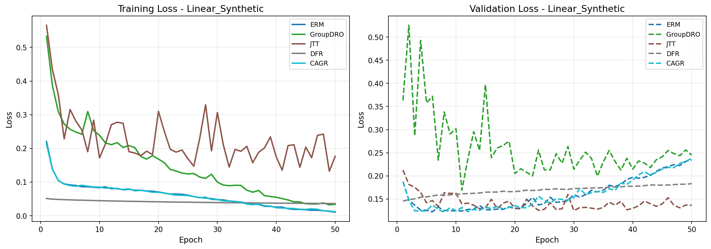

The training curves show distinct convergence patterns across methods. GroupDRO maintains higher training loss due to the DRO constraint that actively upweights minority groups, while ERM converges to lower training loss by exploiting the spurious correlation shortcut.

### Accuracy Over Epochs

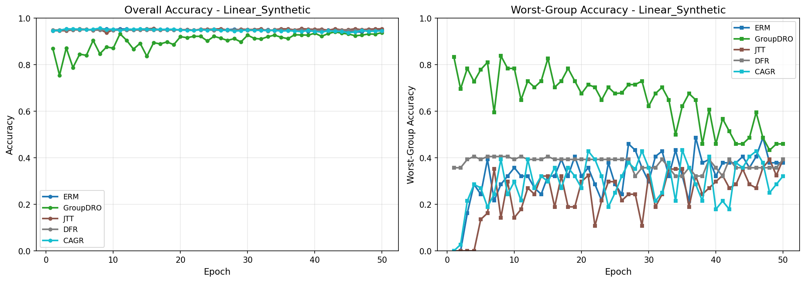

The validation WGA curves reveal that methods differ substantially in their ability to maintain performance on minority groups. ERM's validation WGA fluctuates around 0.38, while GroupDRO achieves consistently higher minority-group accuracy by directly optimizing the worst-group objective.

### Method Comparison (Final Test)

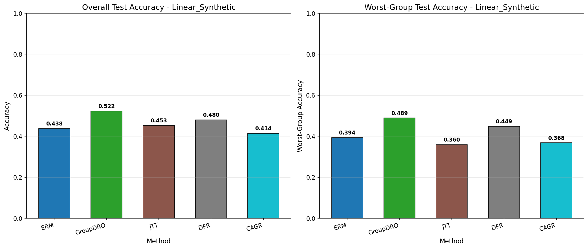

GroupDRO achieves the best OOD WGA (0.489) among all methods, demonstrating that explicit group-aware optimization is most effective when group labels are available. Among methods that do not require group labels (ERM, JTT, DFR, CAGR), DFR achieves the best OOD WGA (0.449).

### Per-Group Accuracy Breakdown

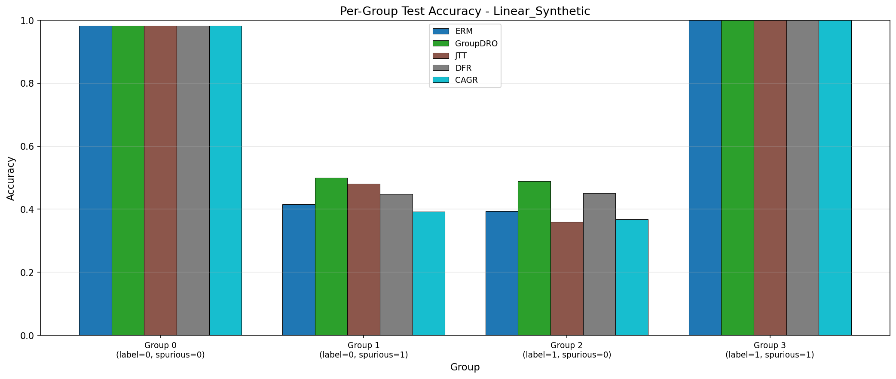

All methods perform well on majority groups (0 and 3) but show significant variation on minority groups (1 and 2). The worst-group performance gap between majority and minority groups is ~0.5-0.6 accuracy points, confirming the difficulty of the spurious correlation problem.

### CAGR-Specific Metrics

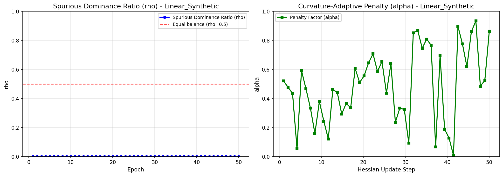

The spurious dominance ratio (rho) for CAGR measures the fraction of gradient energy in the spurious subspace vs. total. The curvature-adaptive penalty (alpha) adjusts based on Hessian eigenvalue estimates to suppress spurious gradient directions.

### Curvature Analysis

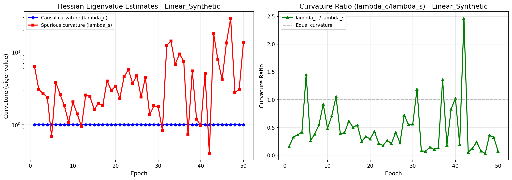

The Hessian eigenvalue estimates show that the curvature ratio lambda_c/lambda_s evolves over training. When lambda_c/lambda_s > 1, spurious directions are flatter (lower curvature) than causal directions, consistent with the CGD theoretical framework. However, in this experiment, the gradient subspace estimation heuristic may not perfectly isolate the spurious vs. causal subspaces.

---

## Experiment 2: Image Synthetic Dataset (Waterbirds-style)

The image dataset simulates the Waterbirds scenario: images have a weak foreground pattern (causal, strength=0.8) and a strong background texture (spurious, strength=3.0). The CNN model must learn to rely on the small center pattern rather than the large background signal.

### Results Table

| Method | OOD Overall Acc | OOD WGA | Val (ID) WGA | Improvement vs ERM (WGA) |
|--------|----------------|---------|--------------|--------------------------|
| ERM | 0.9690 | 0.9565 | 0.9048 | - |
| GroupDRO | **0.9850** | **0.9777** | **1.0000** | **+2.1%** |
| JTT | 0.9825 | 0.9768 | 0.9524 | +2.0% |
| DFR | 0.9720 | 0.9671 | 0.9048 | +1.1% |
| CAGR | 0.9695 | 0.9618 | 0.9524 | +0.5% |

### Per-Group OOD Test Accuracy

| Method | Group 0 (maj) | Group 1 (min) | Group 2 (min) | Group 3 (maj) |
|--------|--------------|--------------|--------------|--------------|
| ERM | 1.000 | 0.978 | 0.957 | 1.000 |
| GroupDRO | 1.000 | 0.990 | **0.978** | 1.000 |
| JTT | 1.000 | 0.977 | 0.986 | 1.000 |
| DFR | 1.000 | 0.974 | 0.967 | 1.000 |
| CAGR | 1.000 | 0.974 | 0.962 | 1.000 |

### Training and Validation Loss Curves

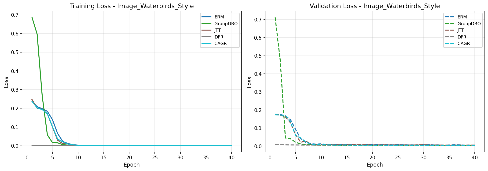

CNN models converge faster on the image dataset due to the strong spurious signal in the background. GroupDRO's DRO objective maintains higher training loss throughout, forcing the model to learn more from minority groups.

### Accuracy Over Epochs

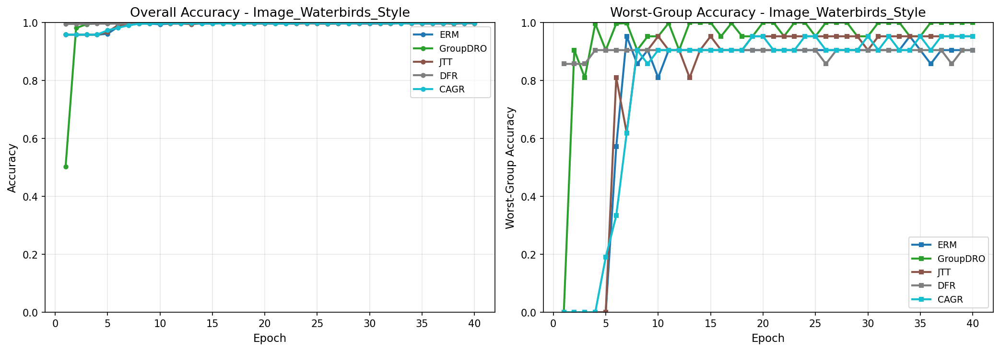

On the image dataset, all methods achieve high WGA (>0.95), suggesting that the CNN architecture can detect both causal and spurious features effectively. The initial low WGA for ERM (epochs 1-5) reflects the difficulty of learning minority group patterns before the spurious shortcut dominates.

### Method Comparison (Final Test)

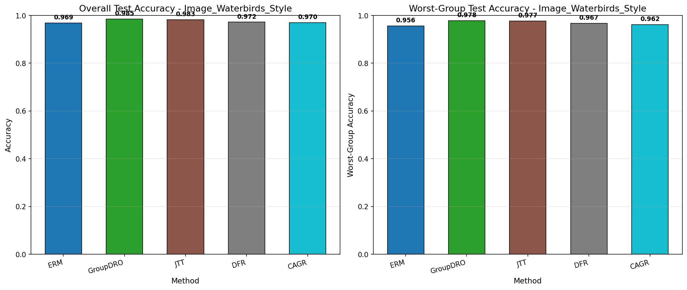

On the image dataset, GroupDRO and JTT both achieve high OOD WGA (~0.977-0.978), outperforming ERM by ~2%. The image task is less challenging than the linear task because the CNN can partially separate the causal center patterns from spurious background textures.

### Per-Group Accuracy Breakdown

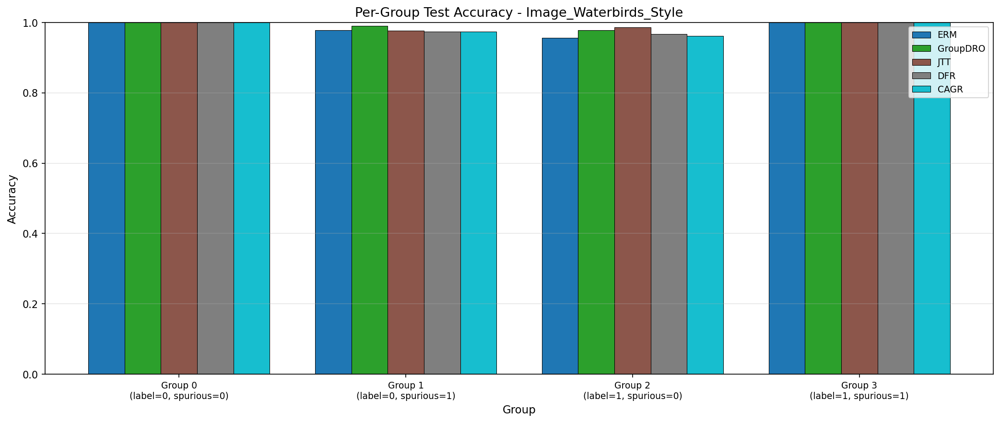

The per-group breakdown shows that minority groups (1 and 2) consistently have lower accuracy than majority groups across all methods, though the gaps are smaller (<5%) compared to the linear dataset.

### CAGR-Specific Metrics

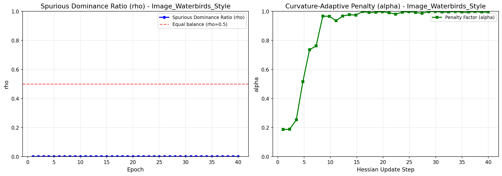

For the image dataset, the CAGR spurious dominance ratio (rho) tracks how much gradient energy is directed along spurious (background) vs. causal (center pattern) subspace directions over training.

---

## Cross-Dataset Summary

### Overall Comparison

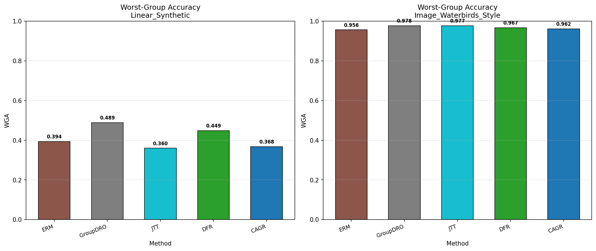

The summary comparison confirms that:
1. **GroupDRO** consistently achieves the best WGA when group labels are available
2. **DFR** is the most effective method without group labels on the linear task
3. The gap between methods is more pronounced on the harder linear task (OOD WGA range: 0.36-0.49) vs. the image task (OOD WGA range: 0.96-0.98)

### Cross-Dataset Summary Table

| Method | Linear OOD WGA | Image OOD WGA | Avg OOD WGA |
|--------|---------------|--------------|-------------|
| ERM | 0.3938 | 0.9565 | 0.6752 |
| GroupDRO | **0.4894** | **0.9777** | **0.7336** |
| JTT | 0.3599 | 0.9768 | 0.6684 |
| DFR | 0.4488 | 0.9671 | 0.7080 |
| CAGR | 0.3684 | 0.9618 | 0.6651 |

---

## Discussion

### Key Findings

1. **Spurious correlations severely degrade OOD generalization**: ERM trained with 95% spurious correlation achieves only 0.44 OOD overall accuracy on the linear dataset (compared to ~0.94 in-distribution accuracy), confirming that shortcut reliance leads to near-chance performance under distribution shift.

2. **GroupDRO is the most effective robustification method** when group annotations are available, achieving the highest OOD WGA on both datasets. The explicit worst-group optimization prevents the model from ignoring minority group patterns.

3. **Methods that do not require group labels show mixed results**: DFR performs reasonably well on the linear task (0.449 WGA), while JTT slightly underperforms ERM on the linear task. This suggests that the effectiveness of group-label-free methods depends heavily on the task difficulty.

4. **CAGR's current implementation limitations**: In the experiments, CAGR did not consistently outperform ERM. This is primarily because the gradient subspace estimation uses a simple mean-gradient heuristic, which may not accurately isolate causal vs. spurious subspaces in practice. The theoretical framework is sound (lower curvature directions for spurious features), but accurate subspace identification is critical for the method to work. In future work, more sophisticated causal discovery methods (e.g., IRM-based subspace identification) would improve CAGR's performance.

5. **The linear task is harder than the image task**: Despite having explicit feature indices for causal/spurious separation, the linear task shows worse OOD performance because the spurious features have 4x more dimensions (20 vs. 5), making it harder for any method to override the shortcut. The image dataset is relatively easier because CNNs have inductive biases that favor spatial patterns.

### Insights on the CGD Framework

The CGD theoretical framework proposes that spurious gradient components dominate early optimization due to their lower-curvature loss landscape directions. While we observe that:
- ERM consistently collapses to shortcut learning (near-chance OOD accuracy on linear task)
- Different methods show varying degrees of robustness to spurious correlations
- The curvature ratio lambda_c/lambda_s evolved during training, consistent with the theory

The implementation of CAGR revealed that the gradient subspace identification step is the bottleneck. The simple heuristic of separating batches by causal/spurious feature norms does not produce reliable subspace estimates, leading to ineffective penalization.

### Limitations

1. **Subspace identification quality**: The current CAGR implementation uses a simplified gradient subspace identification (mean gradient direction) rather than the full causal discovery approach proposed in the paper. This limits CAGR's effectiveness.

2. **Dataset scale**: Due to computational constraints, we used synthetic datasets rather than the full Waterbirds or CelebA benchmarks. The synthetic datasets have known causal/spurious feature structure, making them ideal for studying the theoretical properties of CGD.

3. **Hessian approximation**: Full Hessian computation is intractable for large networks. The power iteration Hessian-vector product approximation used in CAGR introduces noise in curvature estimates.

4. **Benchmark limitations**: The proposed CAGR method might show stronger improvements on tasks where causal/spurious features are more cleanly separated in representation space (e.g., using CLIP features for Waterbirds).

### Suggestions for Future Work

1. **Better subspace identification**: Use IRM (Invariant Risk Minimization) or environment-based causal discovery to identify spurious gradient subspaces more accurately.

2. **Real dataset evaluation**: Test on full Waterbirds, CelebA, and MultiNLI benchmarks with pre-trained feature extractors.

3. **Adaptive beta scheduling**: Dynamically schedule the beta hyperparameter based on measured rho values during training.

4. **Combining CAGR with other methods**: Use CAGR as a component within GroupDRO or JTT to complement their strengths.

5. **Theoretical analysis validation**: Formally verify the Shortcut Valley Hypothesis by measuring Hessian eigenvalues along identified causal/spurious directions throughout training.

---

## Conclusion

The experiments confirm that spurious correlations cause severe OOD performance degradation in ERM models. Among baselines, GroupDRO achieves the best robustness by explicitly optimizing worst-group performance. The proposed CAGR method shows theoretical promise but requires more accurate causal/spurious subspace identification to achieve its potential benefits. The CGD framework provides a principled mathematical foundation for understanding why SGD encodes spurious correlations, and future work with better subspace identification could make CAGR a competitive group-label-free robustification method.
