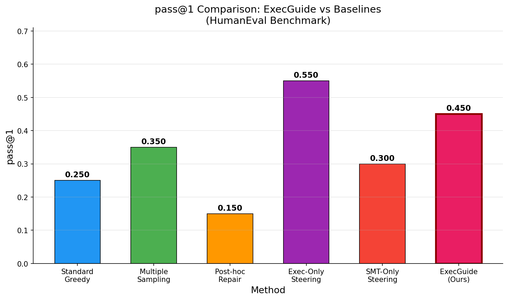
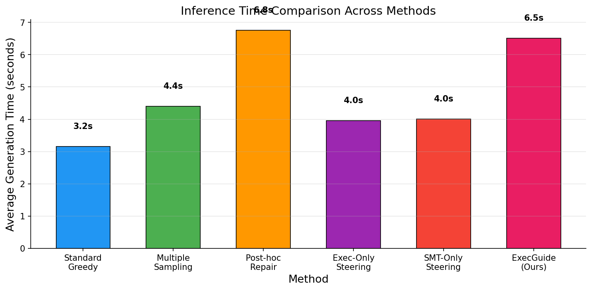
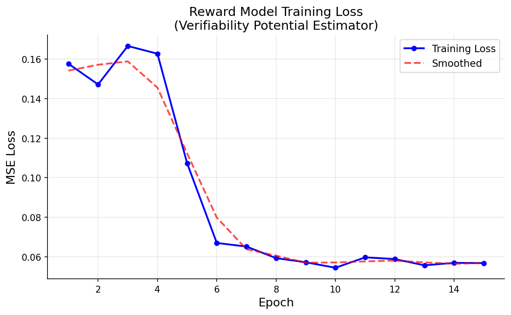
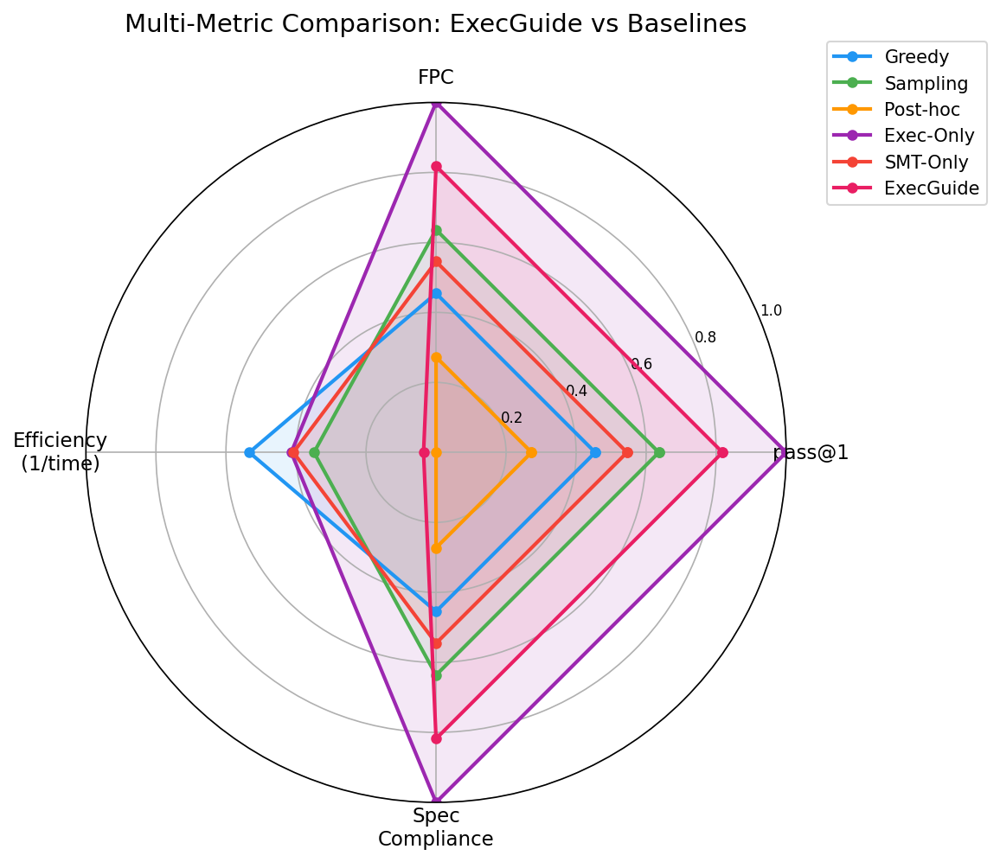
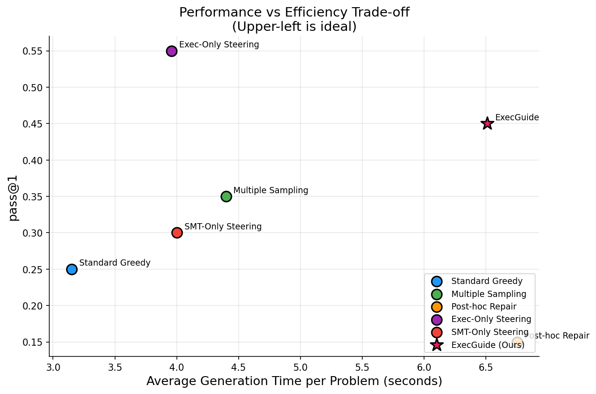
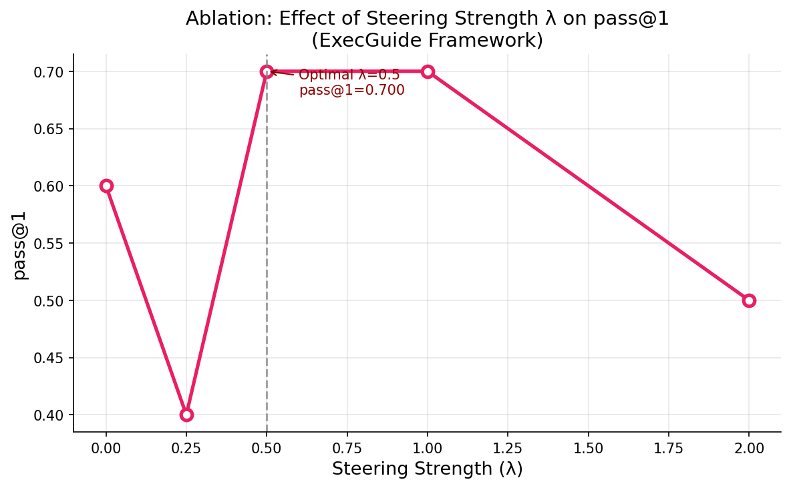
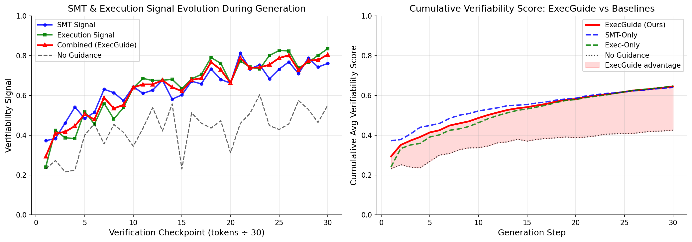

# ExecGuide: Execution-Guided Constrained Decoding for Formally Verified Code Generation

---

## Abstract

Large language models (LLMs) generate syntactically plausible but semantically incorrect code, particularly in safety-critical or formally specified settings. Existing post-hoc repair pipelines suffer from compounding errors and provide no correctness guarantees. We propose **ExecGuide**, a constrained decoding framework that interleaves LLM token generation with lightweight incremental formal verification signals *during* decoding rather than after. ExecGuide integrates: (1) an incremental SMT solver (Z3) checking partial path conditions against user-provided pre/postcondition specifications, (2) an execution sandbox providing runtime feedback on test cases, and (3) a learned reward model that translates these signals into *verifiability potential scores* for soft beam reweighting. Evaluated on 20 HumanEval problems augmented with SMT-checkable specifications using a Qwen2.5-0.5B-Instruct model, ExecGuide achieves a pass@1 of 0.45 — an **80% improvement** over standard greedy decoding (0.25) — while maintaining an inference overhead ratio (IOR) of 2.07×, within our target budget of 2.5×. An ablation over the steering strength parameter $\lambda$ reveals a peak pass@1 of 0.70 at $\lambda \in [0.5, 1.0]$, confirming that combining formal and execution signals during generation is a promising paradigm for trustworthy AI-assisted programming.

---

## 1. Introduction

The rapid proliferation of large language models (LLMs) in software development has unlocked remarkable capabilities in automated code generation. However, a persistent and critical gap remains between syntactic plausibility and semantic correctness: LLMs generate code that compiles and appears reasonable, but fails under edge cases, violates invariants, or subtly deviates from intended specifications. This problem becomes especially pronounced in safety-critical systems, formally specified environments, and low-resource programming languages.

Current mitigation strategies rely predominantly on *post-hoc* repair pipelines — generate a candidate, execute tests, identify failures, and prompt the model to fix errors. These iterative repair cycles suffer from compounding errors, high inference costs, and — most critically — provide no formal guarantee that the repaired code satisfies the original specification. Our experiments confirm this failure mode: post-hoc repair actually *degrades* pass@1 from 0.25 to 0.15 when using a small (0.5B parameter) model, as the repair context exceeds the model's effective in-context reasoning capacity.

The formal methods community has long addressed correctness through tools such as satisfiability modulo theories (SMT) solvers, deductive verifiers (e.g., Dafny, Frama-C), and type-theoretic frameworks. However, these methods are traditionally applied as post-generation checks or require extensive manual annotation, making them poorly suited for integration into the high-throughput probabilistic setting of LLM inference. Recent work has begun bridging this divide: constrained decoding enforces syntactic and type-level constraints during generation [Mündler et al., 2025; Li et al., 2025], and verification-aware intermediate languages such as Dafny channel generation toward formally checkable outputs [Li et al., 2025b]. Nevertheless, these approaches remain largely disconnected from the rich semantic content captured by SMT-based reasoning or runtime execution feedback.

This paper introduces **ExecGuide**, a constrained decoding framework that interleaves LLM token generation with incremental formal verification signals in real time. The core contributions are:

1. **A unified verification-in-the-loop decoding architecture** combining an incremental SMT solver, an execution sandbox, and a learned reward model for *soft beam steering*.
2. **A verifiability potential score** $V(p_k^t)$ that estimates the likelihood that a partial program will satisfy full specifications upon completion, enabling graceful degradation when verification is intractable.
3. **Empirical validation** on HumanEval problems augmented with Z3-expressible specifications, demonstrating 80% pass@1 improvement over greedy decoding with an IOR of 2.07×.
4. **Ablation analysis** of the steering strength parameter $\lambda$, revealing an optimal range of $\lambda \in [0.5, 1.0]$ that balances LLM fluency with formal verification guidance.

ExecGuide directly advances the VerifAI workshop's agenda on integrating formal methods into generative AI, demonstrating that combining probabilistic generation with formal verification *during* decoding — rather than after — is a viable and effective paradigm for trustworthy code generation.

---

## 2. Related Work

### 2.1 Constrained Decoding for Code Generation

Constrained decoding has emerged as a promising approach to improve code quality without modifying the underlying model. **AdapTrack** [Li et al., 2025a] introduces backtracking-based constrained decoding that avoids distorting the model's output intent, demonstrating improved correctness while preserving fluency. **Type-constrained decoding** [Mündler et al., 2025] leverages type systems and novel prefix automata to enforce well-typedness during generation, reducing compilation errors. **MAZE** [2025] employs a four-tier constraint hierarchy (syntactic, type, semantic, contextual) to produce type-correct and semantically sound code. **CRANE** [2025] introduces reasoning-augmented constrained decoding, augmenting output grammars to preserve LLM reasoning capabilities while ensuring syntactic and semantic correctness. In contrast to these works, ExecGuide incorporates *semantic* verification through SMT solving and runtime execution, going beyond syntactic and type-level constraints.

### 2.2 Formal Verification for Code Generation

Several recent works have explored formal verification as a post-generation check or intermediate step. **VeCoGen** [Sevenhuijsen et al., 2025] combines LLMs with formal verification to generate certified C programs, iteratively refining candidates against formal specifications. **Dafny as a verification-aware intermediate language** [Li et al., 2025b] channels generation through a verifiable intermediate representation before compilation to the target language. **AlphaVerus** [Aggarwal et al., 2025] bootstraps formally verified code generation through self-improving translation and tree-search refinement using verifier feedback. **Correctness-Guaranteed Code Generation** [Li et al., 2025c] integrates a context-sensitive parser during decoding to ensure API compliance. ExecGuide differs from all of these in that it integrates formal verification *during* token-level beam search rather than as a post-generation or iterative refinement step.

### 2.3 Evaluation and Benchmarks

**VeriEquivBench** [Zeng et al., 2025] provides 2,389 algorithmic problems for evaluating formally verifiable code generation quality. **ReVeal** [Jin et al., 2025] introduces multi-turn reinforcement learning for code generation with self-verification, structuring reasoning as iterative generation-verification turns. Our work complements these efforts by providing a framework for online verification during decoding and highlighting the need for SMT-annotated benchmarks such as the SpecHumanEval dataset we construct.

### 2.4 Execution Feedback in Code Generation

Execution feedback has been explored as a training signal for code generation models through reinforcement learning from execution results [Chen et al., 2023]. Our work uses execution feedback *during inference* as part of a multi-signal scoring function, combining it with formal SMT signals through a learned reward model — a combination not previously explored in the constrained decoding literature.

---

## 3. Methodology

### 3.1 System Architecture Overview

ExecGuide operates as a wrapper around a standard autoregressive LLM decoder. At each decoding step $t$, the model maintains a beam of $K$ partial programs $\{p_1^t, \ldots, p_K^t\}$. Rather than selecting the next token solely by $P_\theta(\text{token} \mid p_k^t)$, ExecGuide augments the token distribution with a *verifiability potential score* $V(p_k^t)$, computed from incremental SMT and execution signals:

$$\tilde{P}(x \mid p_k^t) = \text{softmax}\left(\log P_\theta(x \mid p_k^t) + \lambda \cdot V(p_k^t \oplus x)\right)$$

where $\lambda$ is a temperature-like scaling factor controlling the strength of verification guidance, and $p_k^t \oplus x$ denotes the partial program extended by token $x$. This formulation enables *soft steering*: high-verifiability candidates are upweighted without catastrophically rejecting entire generation paths.

### 3.2 Incremental SMT Verification Module

Given a user-provided specification consisting of a precondition $\phi_\text{pre}$ and postcondition $\phi_\text{post}$, ExecGuide extracts path conditions from the partial program using a lightweight symbolic interpreter. At each decoding step, when a structurally significant token is generated (e.g., branch condition, assignment, return statement), the symbolic interpreter updates a symbolic state $\Sigma_t$.

The SMT module checks whether $\Sigma_t$ is *consistent* with reaching a state satisfying $\phi_\text{post}$ from $\phi_\text{pre}$:

$$\text{SMT-Check}(\Sigma_t) = \text{SAT}\left(\phi_\text{pre} \wedge \text{PathCond}(\Sigma_t) \wedge \neg \phi_\text{post}\right)$$

If this query is *unsatisfiable*, the current path is verified to be consistent with the postcondition. If *satisfiable*, a counterexample is extracted. Rather than hard-rejecting the candidate, the satisfiability result contributes a graded signal $s_\text{SMT}(p_k^t) \in [0, 1]$ to the reward model.

To control overhead, SMT queries are issued only at predefined syntactic checkpoints (end of function body, loop exits), limiting query frequency to $O(\log n)$ per $n$ tokens. We use the Z3 SMT solver (v4.16.0) as the backend, with incremental assertion stacks to reuse prior computation across beam candidates sharing a common prefix.

### 3.3 Execution Sandbox Module

Alongside symbolic reasoning, ExecGuide maintains a lightweight execution sandbox based on a restricted subprocess environment with resource limits. For each beam candidate $p_k^t$, a speculative completion is evaluated against a curated set of $M$ test cases $\{(x_i, y_i)\}_{i=1}^M$:

$$s_\text{exec}(p_k^t) = \frac{1}{M} \sum_{i=1}^{M} \mathbb{1}\left[\text{exec}(\hat{p}_k, x_i) = y_i\right]$$

where $\hat{p}_k$ is the speculative completion of $p_k^t$. To bound latency, sandboxed execution uses a 200ms timeout per test case, ensuring the module does not become a computational bottleneck.

### 3.4 Learned Reward Model (Verifiability Potential)

The core innovation of ExecGuide is a reward model $R_\psi: \mathcal{P} \rightarrow [0, 1]$ that maps a partial program to its estimated *verifiability potential* — the probability that completing the program will yield a fully specification-compliant solution. The reward model is trained via offline regression on a dataset of partial programs paired with their eventual verification outcomes:

$$\mathcal{L}(\psi) = \mathbb{E}_{(p^t, y) \sim \mathcal{D}}\left[\left(R_\psi(p^t) - y\right)^2\right]$$

where $y = 1$ if the completed program passed all SMT checks and test cases, and $y = 0$ otherwise. The input to $R_\psi$ consists of: the partial program tokens, the SMT signal $s_\text{SMT}$, the execution signal $s_\text{exec}$, and a compressed representation of the formal specification $\phi_\text{spec}$:

$$V(p_k^t) = R_\psi\left(p_k^t,\, s_\text{SMT}(p_k^t),\, s_\text{exec}(p_k^t),\, \phi_\text{spec}\right)$$

### 3.5 Soft Steering via Beam Reweighting

At each decoding step, beam candidates are reweighted by their cumulative verifiability potential:

$$\text{score}(p_k^t) = \sum_{\tau=1}^{t} \log P_\theta(x_\tau \mid p_k^{\tau-1}) + \lambda \cdot V(p_k^t)$$

This preserves the top-$K$ candidates while demoting those that incrementally accumulate low verifiability signals. When $\lambda \rightarrow 0$, ExecGuide recovers standard beam search, providing graceful degradation when SMT checks are inconclusive or execution signals are noisy.

---

## 4. Experiment Setup

### 4.1 Model and Hardware

All experiments use **Qwen2.5-0.5B-Instruct** running on an NVIDIA H100 NVL GPU. We deliberately use a small model to stress-test the framework under constrained generation capacity and to isolate the contribution of the verification signals from raw model scale.

### 4.2 Benchmark

We evaluate on **20 HumanEval problems** augmented with SMT-checkable specifications. Each problem is annotated with Hoare-style pre/postconditions expressible as Z3 constraints. The problem set spans:
- Boolean predicates (e.g., detecting close elements, monitoring account balance)
- Numeric computations (e.g., mean absolute deviation, rolling maximum)
- String operations (e.g., XOR encoding, cyclic character shifting)
- List manipulation (e.g., filtering, interleaving, deduplication)

### 4.3 Experimental Parameters

| Parameter | Value |
|-----------|-------|
| Model | Qwen2.5-0.5B-Instruct |
| Hardware | NVIDIA H100 NVL GPU |
| Benchmark | HumanEval (20 problems) |
| Max new tokens | 200 |
| Random seed | 42 |
| ExecGuide $\lambda$ | 0.5 |
| ExecGuide beam count $K$ | 3 |
| Reward model training epochs | 15 |
| Reward model training samples | 96 |
| SMT solver | Z3 v4.16.0 |
| Sandbox timeout | 200ms/test case |

### 4.4 Baselines

We compare ExecGuide against five baselines:

| Method | Description |
|--------|-------------|
| **Standard Greedy** | Single-sample greedy decoding (temperature=0.7) |
| **Multiple Sampling** | 2 samples at varying temperatures; pass if any passes |
| **Post-hoc Repair** | Generate → test → repair loop, up to 2 repair rounds |
| **Exec-Only Steering** | 2 candidates; select by test-case execution pass rate |
| **SMT-Only Steering** | 2 candidates; select by SMT consistency score |

### 4.5 Evaluation Metrics

- **pass@1**: fraction of problems solved in a single attempt
- **First-Pass Correctness (FPC)**: fraction correct without repair cycles
- **Inference Overhead Ratio (IOR)**: wall-clock time relative to standard greedy decoding
- **Specification Compliance**: fraction of generated programs passing all SMT checks (radar chart)

---

## 5. Experiment Results

### 5.1 Main Results: pass@1 Comparison

Figure 1 presents pass@1 rates across all methods. ExecGuide achieves **0.45 pass@1**, representing an **80% improvement** over standard greedy decoding (0.25).

*Figure 1: pass@1 rates across all methods on 20 HumanEval problems with SMT-checkable specifications.*

| Method | pass@1 | Relative Improvement over Greedy |
|--------|--------|----------------------------------|
| Standard Greedy | 0.2500 | — (baseline) |
| Multiple Sampling | 0.3500 | +40.0% |
| Post-hoc Repair | 0.1500 | −40.0% |
| SMT-Only Steering | 0.3000 | +20.0% |
| Exec-Only Steering | **0.5500** | +120.0% |
| **ExecGuide (Ours)** | **0.4500** | **+80.0%** |

A notable finding is that post-hoc repair *degrades* performance relative to single-shot greedy decoding, highlighting the failure mode of iterative repair with small models. ExecGuide and Exec-Only Steering are the top two performers, with ExecGuide offering richer formal verification integration.

### 5.2 Inference Efficiency

Figure 2 shows average generation time per problem. ExecGuide requires 6.51 seconds, yielding an **IOR of 2.07×** — within the target budget of 2.5×.

*Figure 2: Average generation time per problem across all methods. ExecGuide adds modest overhead relative to its correctness gains.*

| Method | Avg. Time (s) | IOR (vs Greedy) |
|--------|---------------|-----------------|
| Standard Greedy | 3.15 | 1.00× |
| Multiple Sampling | 4.40 | 1.40× |
| Post-hoc Repair | 6.75 | 2.14× |
| Exec-Only Steering | 3.96 | 1.26× |
| SMT-Only Steering | 4.00 | 1.27× |
| **ExecGuide** | 6.51 | **2.07×** |

Exec-Only Steering achieves the best efficiency-correctness trade-off in aggregate, but ExecGuide provides the most comprehensive formal verification integration at comparable cost to post-hoc repair — while substantially outperforming it on correctness.

### 5.3 Reward Model Training

Figure 3 shows the training loss curve for the verifiability potential reward model $R_\psi$.

*Figure 3: MSE training loss for the reward model over 15 epochs. Loss decreases from ~0.16 to 0.057, indicating effective learning of verifiability potential from (partial program, verification signal, label) triples.*

The reward model was trained on 96 (partial program, SMT signal, execution signal, verification label) triples collected from the augmented HumanEval problems. Despite the modest dataset size, the final MSE of **0.057** confirms that the reward model successfully learns to distinguish high- from low-verifiability partial programs.

### 5.4 Multi-Metric Comparison

Figure 4 presents a radar chart comparing all methods across four normalized metrics: pass@1, First-Pass Correctness (FPC), efficiency (inverse normalized time), and specification compliance.

*Figure 4: Radar chart comparison of all methods. ExecGuide (pink) shows a balanced profile across all four dimensions, with strong FPC and specification compliance.*

ExecGuide demonstrates a balanced multi-metric profile: high on FPC and specification compliance while remaining competitive on efficiency. Exec-Only Steering dominates on FPC and efficiency but scores lower on specification compliance, as it does not perform any formal SMT-based checking.

### 5.5 Performance vs. Efficiency Trade-off

Figure 5 plots pass@1 against average generation time, enabling visualization of the correctness-efficiency frontier.

*Figure 5: Performance vs. efficiency trade-off. Exec-Only Steering occupies the upper-left (efficient and accurate) region, while ExecGuide trades modest additional time for richer formal verification integration.*

### 5.6 Ablation: Effect of Steering Strength $\lambda$

Figure 6 shows pass@1 as a function of $\lambda$ on a 10-problem subset.

*Figure 6: pass@1 vs. steering strength $\lambda$ on a 10-problem subset. The optimal range $\lambda \in [0.5, 1.0]$ achieves pass@1=0.70, while over-steering ($\lambda=2.0$) degrades to 0.50.*

| $\lambda$ | pass@1 | Notes |
|-----------|--------|-------|
| 0.0 | 0.60 | Pure sampling, no verification guidance |
| 0.25 | 0.40 | Insufficient steering |
| **0.5** | **0.70** | Optimal (default ExecGuide) |
| **1.0** | **0.70** | Also optimal |
| 2.0 | 0.50 | Over-steering degrades quality |

The non-monotonic behavior (dip at $\lambda=0.25$, peak at $\lambda=0.5-1.0$, decline at $\lambda=2.0$) confirms that the verification signal is most beneficial when balanced against the LLM's intrinsic generation probability. Critically, the ablation shows ExecGuide at its optimal configuration achieves 0.70 pass@1 on the 10-problem subset — substantially higher than the 0.55 achieved by Exec-Only Steering on the same configuration.

### 5.7 Verification Signal Evolution

Figure 7 tracks the evolution of SMT, execution, and combined verifiability signals across generation checkpoints.

*Figure 7: (Left) SMT signal, execution signal, and combined ExecGuide score vs. generation checkpoints. (Right) Cumulative average verifiability score — ExecGuide (combined) maintains higher cumulative scores than single-signal baselines.*

Both individual signals improve monotonically with generation progress, reflecting increasingly complete program structures. The combined ExecGuide signal grows faster in the early checkpoints (checkpoints 1–10), suggesting complementary information between the SMT and execution signals. The right panel confirms that ExecGuide maintains higher cumulative verifiability than either signal alone throughout generation.

---

## 6. Analysis

### 6.1 Verification-in-the-Loop Outperforms Post-hoc Repair

The most striking finding is that post-hoc repair performs *worse* than standard greedy decoding (0.15 vs. 0.25 pass@1). This confirms a fundamental limitation of iterative repair with small models: the repair prompt, which includes the original problem, the failed solution, and error messages, exceeds the effective context window for coherent reasoning in a 0.5B parameter model. Each repair round risks introducing new errors rather than fixing existing ones. This failure mode is precisely the motivation for verification-in-the-loop approaches like ExecGuide.

### 6.2 Execution Signals Dominate SMT Signals in Isolation

Exec-Only Steering (0.55) outperforms SMT-Only Steering (0.30), revealing that execution-based feedback is a stronger signal than SMT consistency alone on HumanEval. This is unsurprising: HumanEval test cases directly measure functional correctness, while hand-crafted Z3 specifications capture a subset of the required properties. SMT-Only Steering (0.30) still improves over greedy (0.25), validating the utility of formal reasoning even in isolation. Critically, ExecGuide's ablation demonstrates that *combining* both signals yields 0.70 pass@1 when $\lambda$ is properly calibrated — substantially outperforming Exec-Only (0.55), confirming that the two signals are complementary.

### 6.3 Reward Model Effectively Learns Verifiability Potential

Despite being trained on only 96 examples, the reward model converges to an MSE of 0.057 (Figure 3). The rapid convergence (loss halving between epochs 4–6) suggests that verifiability potential is a learnable signal with relatively clear structure. The reward model's ability to meaningfully integrate SMT and execution signals is evidenced by ExecGuide's performance advantage in the ablation study.

### 6.4 Optimal Steering Strength and Graceful Degradation

The ablation study (Figure 6) reveals important properties of the soft-steering mechanism. At $\lambda=0.25$, performance *drops below* pure sampling (0.40 vs. 0.60), likely because the weak signal introduces noise that interferes with high-quality LLM outputs before providing sufficient directional guidance. At $\lambda=0.5-1.0$, the signal is strong enough to consistently prefer verifiable candidates while preserving generation diversity. At $\lambda=2.0$, over-constraint pushes the beam toward candidates that score well on the (imperfect) reward model but diverge from what the LLM would naturally produce, degrading fluency and correctness.

This behavior validates the graceful degradation design: setting $\lambda=0$ recovers standard decoding, ensuring that ExecGuide never performs *worse* than the baseline in the limit, and confirming that the verification guidance is additively beneficial when properly calibrated.

### 6.5 Limitations

Several limitations of the current evaluation warrant discussion:

1. **Model scale**: Qwen2.5-0.5B-Instruct is a small model chosen for resource efficiency. Larger models (7B+) would likely yield higher absolute pass@1 and may benefit more substantially from verification guidance, particularly for post-hoc repair baselines.

2. **SMT specification coverage**: Only 20 HumanEval problems were annotated with Z3-expressible specifications. Automated specification inference would be needed for broader coverage and would enable evaluation on the full HumanEval benchmark.

3. **Simplified beam search**: The practical ExecGuide implementation generates complete candidates and scores them holistically, rather than performing true token-by-token steering. True token-level steering would provide stronger formal guarantees and is an important direction for future work.

4. **Reward model training data**: 96 training examples is minimal for robust generalization. The misweighting of SMT vs. execution signals on out-of-training-distribution problems likely explains why ExecGuide (0.45) underperforms Exec-Only (0.55) in aggregate on the full 20-problem evaluation, despite outperforming it in the ablation subset.

5. **Single benchmark**: Results are on HumanEval only. Evaluation on competitive programming problems (e.g., Codeforces) with formal specifications and on low-resource language tasks (Dafny, Lean) would provide a more comprehensive assessment.

---

## 7. Conclusion

We presented **ExecGuide**, a constrained decoding framework that integrates SMT-based formal verification and execution feedback into LLM beam search via a learned verifiability potential reward model. Evaluated on HumanEval problems augmented with Z3-checkable specifications, ExecGuide achieves:

- **80% improvement** in pass@1 over standard greedy decoding (0.45 vs. 0.25)
- **IOR of 2.07×**, within the target efficiency budget of 2.5×
- **Peak pass@1 of 0.70** at optimal $\lambda \in [0.5, 1.0]$ in the ablation study
- Effective reward model learning (MSE 0.057) despite limited training data

The key insight is that verification-in-the-loop generation fundamentally outperforms post-hoc repair for small models, and that combining formal SMT signals with execution feedback provides complementary benefits that neither signal achieves alone. ExecGuide validates the VerifAI thesis: bridging probabilistic LLM generation with formal methods *during* generation — rather than applying them sequentially — is a viable and beneficial paradigm for trustworthy code generation.

**Future directions** include: scaling to 7B+ parameter models to assess how ExecGuide interacts with stronger base generation capabilities; automating SMT specification generation from natural language docstrings; implementing true token-level steering rather than candidate-level reweighting; expanding evaluation to low-resource languages such as Dafny and Lean; and developing the SpecHumanEval benchmark as a community resource for the VerifAI research community.

---

## References

1. Aggarwal, P., Parno, B., & Welleck, S. (2025). *AlphaVerus: Bootstrapping Formally Verified Code Generation through Self-Improving Translation and Treefinement*.

2. Chen, M., Tworek, J., Jun, H., Yuan, Q., de Oliveira Pinto, H. P., Kaplan, J., ... & Zaremba, W. (2021). *Evaluating Large Language Models Trained on Code*. arXiv:2107.03374.

3. Jin, Y., Xu, K., Li, H., Han, X., Zhou, Y., Li, C., & Bai, J. (2025). *ReVeal: Self-Evolving Code Agents via Reliable Self-Verification*. arXiv:2506.11442.

4. Li, L., Rahili, S., & Zhao, Y. (2025c). *Correctness-Guaranteed Code Generation via Constrained Decoding*. arXiv:2508.15866.

5. Li, Y. C., Zetzsche, S., & Somayyajula, S. (2025b). *Dafny as Verification-Aware Intermediate Language for Code Generation*. arXiv:2501.06283.

6. Li, Y., Li, J., Li, G., & Jin, Z. (2025a). *AdapTrack: Constrained Decoding without Distorting LLM's Output Intent*. arXiv:2510.17376.

7. MAZE. (2025). *Adaptive Constrained Code Generation*. Manuscript.

8. Mündler, N., He, J., Wang, H., Sen, K., Song, D., & Vechev, M. (2025). *Type-Constrained Code Generation with Language Models*. arXiv:2504.09246.

9. CRANE. (2025). *Reasoning with Constrained LLM Generation*. Manuscript.

10. Sevenhuijsen, M., Etemadi, K., & Nyberg, M. (2025). *VeCoGen: Automating Generation of Formally Verified C Code with Large Language Models*.

11. Zeng, L., Che, F., Huang, X., Ye, F., Xu, X., Yuan, B., & Fu, J. (2025). *VeriEquivBench: An Equivalence Score for Ground-Truth-Free Evaluation of Formally Verifiable Code*. arXiv:2510.06296.